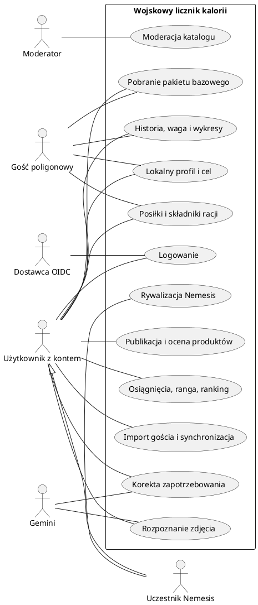

# Wojskowy licznik kalorii — wymagania projektowe - osoba 2

Wersja: 1.2, 9 października 2026 r. Zespół: 3 osoby. Ustalenia backendu: Osoba 2.

Dokument łączy bazowy opis projektu z wymaganiami dotyczącymi trybu poligonowego, analityki, społeczności, rywalizacji i Gemini. Opisuje zakres do wykonania; nie oznacza, że aplikacja została już zaimplementowana. Na polecenie użytkownika maksymalny wspierany okres offline wynosi 30 dni. Rozdział 11 ustala decyzje Osoby 2 dla wersji v1; zmiana tych zasad wymaga aktualizacji dokumentacji, kontraktu i odpowiednich testów.

Dokumenty wykonawcze: [architektura i podział danych](docs/ARCHITEKTURA.md), [etapy prac i zasoby](docs/PLAN_PRAC.md), [workflow pracy i CI/CD](docs/WORKFLOW.md). Wymagania określają zachowanie i limity; dokumenty wykonawcze ich realizację, kolejność i odbiór. Rozbieżność wymaga poprawienia obu stron w jednym PR, nie cichego wyboru wygodniejszej wersji.

## 1. Cel i stos technologiczny

Celem jest rejestrowanie posiłków, wojskowych racji oraz spożytych kalorii i B/T/W (białka, tłuszczu i węglowodanów), również podczas wielodniowego braku internetu. Aplikacja wspiera obserwowanie masy ciała, realizację własnego celu oraz dobrowolną rywalizację.

| Warstwa | Technologia i zakres |
|---|---|
| Android | Kotlin, Android Studio; proponowany interfejs Jetpack Compose, ViewModel i repozytoria danych |
| Pamięć urządzenia | Room/SQLite dla dziennika, katalogu i kolejki; JSON gzip do dostawy pakietu katalogu; DataStore dla ustawień; WorkManager dla synchronizacji |
| Backend | Python, FastAPI, Pydantic, SQLAlchemy, Alembic; REST/JSON i kontrakt OpenAPI |
| Baza serwerowa | PostgreSQL 17; oddzielne bazy `calorie_app` (profile, jedzenie, dziennik i logika) oraz `keycloak` (logowanie); osobne konta techniczne |
| AI | Gemini wywoływany wyłącznie przez backend; model i limity konfigurowane na serwerze |
| Logowanie | Keycloak / OIDC; Authorization Code z PKCE S256 dla Androida; role sprawdzane przez backend |
| Repozytorium i CI/CD | GitHub, pull requesty, GitHub Actions |
| Wdrożenie | Zewnętrzny serwer/VPS z HTTPS; proponowane kontenery Docker Compose i reverse proxy |

Dostawcę serwera, domenę i SMTP konfiguruje Osoba 3. Wersje backendu i limity Gemini określa rozdział 11. Pierwsze wdrożenie może działać na jednym VPS; jest to układ projektowy bez odporności na awarię całego serwera. Dokumentacja źródłowa znajduje się na końcu.

## 2. Aktorzy i uprawnienia

| Aktor | Dostęp |
|---|---|
| Gość poligonowy | Lokalny profil i cel, racje, podstawowe produkty, dziennik, pomiary wagi, lokalne podsumowania; bez konta i sieci |
| Użytkownik z kontem | Wszystkie własne dane, synchronizacja, katalog społeczności, Gemini, osiągnięcia i opcjonalny ranking |
| Uczestnik Nemesis | Uprawnienia użytkownika oraz dostęp do uzgodnionych statystyk konkretnej zaakceptowanej rywalizacji |
| Moderator katalogu | Obsługa zgłoszeń, korekt, ukrywania i scalania produktów; bez domyślnego dostępu do prywatnych dzienników |
| Administrator | Zarządzanie konfiguracją, kontami technicznymi, rolami i katalogiem oficjalnym |
| Systemy zewnętrzne | Dostawca logowania potwierdza tożsamość; Gemini zwraca propozycje rozpoznania i analizy |

Tryb standardowy i poligonowy to sposoby korzystania z tej samej aplikacji i dziennika. Powstaje jeden format danych, a nie dwie niezależne aplikacje. Ranga zdobywana w aplikacji nie daje uprawnień moderatora ani administratora.

## 3. Dostępność funkcji

| Funkcja | Gość offline | Konto offline | Konto online |
|---|---|---|---|
| Racje i podstawowe produkty | Baza dołączona do aplikacji/pobrana wcześniej | Tak | Tak, także aktualizacje |
| Dodawanie, edycja i usuwanie posiłków | Tak | Tak | Tak |
| Cel, waga, podsumowanie B/T/W | Lokalnie | Lokalnie | Lokalnie i na serwerze |
| Historia i wykresy 7/30/90 dni | Z własnych danych lokalnych | Z danych zapisanych/pobranych | Pełna historia serwerowa |
| Własny produkt ręczny | Lokalny szkic | Lokalny szkic | Tak, z opcją publikacji |
| Pełny katalog społeczności | Tylko uprzednio dostępny fragment | Zapisany fragment | Wyszukiwanie całego katalogu |
| Zdjęcie posiłku | Zapis lokalny do późniejszej analizy | Jak dla gościa | Analiza Gemini po zatwierdzeniu wysłania |
| Głosowanie, ranking, nowe Nemesis | Niedostępne | Ostatni pobrany stan, bez nowych działań | Tak |
| Osiągnięcia | Podgląd lokalnych warunków | Podgląd; nowe nagrody oczekują na serwer | Serwer potwierdza nagrody |
| Synchronizacja | Po zalogowaniu i przypisaniu danych | Po odzyskaniu sieci i ważnej sesji | Automatycznie i ręcznie |
| Korekta zapotrzebowania przez AI | Niedostępna | Ostatni zatwierdzony wynik | Tak |

Wygaśnięcie tokenu blokuje operacje serwerowe, ale nie blokuje zapisu do lokalnego dziennika aktywnego profilu. Brak internetu, awaria API lub Gemini nie może zatrzymywać podstawowych funkcji poligonowych.

## 4. Wymagania funkcjonalne

### WF-01. Konto i profil

- Rejestracja, logowanie, wylogowanie i odzyskanie dostępu przez dostawcę tożsamości. Backend przechowuje profil aplikacyjny powiązany z tożsamością, bez własnej bazy haseł.
- Profil: pseudonim, wzrost w cm, pomiary wagi w kg, klasa aktywności, cel: redukcja/utrzymanie/nadwyżka, dzienny cel kcal i opcjonalne cele B/T/W.
- Opcjonalny kalkulator wymaga wieku w pełnych latach, wzrostu, masy, wariantu równania Mifflina–St Jeora i klasy aktywności; pola te służą wyłącznie oszacowaniu. Można samodzielnie podać cel bez korzystania z kalkulatora. Szczegóły określa 11.5.
- Każda zmiana celu lub oszacowanego zapotrzebowania ma datę obowiązywania; nie przepisuje wyników wcześniejszych dni.
- Gość może prowadzić lokalny profil i później przypisać jego dane do konta. Ranking i udostępnianie statystyk są dobrowolne.

### WF-02. Personalizacja aktywności i zapotrzebowania

| Klasa | Opis profilu według założeń użytkownika |
|---|---|
| Stacjonarno-biurowa | Aktywność odpowiadająca orientacyjnie mniej niż 10 tys. kroków dziennie |
| Liniowa | Orientacyjnie 10–20 tys. kroków, średnia aktywność i sport |
| Komandos | Bardzo duża aktywność; orientacyjnie 25 tys. kroków i liczne treningi |

Są to deklarowane klasy aktywności, a nie uniwersalne limity kroków ani gotowe wartości kcal. Przy 20–25 tys. kroków użytkownik wybiera profil według całej aktywności, również treningów. Automatyczny odczyt kroków i integracja z zegarkiem pozostają poza podstawowym zakresem.

Backend wyznacza początkowe oszacowanie metodą `mifflin_pal_v1` z 11.5. Użytkownik może zmienić klasę i cel. W aplikacji należy odróżnić **szacowane zapotrzebowanie do utrzymania masy** od **celu spożycia**. Kalkulator nie ustawia samoczynnie deficytu ani nadwyżki.

### WF-03. Dziennik w trybie standardowym

- Dodanie posiłku z listy produktów/potraw, ręcznie lub na podstawie zatwierdzonego rozpoznania zdjęcia.
- Posiłek ma datę, godzinę, opcjonalny typ (np. śniadanie), nazwę oraz składniki z ilością i jednostką g/ml.
- Użytkownik może poprawić składniki, porcję, kcal oraz B/T/W, edytować lub usunąć wpis i oznaczyć dzień jako kompletnie zapisany.
- Aplikacja pokazuje sumę dzienną, pozostałe kcal i realizację celu. Przekroczenie celu nie blokuje zapisu.
- Wszystkie zapisy najpierw trafiają do trwałej pamięci urządzenia; wysłanie do API następuje osobno.

### WF-04. Racje żywnościowe

- Oficjalny katalog racji ma nazwę, wariant, producenta/źródło, składniki, masę i wartości odżywcze.
- Użytkownik wybiera rację, zaznacza tylko rzeczywiście zjedzone składniki i określa spożytą część, np. pół opakowania.
- Składnik można rozliczać osobno w różnych posiłkach. System nie zakłada zjedzenia całej racji po samym jej wyborze.
- Kalkulacja obejmuje tylko zjedzone ilości. Oficjalne wartości nie są zmieniane głosami użytkowników.
- Pierwszy pakiet obejmuje racje ARPOL WZ 1 i WZ 4 WEGE oraz produkty wymienione w 11.4, w tym owoce, baton i Coca-Cola. Wartości składników muszą pochodzić z opisanych źródeł/etykiet; dane przykładowe oznacza się jako testowe. Sam wybór racji do katalogu nie oznacza jeszcze weryfikacji jej danych.

### WF-05. Tryb poligonowy i pakiet danych

- Dostępny z ekranu startowego bez wymuszonego logowania, także przy pierwszym uruchomieniu bez internetu.
- Minimalny katalog jest dostarczany razem z aplikacją. Użytkownik może bez logowania pobrać jego nowszą wersję, gdy ma internet.
- Lokalne dodawanie, poprawianie i usuwanie posiłków, pomiary wagi, cel, historia i podsumowania działają po restarcie telefonu i aplikacji.
- Pakiet ma wersję, stałe identyfikatory produktów, datę i źródła. Aktualizacja jest atomowa; błąd pobrania pozostawia poprzednią poprawną wersję.
- Format pakietu to JSON skompresowany gzip, importowany do Room; zarówno plik dołączony do APK, jak i aktualizacja używają wspólnego kontraktu. Bieżący odczyt katalogu odbywa się z Room. Nowa generacja jest aktywowana atomowo po walidacji, bez zastępowania dziennika lub kolejki użytkownika; szczegóły w architekturze.
- Ekran pokazuje tryb pracy, wersję pakietu, czas ostatniej synchronizacji i liczbę oczekujących/błędnych operacji.
- Użytkownik może zablokować ruch sieciowy w trybie poligonowym. Po wyłączeniu tej blokady synchronizacja wraca automatycznie, jeśli jest konto i ważna sesja.

### WF-06. Synchronizacja bez utraty historii

- Wspierany okres między udanymi synchronizacjami przyrostowymi wynosi **30 × 24 godziny**. Dłuższy brak sieci nie blokuje dziennika ani nie usuwa danych; wymaga pełnego uzgodnienia stanu według 11.3. Limit nie skraca historii ani zakresów wykresów 7/30/90 dni.
- Każdy lokalny wpis otrzymuje UUID. Zmiana wpisu i dodanie operacji do kolejki następują w jednej transakcji Room.
- Kolejka obejmuje tworzenie, edycję i usuwanie posiłków, pomiary wagi, kompletność dni, lokalne szkice produktów oraz zmiany własnego celu/profilu. Publikowanie szkiców wymaga działania online.
- Przed pierwszym importem danych gościa użytkownik wybiera konto i zatwierdza ich przypisanie. Kolejne synchronizacje tego zbioru nie wymagają ponawiania zgody.
- Konto po stronie serwera jest ustalane z tokenu, nigdy z deklarowanego przez klienta identyfikatora użytkownika.
- Ponowienie operacji z tym samym identyfikatorem nie tworzy duplikatu. Za zsynchronizowaną uznaje się tylko operację potwierdzoną przez serwer.
- Zerwanie połączenia po zapisie serwerowym, a przed otrzymaniem odpowiedzi, jest obsługiwane przez bezpieczne ponowienie.
- Usunięcia są synchronizowane jako znaczniki usunięcia. Zmiany na dwóch urządzeniach są kontrolowane wersją rekordu; konflikt nie może po cichu usuwać jednej wersji.
- Przy konflikcie klient przechowuje obie wersje, pokazuje różnice i pozwala wybrać wynik. Ponawia zmianę z nową operacją i aktualną wersją bazową.
- Wylogowanie i zmiana konta nie przenoszą cudzych danych do nowego konta. Niewysłana kolejka pozostaje odseparowana pod dotychczasowym właścicielem; jej usunięcie wymaga świadomej decyzji.
- Dane lokalne są odporne na brak sieci, restart i aktualizację z poprawną migracją. Odinstalowanie lub utrata telefonu przed synchronizacją może usunąć jedyną kopię; interfejs musi jasno wskazywać wpisy istniejące tylko lokalnie.

### WF-07. Katalog społeczności i oceny

- Użytkownik tworzy produkt lub potrawę z nazwą, masą porcji oraz kcal i B/T/W. Do publikacji wymagany jest opis źródła: etykieta, przepis, własny szacunek lub AI.
- Wartości w katalogu mają podstawę `100 g` dla żywności albo `100 ml` dla napojów, zgodną ze źródłem; jednostka i porcja są jawnymi polami. Obliczenia w ml nie wymagają przeliczania na gramy. Przeliczenie g ↔ ml wymaga udokumentowanej gęstości; brak gęstości blokuje tylko taką konwersję.
- Ręcznie zapisany posiłek może zawierać same kcal; brak B/T/W jest oznaczony jako brak danych, a nie zero. Publiczny produkt bez pełnych danych jest oznaczony jako niekompletny.
- Jeden użytkownik ma jeden aktywny głos na produkt: w górę lub w dół; może go zmienić lub wycofać. Nie głosuje na własny wpis.
- Widok pokazuje osobno głosy dodatnie, ujemne, źródło i status weryfikacji. Popularność nie jest równoznaczna z potwierdzeniem poprawności.
- Zgłoszenie błędu trafia do moderatora. Zmiana katalogu nie zmienia odżywczych wartości już zapisanych posiłków.

### WF-08. Wyszukiwanie i unikanie duplikatów

- Katalog rozdziela produkt/potrawę od porcji: mały rosół i duży rosół używają tej samej definicji, lecz innej gramatury.
- Wyszukiwanie uwzględnia nazwę znormalizowaną, aliasy, markę, wariant, skład/przepis i wartości na 100 g lub 100 ml; wartości porównuje się we wspólnej jednostce.
- Niewielka różnica kcal sama nie tworzy nowego produktu. Także podobna liczba kcal sama nie wystarcza do automatycznego scalenia różnych potraw.
- Próg zgodności energetycznej v1: 10% we wspólnej jednostce bazowej, stosowany wyłącznie razem ze zgodnością nazwy i składu. Jest to parametr deduplikacji, nie kryterium dietetyczne; szczegóły określa 11.4.
- Wysoka zgodność: wskazanie istniejącego produktu. Niejednoznaczność: lista kandydatów do wyboru. Brak zgodności: propozycja nowego wpisu.
- Wyraźnie różny przepis, marka lub skład może uzasadniać osobny wariant. Jednoczesne publikacje są sprawdzane ponownie przed zapisem; duplikaty można scalić z zachowaniem referencji i historii.

### WF-09. Gemini — analiza zdjęcia

1. Użytkownik robi zdjęcie lub wybiera je z galerii i akceptuje wysłanie do analizy.
2. Android zmniejsza zdjęcie i usuwa niepotrzebne metadane, w tym lokalizację. Backend sprawdza format, rozmiar i limit żądań.
3. Gemini zwraca uporządkowaną propozycję: składniki, ilości i jednostki g/ml, kcal, dostępne B/T/W, niepewność i uwagi.
4. Backend waliduje wynik i dopasowuje składniki do katalogu zgodnie z WF-08.
5. Użytkownik widzi propozycję i poprawia lub zatwierdza skład, ilości, jednostki i wartości. Samo wykonanie zdjęcia nie dodaje posiłku.
6. Po zatwierdzeniu aplikacja zapisuje posiłek. Brakujące produkty stają się szkicami; po zatwierdzeniu publikacji trafiają do katalogu jako szacunek AI, z ponowną kontrolą duplikatów.

Istniejący produkt nie jest nadpisywany wynikiem AI; korekta danego spożycia jest zapisana w pozycji dziennika. Backend nigdy nie przekazuje modelowi prawa do bezpośredniego zapisu bazy. Klucz Gemini nie znajduje się w APK. Przy błędzie modelu, przekroczeniu limitu lub braku internetu dostępne jest dodanie ręczne; ponowne wysłanie zdjęcia wymaga wcześniejszej zgody użytkownika na analizę.

### WF-10. Historia i analityka

- Dziennik według dni oraz wykresy dla ostatnich 7, 30 i 90 dni: masa ciała, kcal, B/T/W i realizacja celu.
- Podsumowanie okresu pokazuje średnie spożycie, liczbę kompletnych dni, liczbę dni w celu oraz zmianę masy między dostępnymi pomiarami.
- Dzień w celu w v1: zamknięta doba z kompletną deklaracją dziennika i spożyciem w granicach ±10% dodatniego celu obowiązującego tego dnia, z granicami włącznie. Tolerancja jest wersjonowana.
- Dni bez wpisów lub niekompletne są oznaczane jako brak/niepełne dane, nie jako zerowe spożycie ani potwierdzony deficyt. W v1 ważna kompletność wymaga deklaracji użytkownika, co najmniej jednego nieusuniętego posiłku, znanej energii wszystkich pozycji dziennika w tym dniu i dodatniej sumy kcal dnia. Sam znacznik kompletności nie czyni pustego dnia kompletnym. Taka sama reguła obowiązuje statystyki, punkty, Nemesis i korekty energii.
- Wykres wagi nie wymyśla pomiarów. Każdy wynik wskazuje liczbę dostępnych dni/pomiarów i aktualność synchronizacji.

### WF-11. Osiągnięcia, ranga i ranking

- Osiągnięcia v1: 10 kolejnych kompletnych dni, 10 kolejnych dni w celu, pomiary w 4 różnych dniach w ciągu 14 dni oraz posiłki z racji w 5 różnych dniach. Każda odznaka jest przyznawana raz; serwer może ją cofnąć, jeżeli korekta usunie spełnienie warunku.
- Osiągnięcie „10 dni powyżej 4000 kcal” pozostaje opcją przyszłą, poza listą v1. Zwiększanie spożycia nie daje dodatkowych punktów.
- Ranga wynika z punktów za regularność i realizację własnego celu. Odznaki są prezentowane osobno i nie dają dodatkowych punktów.
- Punktacja `regularity_v1`: 1 pkt za kompletny zamknięty dzień, dodatkowy 1 pkt za dzień w celu; najwyżej 2 pkt dziennie. Rangi: Rekrut 0–19, Szeregowy 20–59, Kapral 60–119, Sierżant od 120 pkt. Są to etykiety gry, bez uprawnień służbowych lub administracyjnych.
- Większy deficyt, większa nadwyżka ani większa liczba wpisów w jednym dniu nie zwiększają punktów.
- Ranking pokazuje pseudonim, rangę, punkty i liczbę osiągnięć. Remisy rozstrzyga jednakowa pozycja; dalsze sortowanie po pseudonimie jest wyłącznie prezentacyjne.
- Serwer oblicza wynik z danych dziennika, a po korekcie wpisów przelicza zależne osiągnięcia i punkty. Wyniki offline nie są potwierdzonym wynikiem rankingowym.

### WF-12. Nemesis — rywalizacja dwóch użytkowników

- Jeden użytkownik zaprasza drugiego; rywalizacja rozpoczyna się dopiero po akceptacji i uzgodnieniu celu, okresu 7/30/90 dni oraz zakresu udostępnienia.
- W pierwszej wersji użytkownik ma najwyżej jedną aktywną rywalizację. Statusy: zaproszona, aktywna, zakończona, anulowana.
- Obaj widzą regularność, realizację własnego celu, procentową zmianę masy oraz średni szacowany deficyt/nadwyżkę. Surowa masa i dziennik posiłków nie są domyślnie udostępniane.
- Deficyt dnia [%] = 100 × (szacowane zapotrzebowanie − spożycie) / szacowane zapotrzebowanie. Wartość ujemna oznacza nadwyżkę. Obliczenie wymaga dodatniego oszacowania zapotrzebowania i kompletnego dziennika.
- Przykład 15% i 12% jest informacją porównawczą o zarejestrowanych danych, a nie automatycznym wskazaniem zwycięzcy. Obaj użytkownicy mają własne cele i wersje oszacowania zapotrzebowania.
- Wynik rywalizacji to punkty `regularity_v1` z WF-11 naliczone w jej okresie. Większy deficyt nie daje wyższego wyniku. Przy remisie wynik to remis.
- Niepełne dane są jawnie oznaczone. Termin dosynchronizowania wynosi **30 × 24 godziny po końcu rywalizacji**, zgodnie ze wspieranym okresem offline. Do tego terminu wynik jest wstępny. Operacje zakwalifikowane do terminu pod blokadą bazy są uwzględniane po udanym zatwierdzeniu transakcji; późniejsze wpisy aktualizują historię i ranking ogólny, lecz nie wynik Nemesis. Dokładny moment kwalifikacji i obsługę spóźnionego workera określa 11.7.
- Uczestnik może zakończyć udostępnianie i anulować rywalizację. Bez zgody drugiej strony nie ma dostępu do jej danych.

### WF-13. Gemini — aktualizacja zapotrzebowania

- Backend analizuje trend wagi, kompletność dziennika, realizację celu i dotychczasową klasę aktywności; Gemini pomaga interpretować wynik i proponować korektę.
- Warunek analizy: 14 zamkniętych dni obserwacji, co najmniej 10 kompletnych dni dziennika i pomiary w 4 różnych dniach. Liczbowa korekta w v1 wymaga dodatkowych warunków stabilnej masy i kompletności z 11.5; ich brak oznacza analizę opisową bez zmiany ustawień.
- Użytkownik otrzymuje propozycję klasy i zapotrzebowania, uzasadnienie, zakres dat i informację o niepewności. Może ją przyjąć lub odrzucić.
- Opcjonalny tryb automatyczny wymaga wcześniejszego włączenia przez użytkownika. Granice zmian i częstotliwość ustala wersjonowana konfiguracja backendu; każda zmiana jest zapisana i widoczna, z możliwością powrotu do poprzedniej.
- Granice techniczne v1: nie częściej niż raz na 14 dni, najwyżej 5% korekty oszacowania na cykl; dla automatu dodatkowo łącznie najwyżej 10% względem ostatniej wartości świadomie zatwierdzonej przez użytkownika. Są to ograniczenia automatyzacji, nie zalecenie dotyczące diety.
- Zmiana oszacowania nie zmienia wstecz historii. Samo skorygowanie kategorii nie przestawia celu kalorycznego bez zatwierdzenia lub uprzednio wybranej reguły automatycznej.
- Walidacja i zapis należą do backendu. Gdy model zwróci niespójny wynik, obowiązuje poprzednia konfiguracja.

## 5. Przypadki użycia — opis tekstowy

| ID | Aktor i cel | Przebieg podstawowy | Wyjątek / rezultat |
|---|---|---|---|
| UC-01 | Gość: uruchomić tryb poligonowy | Wybiera tryb, ustawia lokalny profil i cel | Brak sieci/konta nie blokuje działania |
| UC-02 | Użytkownik: utworzyć konto i zalogować się | Otwiera logowanie dostawcy, wraca do aplikacji, pobiera własny profil | Anulowanie/błąd pozostawia możliwość działania lokalnego |
| UC-03 | Gość: przypisać historię do konta | Loguje się, widzi liczbę wpisów, zatwierdza konto docelowe | Zbiór jest przypisany raz; ponowienie nie duplikuje wpisów |
| UC-04 | Użytkownik/gość: ustawić profil i cel | Wprowadza wzrost, wagę, klasę i cel z datą obowiązywania | Niepoprawne wartości wymagają poprawy |
| UC-05 | Użytkownik/gość: dodać zwykły posiłek | Wyszukuje produkt, podaje ilość, zatwierdza | Zapis lokalny i natychmiastowe podsumowanie |
| UC-06 | Użytkownik/gość: rozliczyć rację | Wybiera rację, składniki i rzeczywiście zjedzone części | Niezaznaczone składniki nie zwiększają sumy |
| UC-07 | Użytkownik/gość: poprawić dziennik | Edytuje/usuwa wpis albo oznacza dzień jako kompletny | Zmiana trafia do kolejki; podsumowanie jest przeliczone |
| UC-08 | Użytkownik/gość: zapisać wagę | Podaje pomiar i jego datę | Wykres korzysta z faktycznych pomiarów |
| UC-09 | Użytkownik/gość: zobaczyć postęp | Wybiera okres 7/30/90 dni i wykres | Braki danych są widoczne; offline zakres zależy od pamięci lokalnej |
| UC-10 | Użytkownik/gość: pobrać pakiet bazowy | Przy dostępnej sieci sprawdza i pobiera wersję katalogu | Nieudana aktualizacja nie usuwa poprzedniego pakietu |
| UC-11 | Użytkownik: zsynchronizować dane | Aplikacja wysyła kolejkę, odbiera potwierdzenia i zmiany | Przy 401 prosi o logowanie; przy braku sieci zachowuje kolejkę |
| UC-12 | Użytkownik: rozwiązać konflikt | Porównuje wersję lokalną i serwerową, wybiera wynik | Bez decyzji obie wersje pozostają zachowane |
| UC-13 | Użytkownik: rozpoznać zdjęcie | Wybiera/robi zdjęcie, wysyła, poprawia propozycję, zatwierdza | Błąd AI umożliwia ręczny wpis; wynik bez akceptacji jest szkicem |
| UC-14 | Użytkownik: opublikować produkt | Uzupełnia dane, sprawdza podobne wpisy, zatwierdza publikację | Istniejący produkt jest używany zamiast duplikatu |
| UC-15 | Użytkownik: ocenić/zgłosić produkt | Daje jeden głos albo wskazuje problem | Zmiana głosu zastępuje poprzedni; zgłoszenie trafia do moderatora |
| UC-16 | Użytkownik: zobaczyć osiągnięcia i ranking | Otwiera własne nagrody i dobrowolny ranking | Offline widzi stan lokalny/pobrany z datą aktualizacji |
| UC-17 | Uczestnicy: rozpocząć Nemesis | Zaproszenie, uzgodnienie celu/okresu, akceptacja drugiej strony | Odrzucenie nie rozpoczyna rywalizacji |
| UC-18 | Uczestnik: śledzić/zakończyć Nemesis | Ogląda dozwolone porównanie lub anuluje udostępnianie | Brak zgody blokuje dostęp; końcowy wynik ma status wstępny/ostateczny |
| UC-19 | Użytkownik: dopasować zapotrzebowanie | Otwiera analizę, przyjmuje/odrzuca korektę lub włącza automat | Niepełne dane/błąd AI pozostawiają dotychczasowe ustawienia |
| UC-20 | Moderator: uporządkować katalog | Weryfikuje zgłoszenie, poprawia, ukrywa lub scala produkt | Referencje i historyczne wartości posiłków pozostają zachowane |

### Schemat przypadków użycia (UML / PlantUML)

Kod można otworzyć w dowolnym rendererze PlantUML. Przedstawia główne grupy przypadków; szczegóły opisuje tabela powyżej.

## 6. Model danych i wspólne reguły

| Encja | Najważniejsze dane / relacje |
|---|---|
| UserAccount / UserProfile / UserConsent | Konto: UUID, unikalna para issuer + subject, stan i generacja; profil 1:1: pseudonim, wzrost i preferencje; zgody online mają osobne wersjonowanie |
| GoalVersion | Użytkownik, cel kcal/B/T/W, typ celu, klasa i oszacowane zapotrzebowanie, okres obowiązywania, źródło zmiany |
| WeightEntry | UUID, użytkownik, kg, czas pomiaru, wersja, znacznik usunięcia |
| Product / ProductVersion | Nazwa, aliasy, marka/przepis, jednostka g/ml, kcal/B/T/W na 100 jednostek, opcjonalna gęstość ze źródłem, status i wersja |
| Ration / RationComponent | Racja, wariant, składniki, referencje wersji produktów, ilość i jednostka g/ml w opakowaniu |
| MealEntry / MealItem | UUID, właściciel, czas i lokalna data, składniki, ilość i jednostka g/ml, zapisane wartości odżywcze i wersja |
| DiaryDay | Użytkownik, lokalna data, status kompletności; kompletność synchronizowana jak inne dane użytkownika |
| ProductVote / ProductReport | Autor, produkt, wartość głosu albo opis zgłoszenia; unikalny głos autora na produkt |
| Achievement / UserAchievement | Wersjonowana reguła, nagroda użytkownika i powiązany okres |
| NemesisChallenge | Dwoje uczestników, cel, okres, strefa rozliczania, zgody, wersja zasad, status i wynik |
| NemesisDayProjection | Rywalizacja, uczestnik, dzień, punkty i dane do uzgodnionych agregatów, rewizje źródłowe i czas kwalifikacji; aktualizacja atomowa z dziennikiem tylko do terminu |
| AIAnalysis / EnergyAdjustment | Autor, rodzaj analizy, wersja modelu/reguł, propozycja, zatwierdzenie, daty i uzasadnienie |
| SyncOperation / ChangeLog | Op ID, właściciel, typ i ID encji, epoka i wersja bazowa, wynik; monotoniczny kursor zmian serwerowych |
| SyncRecoveryMapping | Właściciel, źródłowa epoka i UUID encji, docelowy UUID; unikalne przypisanie odzyskanego wpisu między urządzeniami |
| OfflinePackage | Wersja katalogu, format, źródła, suma kontrolna i data publikacji |

- Room przechowuje lokalne odpowiedniki danych potrzebnych offline, osobne zbiory gościa/kont, katalog i trwałą kolejkę `outbox`.
- `MealItem` zapisuje odżywczy obraz spożycia: ilość, jednostkę, zastosowane wartości oraz ewentualną ręczną korektę. Aktualizacja/scalenie produktu nie przelicza historii.
- Wartość porcji = wartość na 100 jednostek × spożyta ilość w tych jednostkach / 100. Brak wartości oznacza `null`; sumy B/T/W pokazują wtedy, że są niepełne. Przykład kontrolny: 250 ml napoju o 42 kcal/100 ml daje 105 kcal; nie jest potrzebna masa napoju.
- Czas przesyłany w ISO 8601/UTC wraz ze strefą IANA i zapisaną lokalną datą. Dziennik używa daty spożycia, nie daty synchronizacji; Nemesis używa jednej strefy uzgodnionej przy rozpoczęciu.
- Backend używa `Decimal` i PostgreSQL `NUMERIC`, a API przesyła ilości i wartości odżywcze jako ciągi dziesiętne. Obliczenia zachowują co najmniej 4 miejsca po przecinku; prezentacja zaokrągla końcową sumę metodą `HALF_UP`: kcal do liczby całkowitej, makra do 0,1 g. API i Android mają wspólne przykłady, w tym wartości graniczne; punktacja używa sum przed zaokrągleniem prezentacyjnym.
- Osiągnięcia i rankingi oblicza serwer, ponownie po istotnej korekcie dziennika; klient nie przesyła gotowych punktów jako wiążącego wyniku.

## 7. Kontrakt API do podziału pracy

Wersja początkowa `/api/v1`. Backend dostarcza OpenAPI i przykładowe odpowiedzi przed integracją mobilną. Poniższe ścieżki są projektem kontraktu do implementacji, a nie opisem działającego serwera.

| Obszar | Operacje |
|---|---|
| Profil | `POST /me/bootstrap`, `GET /me`, `GET /me/goals`; zapis profilu i celów przez `POST /sync/push` |
| Kalkulator | `POST /energy-estimates` — wyliczenie propozycji bez zapisu celu |
| Zgody online | `PUT /me/consents` — ranking i automatyczne korekty; Nemesis przez własne operacje |
| Katalog | `GET /products?query=...`, `GET /products/{id}`, `POST /products`, `POST /products/matches` |
| Racje i pakiet | `GET /rations`, `GET /rations/{id}`, `GET /offline-package/manifest`, `GET /offline-package/{version}` |
| Dziennik | `GET /me/meals?from=...&to=...`, `GET /me/weights?from=...&to=...` |
| Synchronizacja | `POST /sync/push`, `GET /sync/pull?cursor=...` |
| Zdjęcia AI | `POST /ai/meal-analyses`, `GET /ai/meal-analyses/{id}`, `POST /ai/meal-analyses/{id}/confirm` |
| Zapotrzebowanie AI | `POST /ai/energy-analyses`, `GET /ai/energy-analyses/{id}`, `POST /ai/energy-analyses/{id}/decision` |
| Oceny i zgłoszenia | `PUT /products/{id}/vote`, `DELETE /products/{id}/vote`, `POST /products/{id}/reports` |
| Statystyki | `GET /me/statistics?days=30` (dozwolone: 7, 30, 90), `GET /me/achievements`, `GET /leaderboard` |
| Nemesis | `POST /nemesis`, `GET /me/nemesis`, `POST /nemesis/{id}/accept`, `POST /nemesis/{id}/cancel`, `GET /nemesis/{id}/statistics` |
| Moderacja | `GET /moderation/reports`, `PATCH /moderation/products/{id}`, `POST /moderation/products/{id}/merge` |
| Techniczne | `/health/live`, `/health/ready`; metryki dostępne wyłącznie dla infrastruktury |

Pakiet bazowy oraz oficjalne racje są publiczne do odczytu. Pozostałe operacje wymagają access tokenu i kontroli właściciela/roli. Kalkulator lokalny korzysta z tej samej wersji formuły co backend. Nie powstaje własny endpoint przyjmujący hasło do logowania.

### Protokół synchronizacji

Każda operacja `push` zawiera `operation_id`, `entity_type`, `entity_id`, `action`, `sync_epoch`, `base_revision` i `payload`. Właściciel kolejki jest sprawdzany lokalnie przed wysyłką, a właściciel danych na serwerze wynika z tokenu. Nowy rekord ma pustą wersję bazową.

Backend zwraca wynik osobno dla każdej operacji: `accepted`, `already_applied`, `conflict` albo `rejected`, aktualną wersję oraz dane potrzebne do rozwiązania konfliktu. Zapis encji i wyniku operacji odbywa się w jednej transakcji PostgreSQL. Ten sam identyfikator z inną treścią jest błędem, a nie nową operacją. Kolejka zachowuje kolejność zmian tej samej encji.

`pull` zwraca stronicowane zmiany i usunięcia z kursorem opartym na kolejności zatwierdzonych zmian serwerowych, nie na zegarze telefonu. Klient zapisuje stronę i kursor w jednej transakcji. Kursor jest ważny przez 30 × 24 godziny; po tym czasie serwer wymaga pełnego pobrania stanu z zachowaniem niewysłanych operacji lokalnych. Szczegółowe zmiany i znaczniki usunięcia przechowuje się przez 60 dni jako bufor techniczny. Trwałe potwierdzenia idempotencji i zastrzeżone identyfikatory usuniętych encji zapobiegają duplikatom także po sprzątaniu historii; zasady określa 11.3.

Wszystkie zmiany posiłków, wagi, kompletności dni, profilu, celów i prywatnych szkiców produktów z Androida przechodzą przez wspólny protokół synchronizacji. `PATCH /me` i `POST /me/goals` nie wchodzą do v1. Potwierdzenie analizy zdjęcia AI zwraca zatwierdzony szkic i referencje produktów; zapis posiłku nadal idzie przez tę samą kolejkę. Decyzja o korekcie zapotrzebowania jest operacją online tworzącą nową wersję celu po stronie serwera, przez tę samą usługę wersjonowania i dziennik zmian.

Błędy API mają spójne pola `code`, `message`, `details`, `request_id`. Statusy: 401 — ponowne logowanie, 403 — brak wymaganej roli, 404 — brak zasobu lub cudzy prywatny zasób, 409 — konflikt/konieczne uzgodnienie stanu, 410 — wygasły kursor lub snapshot, 422 — błędne dane, 429 — limit, 5xx — błąd serwera. Poprawna strukturalnie paczka `push` zwraca HTTP 200 i wyniki poszczególnych operacji, także konfliktów; błąd całego żądania ma odpowiedni status HTTP. Ponowienia respektują `Retry-After`; trwała walidacja wymaga poprawy danych.

## 8. Podział odpowiedzialności między trzy osoby

### Osoba 1 — aplikacja mobilna i pamięć lokalna

**Odpowiada za WF-01–13 po stronie Androida oraz UC-01–19 w interfejsie.**

- Projekt ekranów i nawigacji: start/tryb, profil/cel, dziennik, wybór racji, katalog, zdjęcie i korekta, historia/wykresy, osiągnięcia/ranking, Nemesis, ustawienia/synchronizacja.
- Kotlin: stan ekranów, walidacja, obliczenia porcji, prezentacja niepełnych danych i błędów API.
- Room: schemat, migracje, dane startowe, transakcje dziennik + kolejka, izolacja kont i gościa.
- WorkManager: synchronizacja po spełnieniu warunków sieci/sesji, ponawianie, ręczne uruchomienie, konflikty i widoczny stan kolejki.
- Integracja OIDC przez bibliotekę klienta, przeglądarkę systemową i PKCE; bez sekretu klienta w APK. Tokeny chronione z wykorzystaniem Android Keystore.
- Aparat/galeria, obsługa odmowy uprawnień, przygotowanie zdjęcia i zgoda na analizę. Brak sieci pozostawia zdjęcie/szkic lokalnie.
- Integracja API; aplikacja czyta dane dziennika z lokalnego repozytorium. Serwer aktualizuje jego stan poprzez synchronizację.
- Testy trwałości danych, obliczeń, migracji, konfliktów i krytycznych przepływów; wydanie APK do demonstracji.

**Dostarcza:** kod Androida, działający tryb poligonowy, ekrany wszystkich funkcji, testy i instrukcję uruchomienia. Otrzymuje od osoby 2 OpenAPI i dane testowe, a od osoby 3 adresy środowisk i konfigurację logowania.

### Osoba 2 — backend Python, PostgreSQL i integracje

**Odpowiada za reguły biznesowe WF-01–13, API, UC-20 i poprawność danych serwerowych.**

- Model PostgreSQL, migracje, ograniczenia integralności, dane startowe racji/produktów wraz ze źródłami.
- FastAPI: endpointy, OpenAPI, walidacja, stronicowanie i wspólne błędy.
- Weryfikacja access tokenów: podpis, dozwolony algorytm, issuer, audience, czas ważności, klucze JWKS; autoryzacja właściciela i ról. ID token nie służy do wywołań API.
- Synchronizacja: idempotencja, wersjonowanie, konflikty, kursory, usunięcia, transakcje i izolacja danych użytkowników.
- Wersjonowany pakiet offline, wyszukiwanie i dopasowanie produktów, głosy, zgłoszenia oraz minimalna obsługa moderacji przez zabezpieczone API.
- Gemini: adapter API, walidacja odpowiedzi, dopasowanie produktów, limity użytkownika, śledzenie zużycia i obsługa błędów. Zlecenia AI mają trwały stan; wymagające czasu zadania obsługuje proces roboczy.
- Statystyki 7/30/90 dni, kompletność dziennika, wersje celów, osiągnięcia, punkty, rangi i Nemesis z kontrolą zgód.
- Korekty zapotrzebowania: reguły, walidacja, wersjonowanie, uzasadnienie, zgody i historia zmian.
- Testy integracyjne z PostgreSQL, testy autoryzacji między kontami i kontraktu synchronizacji; mock Gemini w CI.

**Dostarcza:** kod Python, migracje, OpenAPI, seed katalogu, testy i dokumentację zasad. Uzgadnia z osobą 1 format synchronizacji; z osobą 3 sposób uruchamiania usług i zadania okresowe.

### Osoba 3 — DevOps, GitHub i wdrożenie

**Odpowiada za środowiska, CI/CD i operacyjną dostępność usług.**

- Repozytorium GitHub: proponowany monorepo z `/android`, `/backend`, `/infra`, `/docs`; chroniona główna gałąź i wymagane kontrole PR.
- Lokalny Docker Compose oraz oddzielne konfiguracje testowej i docelowej instalacji na zewnętrznym serwerze.
- Uruchomienie API, procesu roboczego, PostgreSQL, dostawcy logowania i reverse proxy z HTTPS. Baza nie jest publicznie dostępna.
- Konfiguracja dostawcy OIDC: środowiska/realmy, publiczny klient Androida z wymaganym PKCE S256, audience API, role, dokładne adresy powrotu i obsługa poczty do odzyskiwania konta. Hasła nie trafiają do aplikacji ani backendu.
- Sekrety bazy, Gemini, poczty, wdrożeń i podpisywania APK przechowywane poza repozytorium; kontrolowany dostęp i rotacja. Konfiguracja wersjonowana bez sekretów.
- GitHub Actions: Android — kompilacja, lint i testy; Python — lint i testy z testowym PostgreSQL; następnie budowa oznaczonego obrazu i publikacja artefaktów.
- PR uruchamia sprawdzenia bez dostępu do sekretów produkcyjnych. Testy CI nie wykonują płatnych wywołań Gemini.
- Wdrożenie testowe po scaleniu; docelowe z wersjonowanego wydania, z kontrolowanym zatwierdzeniem w GitHub. Przed migracją kopia bazy; po wdrożeniu test gotowości i podstawowy test działania.
- Procedura wycofania obrazu i osobna procedura awarii migracji danych. Sam powrót do starego obrazu nie gwarantuje odwrócenia migracji.
- Kopie PostgreSQL aplikacji i systemu tożsamości, przechowywane również poza serwerem; co najmniej jedna sprawdzona procedura odtworzenia.
- Monitoring dostępności, błędów, czasu odpowiedzi, dysku, zadań synchronizacji, procesu roboczego i kosztu/liczby analiz AI; alerty na awarie i przekroczenie limitów.
- Instrukcja konfiguracji, wdrożenia, odtwarzania, aktualizacji i obsługi awarii. Publikacja w Google Play jest osobnym zadaniem; zakres podstawowy obejmuje APK.

**Dostarcza:** pliki infrastruktury, workflowy GitHub Actions, działające środowisko, kopie i instrukcje operacyjne. Kod reguł, migracji i zadań okresowych tworzy osoba 2; ich uruchamianie i monitoring zapewnia osoba 3.

### Wspólne punkty styku

| Temat | Osoba 1 | Osoba 2 | Osoba 3 |
|---|---|---|---|
| Offline/synchronizacja | Room, kolejka, ekran konfliktów | Protokół, wersje i idempotencja | Dostępność i monitoring API |
| Logowanie | Klient Android i tokeny | Walidacja tokenów i dostęp do danych | Konfiguracja dostawcy i domen |
| Racje/katalog | Wybór i obliczenie porcji | Źródła, dane, wersje i deduplikacja | Dostarczanie pakietu i kopie |
| Gemini | Zdjęcie, zgoda i korekta | Analiza, walidacja i dopasowanie | Sekrety, proces roboczy i limity kosztu |
| Nemesis/ranking | Widoki, zaproszenia, zgody | Punktacja i kontrola udostępniania | Harmonogram i monitoring |
| Wydanie | Poprawna aplikacja i testy | Poprawne API i migracje | Pipeline, deploy i odtworzenie |

## 9. Kolejność realizacji

1. **Fundamenty:** uzgodnić model, kontrakt API/sync i wspólne obliczenia; uruchomić repozytorium i CI. Osoba 1 implementuje lokalny dziennik na danych testowych, osoba 2 schemat/API, osoba 3 środowisko.
2. **Rdzeń offline i konta:** gotowy pakiet startowy, racje, posiłki, profil, cel, waga oraz synchronizacja i logowanie. Odbiór: 30 dni wpisów offline, następnie poprawny import do konta bez duplikatów, oraz pełne uzgodnienie po przekroczeniu limitu.
3. **Historia, katalog i AI:** wykresy 7/30/90 dni, produkty społeczności, oceny, deduplikacja, zdjęcie i ręczna korekta wyniku.
4. **Motywacja i dopasowanie:** osiągnięcia, rangi, ranking, Nemesis oraz korekty zapotrzebowania z wersjonowaniem.
5. **Odbiór całości:** scenariusze poniżej, wydanie APK, wdrożenie serwerowe, kontrola kopii i komplet instrukcji.

Etap 2 jest pierwszą użyteczną wersją. Etapy 3–5 pozostają częścią pełnego zamówionego zakresu. Nie ustalono terminu końcowego; zespół estymuje zadania po akceptacji kontraktu i wyborze infrastruktury.

## 10. Kryteria odbioru i wymagania niefunkcjonalne

| ID | Scenariusz / oczekiwany wynik |
|---|---|
| KO-01 | Nowa instalacja w trybie samolotowym: gość dodaje banan i składnik racji; po restarcie wpisy i suma pozostają |
| KO-02 | Częściowa racja: zjedzenie połowy jednego składnika i całego drugiego daje dokładną sumę tych ilości |
| KO-03 | 30 dni offline: posiłki, edycje, usunięcia, kompletność dni i pomiary po logowaniu trafiają na serwer z pierwotnymi datami |
| KO-04 | Ten sam push wysłany trzy razy, także po utracie odpowiedzi: jeden wpis, jedna zmiana punktacji |
| KO-05 | Wygaśnięcie sesji nie blokuje lokalnego zapisu; synchronizacja wznowiona po ponownym logowaniu |
| KO-06 | Równoczesna edycja na dwóch urządzeniach: konflikt widoczny, obie wersje zachowane do decyzji |
| KO-07 | Zmiana konta: wpisy i kolejka konta A nie zostają wysłane na konto B |
| KO-08 | Przerwana aktualizacja katalogu lub migracja aplikacji: dotychczasowy katalog i niewysłane logi pozostają dostępne |
| KO-09 | Mały i duży rosół oraz drobna różnica kcal: wspólny produkt i różna masa; inny przepis nie jest scalany samą zgodnością kcal |
| KO-10 | Zdjęcie z rozpoznaniem błędnym, timeoutem lub brakiem B/T/W: użytkownik może poprawić wynik lub wpisać ręcznie, bez cichego zapisu |
| KO-11 | Historia z brakującymi dniami: brak danych nie jest wyświetlany jako zero kcal lub potwierdzony deficyt |
| KO-12 | Zmiana celu dziś nie zmienia realizacji celu wczoraj; aktualizacja katalogu nie zmienia kcal historycznego posiłku |
| KO-13 | Zmiana głosu nie zwiększa liczby głosujących; cudze konto nie może zmienić własności głosu ani posiłku |
| KO-14 | Nemesis bez akceptacji nie ujawnia statystyk; większy deficyt nie daje dodatkowych punktów; anulowanie odcina dalszy dostęp |
| KO-15 | Korekta AI: za mało danych oznacza brak zmiany; zaakceptowana korekta ma uzasadnienie i datę, a automat respektuje ustawione granice |
| KO-16 | PR przechodzi CI; wydanie uruchamia się na serwerze przez HTTPS; brak kluczy/sekretów w repozytorium, logach i APK |
| KO-17 | Odtworzenie kopii na środowisku testowym przywraca dziennik, katalog i konfigurację tożsamości |
| KO-18 | Kursor w wieku dokładnie 30 × 24 h działa; starszy o 1 s wymaga pełnego uzgodnienia; lokalna kolejka i historia pozostają zachowane |
| KO-19 | Powrót po 61 dniach i ponowienie wcześniej przyjętego create/delete nie duplikuje ani nie wskrzesza danych; wynik potwierdza trwały rejestr operacji |
| KO-20 | Równoległe transakcje zatwierdzane w innej kolejności niż rozpoczęcie nie pomijają żadnej zmiany w pull; przerwany snapshot daje się wznowić lub rozpocząć od nowa |
| KO-21 | Gemini: jednoczesne żądania i timeout nie przekraczają zarezerwowanego budżetu; CI używa mocka, a błąd modelu pozostawia możliwość ręcznego wpisu |
| KO-22 | Nemesis uwzględnia wpis przyjęty do końca 30-dniowego terminu; wpis po terminie zmienia historię, lecz nie zamknięty wynik; anulowanie odcina dostęp |
| KO-23 | 250 ml po 42 kcal/100 ml daje 105 kcal; brak gęstości nie blokuje ml, ale blokuje przeliczenie na g; brak makr pozostaje null |
| KO-24 | Aktualizacja celu przyjęta z opóźnieniem stosuje datę zadeklarowaną przy utworzeniu offline; nowa korekta AI zaczyna obowiązywać od następnego dnia i nie nadpisuje historii |
| KO-25 | Pusty dzień, same wpisy z 0 kcal lub brak energii nie stają się kompletne po ustawieniu flagi; nie dają punktów i nie wchodzą jako zero do średniej ani korekty energii |
| KO-26 | Termin Nemesis 12:00, korekta 12:01, worker 12:05: wynik zamyka się według projekcji sprzed terminu; korekta późniejsza zmienia tylko historię/ranking ogólny |
| KO-27 | Transakcja Nemesis zakwalifikowana pod blokadą przed terminem, zakończona po terminie, wchodzi do wyniku dopiero po commit; rollback niczego nie nalicza, a finalizer czeka na blokadę |
| KO-28 | Dwa środowiska nie mogą mieć niezależnych płatnych liczników: środowisko bez roli płatnej używa mocka; wszystkie płatne próby referencyjne przechodzą przez jeden ledger |
| KO-29 | Dzień kompletny przed północą otrzymuje należne punkty po zamknięciu doby bez nowego zapisu klienta; ponowienie zadania i restart workera nie duplikują punktów, także przy zmianie czasu |
| KO-30 | Aktualizacja pakietu: uszkodzony gzip/hash, zła referencja, brak miejsca lub restart importu pozostawiają stary kompletny katalog; udana aktywacja nie zmienia dziennika, outbox ani historycznych wartości; później zakończony import starszego release nie zastępuje nowszego |
| KO-31 | Przełączenie konta A na B podczas żądania WorkManager nie zapisuje odpowiedzi ani operacji A w zakresie B; import gościa jest przypisany tylko raz |
| KO-32 | Odtworzenie kopii sprzed potwierdzonego posiłku i płatnego wywołania zmienia sync_epoch: telefon zachowuje potwierdzony posiłek i outbox do uzgodnienia, stary checkpoint/operacja nie wykonuje zapisu, zadania nie powtarzają płatnego wywołania, a niepewny budżet nie staje się ponownie dostępny |

Dodatkowe wymagania:

- Interfejs w języku polskim, czytelne jednostki i stany: lokalny, oczekujący, zsynchronizowany, konflikt, błąd. Działanie podstawowe nie zależy od AI.
- Propozycja celu wydajności: zapis lokalny do 1 s i typowe żądanie API bez AI do 2 s dla 95% żądań, w uzgodnionym teście na środowisku docelowym; pomiar uwzględnia oddzielnie sieć.
- Analizy AI mają limit czasu, status przetwarzania i możliwość powrotu do ręcznego wpisu. Limity zdjęć i użytkownika są konfigurowane oraz dokumentowane przed integracją.
- Logi techniczne nie zawierają haseł, tokenów, zdjęć ani całych prywatnych dzienników. Dane dostępne są tylko uprawnionym osobom; API sprawdza własność każdego zasobu.
- Retencja zdjęć w backendzie: usuwanie po zakończeniu analizy lub najpóźniej po 24 h od przyjęcia, również po awarii; zdjęcia nie trafiają do kopii bazy i logów. Dane wysyłane Gemini ogranicza się do potrzeb analizy. Jest to retencja naszej aplikacji, niezależna od warunków dostawcy API.
- Propozycja kopii: codziennie, historia 14 dni, sprawdzenie odtworzenia przed odbiorem. Docelowe RPO 24 h i RTO 4 h są celami projektowymi do potwierdzenia testem.
- Zmiany schematów Room/PostgreSQL zachowują dane. Wydanie obejmuje instrukcję uruchomienia, konfigurację bez sekretów, OpenAPI, źródła katalogu i znane ograniczenia.

## 11. Ustalone decyzje Osoby 2 — wersja v1

Decyzje poniżej są podstawą implementacji backendu i kontraktu przekazywanego osobom 1 i 3. Liczby dotyczące limitów, punktacji i jakości są decyzjami projektowymi, a nie gwarancjami dostawców lub zaleceniami żywieniowymi. W tym etapie powstaje dokumentacja; kod, seed i pomiary jakości będą osobnymi rezultatami implementacji.

### 11.1. Stos i struktura backendu

| Element | Wybór i uzasadnienie |
|---|---|
| Runtime | Python 3.13; jedna wersja w środowisku lokalnym, CI i obrazie |
| HTTP / walidacja | FastAPI i Pydantic 2; jeden kontrakt OpenAPI dla Androida i testów |
| Baza | PostgreSQL 17, SQLAlchemy 2, sterownik psycopg 3, migracje Alembic; ograniczenia unikalności i transakcje w bazie |
| Zależności / jakość | uv i wersjonowany lockfile; pytest, HTTPX, Ruff; dokładne wersje poprawek ustalane i blokowane przy tworzeniu szkieletu |
| Architektura | Jeden modularny backend w `/backend`: auth, profile/goals, diary/sync, catalog/rations, analytics/gamification, nemesis, ai; schematy HTTP oddzielone od modeli bazy |
| Zadania w tle | Osobny proces workera z tego samego kodu; trwała tabela zadań PostgreSQL, pobieranie przez `FOR UPDATE SKIP LOCKED`, dzierżawy, limit prób i ponawianie |
| Wdrożenie | API i worker jako osobne procesy/kontenery; osoba 3 zapewnia PostgreSQL, Keycloak i reverse proxy; Redis i broker wiadomości nie są wymagane w v1 |

Układ fizyczny baz, lokalne zakresy właścicieli i granice modułów określa [architektura](docs/ARCHITEKTURA.md). Jedna instancja PostgreSQL na środowisko może obsługiwać oddzielne bazy `keycloak` i `calorie_app`; produkty i racje pozostają w tej samej bazie co dane aplikacyjne. Android ma roboczą bazę Room, do której importuje katalog JSON gzip.

Migracje są uruchamiane raz jako zadanie wdrożeniowe, przed startem nowej wersji usług. Endpointy nie wywołują `create_all`. Operacje sieciowe Gemini nie trzymają otwartej transakcji bazy. Kolejka ma stan `queued/running/succeeded/failed`, `lease_until`, licznik prób i identyfikator dzierżawy; stary worker nie może zapisać wyniku po przejęciu zadania. Zadania obliczeniowe są idempotentne. Dla zewnętrznego wywołania AI nie obiecujemy wykonania dokładnie raz — patrz 11.6.

### 11.2. Kontrakt logowania i zapisów

- Dostawca: Keycloak. Publiczny klient mobilny `calorie-android`, audience API `calorie-api`, oddzielne realmy `calorie-dev` i `calorie-prod`. Osoba 3 dostarcza rzeczywiste adresy issuer i dozwolone adresy powrotu; backend nie akceptuje adresu issuer podanego dowolnie w żądaniu.
- Backend sprawdza podpis RS256, dokładny issuer, audience, `exp`, `nbf` i niepusty `sub`; tolerancja zegara 60 s. Klucze JWKS pobiera tylko z konfiguracji zaufanego dostawcy, przechowuje maksymalnie 15 min i odświeża przy nieznanym `kid` z ograniczeniem częstotliwości. Nieznany klucz albo błąd weryfikacji nigdy nie otwiera dostępu. Brak dostawcy i niezbędnego klucza daje 503, a nie pominięcie weryfikacji.
- Role API: `user`, `catalog_moderator`, `admin`, z przestrzeni ról klienta `calorie-api`. Moderator i administrator nie mają domyślnego dostępu do cudzych dzienników. Identyfikacja konta to para `(issuer, sub)`; ID token oraz token z audience wyłącznie klienta Android są odrzucane.
- `POST /me/bootstrap` idempotentnie zakłada techniczną tożsamość aplikacyjną dla zalogowanego konta i zwraca UUID. Nie przyjmuje historii gościa, celów ani cudzej tożsamości. Profil użytkowy i pierwszy cel powstają przez sync po potwierdzeniu przypisania danych przez użytkownika.
- Offline synchronizujemy: profil, wersje celów, posiłki, wagę, kompletność dni i prywatne szkice produktów. Publikacja produktu, głosy, moderacja, zgody na ranking/automat, Nemesis i zlecenia AI są operacjami online. Zgody mają domyślnie wartość `false`; ich wersji serwerowej nie może nadpisać stary profil z kolejki offline.
- Mutacje online używają `Idempotency-Key` (UUID, zakres: właściciel + operacja) i kontroli wersji zasobu. Ponowienie z innym body daje 409; akceptacja zaproszenia, odznaka lub analiza nie może zostać wykonana drugi raz. Klucz i wynik są zapisywane atomowo wraz ze zmianą lub utworzeniem zadania.
- Serwerowa korekta celu korzysta ze wspólnej usługi wersjonowania, blokady konta i `ChangeLog`. Jeżeli od analizy zmieniły się cel lub dane źródłowe, akceptacja daje 409 i wymaga nowej analizy. Android otrzymuje zmianę przez pull.

### 11.3. Synchronizacja, 30 dni offline i odzyskiwanie

**Granica wsparcia.** Pełną synchronizację przyrostową gwarantujemy do 30 × 24 h od czasu wystawienia ostatniego ukończonego checkpointu serwera, włącznie. Zegar telefonu nie decyduje o ważności. Pierwszy import gościa może zawierać starszą historię i nie jest ograniczony wiekiem konta. Po 30 dniach dane nadal są zapisywane lokalnie; serwer wymusza uzgodnienie pełnego stanu przed kolejnym push. Zakres historii 90 dni i czas trwania Nemesis 90 dni pozostają dostępne.

**Kolejność pracy klienta.** Po uzyskaniu sesji klient wykonuje pull i przechowuje stan serwerowy oddzielnie od niewysłanej kolejki, następnie push i ponowny pull. `push` wymaga podpisanego checkpointu powiązanego z kontem, wersją protokołu i epoką serwera `sync_epoch`; sam poprawny access token nie pozwala ominąć wymaganego uzgodnienia. Pierwszy import gościa uzyskuje checkpoint przez pobranie stanu konta, a potem wysyła lokalne UUID; istniejące wpisy konta pozostają zachowane.

**Transakcje i kolejność zmian.** Serwer blokuje wiersz licznika synchronizacji danego konta na czas każdej transakcji modyfikującej jego dane. W jednej transakcji zapisuje encję, jej rewizję, wynik operacji i kolejną pozycję `ChangeLog`. Zmiany serwerowe i worker używają tej samej zasady. Dzięki temu kursor nie omija wolniejszej transakcji, która rozpoczęła się wcześniej, ale zatwierdziła później; sam globalny `BIGSERIAL` nie zapewnia tej własności. Dane wspólne, np. katalog, mają odrębne wersje i nie rozszerzają dostępu do cudzej kolejki.

**Paczki i zależności.** `push`: najwyżej 100 operacji i 1 MiB JSON; pojedyncza encja najwyżej 256 KiB. Transakcja obejmuje jedną operację, nie całą paczkę. W jednej paczce występuje najwyżej jedna zmiana danej encji; następną klient wysyła dopiero po potwierdzeniu jej poprzednika i podaniu zwróconej rewizji. Po konflikcie zależne operacje czekają na rozwiązanie. Nie usuwa się ani nie nadpisuje obu wersji automatycznie. Nie można usunąć celu już używanego przez historię; kolejne zmiany tworzą wersje.

**Idempotencja i usunięcia.** Klucz operacji to `(owner_id, operation_id)`; zapisywany jest hash kanonicznej treści żądania, z normalizacją wartości dziesiętnych. Ten sam klucz z inną treścią jest błędem. Dla przyjętej operacji ponowienie zwraca `already_applied` i jej pierwotną rewizję, a nie bieżący stan encji. Dla zapisanej odmowy/konfliktu zwracany jest ten sam wynik; poprawiona operacja ma nowy identyfikator. Nowy UUID encji nie może kolidować z istniejącym lub zastrzeżonym po usunięciu, również przy imporcie gościa. Edycja usuniętej encji zwraca konflikt; jej odtworzenie wymaga świadomej decyzji i nowego UUID.

| Dane techniczne | Retencja |
|---|---|
| Szczegółowy `ChangeLog`, usunięte rekordy i pełne odpowiedzi operacji | Minimum 60 × 24 h od zmiany; bufor dla wsparcia 30 dni |
| Minimalne potwierdzenie operacji: ID, hash, typ wyniku, ID encji i przyjęta rewizja | Do usunięcia konta; bez treści posiłków, zdjęć i całych payloadów |
| Minimalne zastrzeżenie UUID usuniętej encji | Do usunięcia konta; bez treści encji, zapobiega jej wskrzeszeniu |
| Żywe dane dziennika i wersje celów | Nie są usuwane z powodu limitu offline |

Po usunięciu pełnej odpowiedzi powtórzenie odrzuconej operacji nadal zwraca zapamiętany kod, ale szczegóły mogą wymagać odczytu aktualnego stanu. Przy zamykaniu konta najpierw ustawiany jest stan `deleting` i zwiększana generacja sesji; każde uwierzytelnione żądanie oraz bootstrap sprawdzają ten stan w bazie. Backend następnie blokuje/usuwa tożsamość w Keycloak i uzyskuje potwierdzenie; dopiero wtedy usuwa dane konta i minimalne rejestry. Przy błędzie dostawcy stan `deleting` pozostaje i blokuje także bootstrap. Znacznik blokady starej pary `(issuer, sub)` pozostaje co najmniej do wygaśnięcia wszystkich możliwych starych access tokenów z tolerancją zegara. Operacyjne access tokeny mają maksymalnie 5 min życia; API odrzuca tokeny z większą różnicą `exp-iat`. Ewentualna ponowna rejestracja otrzymuje nowy subject i UUID konta. Dzięki temu stary JWT nie odtwarza usuniętego konta; checkpointy są związane również z generacją konta.

**Pull i pełny snapshot.** Pierwsze żądanie `GET /sync/pull` bez kursora rozpoczyna spójny snapshot danych konta wraz z pozycją `H` dziennika zmian. Snapshot zostaje materializowany w transakcji o izolacji repeatable read; paginacja czyta jego niezmienną kopię, nie zmieniające się tabele. Strona ma najwyżej 500 rekordów. Podpisany `snapshot_token` jest ważny 60 min. Wygasły token daje 410 `snapshot_expired`; klient zaczyna od nowa i zachowuje outbox. Dopiero pobranie wszystkich stron daje checkpoint dla `H`; potem klient pobiera zmiany większe niż `H`. Sprzątanie nie usuwa danych potrzebnych aktywnemu snapshotowi.

W pull przyrostowym pierwsza strona zamraża górną granicę `H`; kolejne strony nie przekraczają tej granicy, a ukończony checkpoint jest wydawany dopiero po ostatniej stronie. Token strony nie przedłuża 30-dniowego okresu poprzedniego checkpointu. Każdy kursor i token snapshotu jest związany z kontem, schematem, pozycją i `sync_epoch`; uszkodzony lub cudzy token nie ujawnia danych.

**Powrót po terminie.** Przy tej samej epoce pull ze starym checkpointem daje 410 `sync_cursor_expired`, a push 409 `sync_reconciliation_required`. Klient zapisuje snapshot i zachowuje lokalne wersje oraz operacje do porównania. Wpis znany wcześniej serwerowi, nieobecny w pełnym snapshotcie tej samej epoki, jest traktowany jako usunięty; nie jest automatycznie tworzony ponownie. Dla niepotwierdzonych operacji klient zachowuje oryginalne ID i treść, aby serwer mógł rozpoznać utraconą odpowiedź. Dopiero rozstrzygnięcie konfliktu tworzy nową operację. Poza 30 dniami obiecujemy tę ścieżkę odzyskiwania, nie automatyczne rozstrzygnięcie wszystkich konfliktów.

**Odtworzenie starszej kopii serwera.** Cofnięcie bazy wymaga osobnej procedury, ponieważ może utracić liczniki, potwierdzenia i zmiany wykonane po kopii:

1. Przy zatrzymanym ruchu i workerach O3 nadaje instalacji nowy losowy `sync_epoch` i trwale zapisuje go przed otwarciem API. Nie przejmuje epoki z kopii. Zwykły restart lub rollback samego obrazu bez cofnięcia danych jej nie zmienia. O3 unieważnia stare snapshoty i sesje oraz sprawdza spójność kont aplikacji z odtworzonym Keycloak.
2. Bootstrap/pull podają aktualną epokę. Android zapisuje ją przy stanie serwerowym, rewizjach i operacjach outbox. Token albo operacja ze starej epoki daje 409 `sync_epoch_changed` bez wykonania mutacji, także gdy żądanie ma nowy checkpoint. Weryfikacja epoki po uwierzytelnieniu ma pierwszeństwo przed błędem wieku kursora.
3. Klient zatrzymuje push i zachowuje wszystkie lokalne dane, również wcześniej potwierdzone wpisy oraz pierwotne ID operacji. Pobiera świeży snapshot do osobnego obszaru uzgodnienia. Brak wpisu po restore nie dowodzi usunięcia. Różna treść przy tej samej liczbowej rewizji także jest konfliktem, bo rewizje należą do różnych epok.
4. Operacja mająca potwierdzenie w odtworzonym rejestrze zachowuje swój wynik. Pozostałe rozbieżności wymagają porównania obu wersji i świadomej decyzji użytkownika; nie wykonujemy automatycznego ponownego push starej kolejki. Przyjęte odzyskanie tworzy nową operację z bieżącą epoką i rewizją. Jeśli brakujący rekord ma być utworzony ponownie, otrzymuje nowy UUID; zastrzeżone UUID nadal obowiązują. Serwer zapisuje atomowo z odzyskanym rekordem unikalne przypisanie `(owner_id, source_epoch, source_entity_id) → target_entity_id`, zachowane do usunięcia konta. Drugie urządzenie trafia na ten sam rekord, a różna treść wymaga rozwiązania konfliktu. Wpisy zależne odzyskuje się z aktualizacją referencji, bez drugiej kopii tego samego posiłku.
5. Nie kasujemy zachowanej lokalnej wersji przed rozstrzygnięciem i potwierdzeniem odzyskania. Dane nieobecne zarówno w kopii, jak i na urządzeniach mogą być utracone w granicach RPO; procedura nie obiecuje ich odtworzenia. Przywrócenie płatnego AI podlega dodatkowej blokadzie opisanej w 11.6.

### 11.4. Katalog początkowy i jednostki

Wybieramy mały, identyfikowalny pakiet zamiast deklarowania nieudowodnionej popularności produktów:

| Pozycja v1 | Źródło i warunek publikacji |
|---|---|
| ARPOL WZ 1 | [Karta producenta](https://arpol.net.pl/produkt/racja-wz-1/) dla nazwy/składu; wartości każdego składnika z jego etykiety lub karty producenta |
| ARPOL WZ 4 WEGE | [Karta producenta](https://arpol.net.pl/produkt/racja-wz-4-wege/) oraz analogiczna weryfikacja wszystkich składników jadalnych |
| Banan surowy, jabłko ze skórką, pomarańcza — części jadalne | USDA FoodData Central, pojedynczy wskazany rekord Foundation lub SR Legacy dla każdej pozycji; seed zapisuje FDC ID i wersję danych |
| Baton owocowo-zbożowy 35 g występujący w wybranej racji | Etykieta konkretnego producenta i wariantu; samo określenie „baton” nie wystarcza do publikacji |
| Coca-Cola Original Taste, rynek PL | [Polska karta producenta](https://www.coca-cola.com/pl/pl/brands/brand-products-coca-cola), podstawa 100 ml; nie zastępujemy jej danymi wariantu z innego kraju |

Dokumentacja producenta racji nie daje automatycznie pełnych makr wszystkich składników. Zbieranie etykiet i identyfikatorów FDC jest zadaniem implementacji seeda, a nie zamkniętą weryfikacją danych. Oficjalny pakiet do odbioru etapu 2 musi mieć zweryfikowane kcal i B/T/W wszystkich wymienionych pozycji jadalnych; brak źródła blokuje jego publikację. Do czasu zebrania danych testy używają wyraźnie oznaczonego pakietu demonstracyjnego o osobnym ID, który nie trafia jako oficjalny katalog do wydania. Nie rozdzielamy sumy kcal całej racji proporcjonalnie między składniki. Akcesoria niejadalne nie są produktami dziennika; proszki zapisują wartości suchego produktu i instrukcję przygotowania, a dodana woda nie zwiększa energii.

Każda wersja produktu przechowuje URL lub identyfikator dokumentu/etykiety, datę odczytu, rynek, jednostkę i producenta. Pakiet ma stałe UUID, `schema_version`, numer wydania, SHA-256, rozmiar i datę publikacji. Manifest oraz plik są pobierane przez HTTPS; niespójna suma kontrolna blokuje instalację. Zmiana danych tworzy nową wersję, bez przeliczania historycznych posiłków.

Deduplikacja v1 używa normalizacji nazwy i aliasów oraz wyszukiwania PostgreSQL `pg_trgm`. Automatyczne wskazanie istniejącego wariantu wymaga zgodności marki, wariantu, składu i jednostki. Dla energii porównujemy `abs(a-b)/max(a,b) <= 0.10`; dwa zera są zgodne, zero i wartość dodatnia nie. Brak energii lub składu oznacza propozycje do ręcznego wyboru. Scalanie istniejących publicznych wpisów należy do moderatora; sama podobna kaloryczność nie uruchamia scalenia.

### 11.5. Zapotrzebowanie i korekty

Metoda początkowa `mifflin_pal_v1`: spoczynkowe zapotrzebowanie `R = 10 × masa_kg + 6.25 × wzrost_cm − 5 × wiek_lat + s`, gdzie wariant równania ma `s=5` albo `s=-161`. Źródłem równania jest [publikacja Mifflina i współautorów](https://pubmed.ncbi.nlm.nih.gov/2305711/?dopt=Abstract). Użytkownik świadomie wybiera wariant albo pomija kalkulator; nie wyprowadzamy go z imienia. Dane wejściowe i wersja metody są zapisane przy oszacowaniu.

Wybór produktu: `E = R × PAL`, gdzie klasy mają startowo PAL 1.5 / 1.8 / 2.2, odpowiednio stacjonarno-biurowa / liniowa / komandos. To orientacyjne współczynniki aplikacji, inspirowane [przedziałami aktywności FAO/WHO/UNU](https://www.fao.org/4/y4249e/y4249e0j.htm); połączenie z równaniem R i mapowanie na nasze klasy jest przybliżeniem projektowym, nie zwalidowanym algorytmem dla służby wojskowej. Liczba kroków sama nie wyznacza PAL. Kalkulator v1 jest przeznaczony dla osób pełnoletnich; nie wylicza korekt dla ciąży/karmienia ani indywidualnych stanów wymagających specjalistycznego postępowania. W tych sytuacjach pozostaje ręczny cel; aplikacja nie wymaga wpisywania diagnozy.

Wiek jest podawany w pełnych latach na dzień oszacowania, bez wymagania daty urodzenia. Wzrost, masa i E muszą być dodatnie i skończone. Klient pokazuje E jako szacunek; użytkownik sam zatwierdza dodatni cel kcal i opcjonalne cele makr. Zmiana klasy nie zmienia celu bez decyzji użytkownika.

Korekta `energy_adjustment_v1`:

1. Analiza obejmuje ostatnie 14 zamkniętych dni w strefie profilu; minimum to 10 kompletnych dni według WF-10 i pomiary w 4 różnych dniach, co najmniej po 2 w każdej połowie okresu. Dla dnia z wieloma pomiarami używa mediany nieusuniętych pomiarów tego dnia, więc ich liczba nie zwiększa wagi dnia. Braki, inne wersje oszacowania w tym oknie lub zmiana danych po obliczeniu blokują zatwierdzenie starego wyniku.
2. Liczbowa propozycja jest dopuszczalna tylko przy 14 kompletnych dniach oraz `abs(M2-M1)/M1 <= 0.005`, gdzie M1 i M2 są medianami dostępnych dziennych median masy z pierwszych i drugich 7 dni, a M1 > 0. Wtedy kandydat E to średnie zapisane kcal z 14 dni. Dla niestabilnej masy v1 zwraca opis trendu i `manual_review_required`; nie przelicza kilogramów na kcal arbitralnym stałym współczynnikiem.
3. Backend ogranicza kandydata do ±5% bieżącego E i, dla automatu, do ±10% ostatniej wartości E świadomie zatwierdzonej przez użytkownika. Różnica poniżej 1% bieżącego E oznacza `no_change`. Gemini wyjaśnia wynik na podstawie agregatów; nie wyznacza wiążącej liczby i nie zapisuje bazy. Błędna odpowiedź modelu oznacza brak korekty.
4. Automat jest domyślnie wyłączony, wymaga zgody online i działa nie częściej niż co 14 × 24 h od ostatniej zastosowanej korekty. Każda propozycja wygasa po 24 h i wskazuje rewizje wejściowe. Zmiana tworzy nową wersję oszacowania od początku następnego lokalnego dnia; nie zmienia kcal/B/T/W celu ani klasy aktywności. Sugestię klasy użytkownik zatwierdza osobno przez zmianę profilu/celu.
5. Ręczne przyjęcie prawidłowej propozycji ustawia nową wartość odniesienia dla limitu 10%; automat nie przesuwa sam swojego punktu odniesienia. Wyłączenie zgody blokuje również już zakolejkowane zadanie przed zapisem. Przywrócenie poprzedniego E jest nową wersją od następnego dnia, z zachowaniem audytu.

Cele mają wersjonowaną oś czasu, jedną obowiązującą wersję dla danej lokalnej daty i rewizję całej osi do wykrywania konfliktów. Nowa decyzja użytkownika może obowiązywać dziś lub w przyszłości. Zmiana rzeczywiście zapisana wcześniej offline zachowuje zadeklarowaną datę obowiązywania po dosynchronizowaniu i może uzupełnić serwerowe podsumowania; nie jest zastępowana datą przyjęcia przez API. Korekta błędnej historii wymaga jawnej operacji z audytem, nie nadpisania istniejącej wersji. Zmiana strefy profilu nie przesuwa już zapisanych lokalnych dat posiłków.

### 11.6. Gemini: model, koszty i trwałość zadań

Wybieramy `gemini-3.5-flash-lite` jako model początkowy dla ekstrakcji posiłku i wyjaśnienia korekty. Obsługuje obrazy i odpowiedzi strukturalne według [dokumentacji modelu](https://ai.google.dev/gemini-api/docs/models/gemini-3.5-flash-lite). ID jest konfigurowane na serwerze i zapisywane przy analizie; nie używamy aliasu `latest`. Niedostępność modelu zwraca kontrolowany błąd, bez automatycznego przełączenia na droższy model. Dla rzeczywistych danych użytkowników wybieramy płatny wariant API; CI i rozwój domyślnie używają mocka. To wybór architektury, nie uruchomienie płatnej usługi.

| Parametr v1 | Ustalenie |
|---|---|
| Limity użytkownika | 10 nowych analiz zdjęcia na dobę UTC; 1 nowa analiza energii na 14 × 24 h; ponowienie tego samego klucza nie nalicza nowego zlecenia |
| Równoległość | 1 aktywne zlecenie na konto, 2 wywołania dostawcy na całe środowisko, kontrolowane w bazie |
| Obraz | 1 plik JPEG/PNG/WebP, maks. 5 MiB, 4096 px na bok i 16 mln pikseli po dekodowaniu; backend usuwa metadane i skaluje do maks. 1600 px na dłuższym boku |
| Odpowiedź | JSON Schema, najwyżej 30 składników; wartości dodatnie/nieujemne zgodnie z polem, brak makr jako null, odrzucenie NaN/Infinity i nieznanych jednostek |
| Tokeny | Maks. 8192 tokeny wejścia po przygotowaniu obrazu i promptu oraz 2048 tokenów całego rozliczanego wyjścia, włącznie z reasoning; brak narzędzi, wyszukiwania i generowania obrazów |
| Czas / próby | 45 s na próbę, najwyżej 2 próby w obrębie 120 s; po 5 min oczekiwania w kolejce zadanie kończy się czytelnym błędem |
| Budżet całego projektu | 1 USD na dobę UTC i 10 USD na miesiąc kalendarzowy UTC; jedno wskazane środowisko płatne i jeden centralny ledger wszystkich analiz oraz ponowień |
| Retencja | Obraz w backendzie do zakończenia zlecenia, maks. 24 h; wyjaśnienie, decyzja i wersje reguł w historii użytkownika |

Według [cennika Google odczytanego 9.10.2026](https://ai.google.dev/gemini-api/docs/pricing#gemini-3.5-flash-lite) stawki Standard wynoszą 0.30 USD / mln tokenów wejścia i 2.50 USD / mln wyjścia. Dla limitów powyżej górny koszt tokenów jednej próby to 0.0075776 USD; rezerwujemy 0.01 USD na próbę. Cena, wersja tabeli opłat i limit są konfiguracją serwera. Przed włączeniem integracji test potwierdza sposób liczenia tokenów obrazu i reasoning; jeśli adapter nie potrafi narzucić tych granic, nie dopuszcza płatnego żądania. Zmiana ceny wymaga aktualizacji rezerwacji. Budżet nie obejmuje podatków i infrastruktury.

W v1 tylko jedno wskazane środowisko może otrzymać płatny klucz Gemini; jego baza zawiera wspólny ledger. Pozostałe środowiska używają mocka. Płatne testy referencyjne są zlecane przez API tego samego środowiska, z tymi samymi rezerwacjami, limitami i audytem, a nie przez osobny skrypt z kluczem. Przeniesienie roli płatnego środowiska wymaga wyłączenia poprzedniego workera i przeniesienia bieżących liczników/rezerwacji; ich zerowanie nie resetuje budżetu.

Po odtworzeniu starszej kopii ledger nie jest dowodem pozostałego budżetu. Procedura restore pozostawia płatny adapter wyłączony, a wszystkie niedokończone zadania z kopii w stanie wymagającym uzgodnienia, bez ponownego wysyłania do dostawcy. O3/O2 uzgadniają wydatki i próby o nieznanym wyniku z niezależnym rejestrem rozliczeń dostawcy, uwzględniając opóźnione naliczenia. Bez wiarygodnego uzgodnienia bieżąca doba i miesiąc UTC otrzymują pozostały budżet 0; samo wgranie bazy nie odblokowuje ani jednego płatnego wywołania. Nowy okres może odzyskać swój zwykły limit dopiero po zatrzymaniu wszystkich starych workerów i zablokowaniu odtwarzania starych zadań. W razie nadal niepewnego obciążenia nowego okresu adapter pozostaje wyłączony do wyjaśnienia. Dziennik i zapis ręczny działają niezależnie od tej blokady.

Przed wywołaniem worker atomowo rezerwuje koszt w licznikach dobowym i miesięcznym; brak miejsca daje `ai_budget_exhausted`. Po odpowiedzi rozlicza faktyczne zużycie, a przy nieznanym wyniku lub koszcie zachowuje pełną rezerwację. Timeout po możliwym wykonaniu po stronie dostawcy nie jest automatycznie ponawiany. Ponawiamy tylko jednoznaczne 429 lub błąd przed wysłaniem żądania, z `Retry-After` i osobną rezerwacją. Po utracie workera zadanie, którego wywołanie rozpoczęto, kończy się `provider_result_unknown`; nie jest wysyłane ponownie automatycznie. Dodatkowe żądanie użytkownika jest nową, świadomą analizą.

Do modelu trafia przygotowane zdjęcie lub agregaty, bez tokenów, identyfikatora konta i pełnego dziennika. Tekst znaleziony na zdjęciu jest danymi, nie instrukcją. Zlecenie i jego wynik są dostępne wyłącznie właścicielowi. Walidacja JSON nie potwierdza poprawności żywieniowej — propozycję posiłku zawsze zatwierdza użytkownik. Potwierdzenie analizy nie publikuje produktu i nie zapisuje posiłku poza sync.

Przed wydaniem: zestaw minimum 30 opisanych zdjęć obejmujący pojedyncze produkty, dania mieszane, racje i nieczytelne ujęcia. Kryteria: 100% niepoprawnych struktur zatrzymuje walidacja, 100% przypadków pozostawia ręczny zapis, a co najmniej 90% czytelnych zdjęć identyfikuje główne składniki według przygotowanej listy referencyjnej. Masa i kcal pozostają szacunkiem; ten test nie certyfikuje dokładności dietetycznej. Brak spełnienia kryterium blokuje wydanie funkcji AI i wymaga poprawy promptu lub ponownego wyboru modelu z aktualizacją kosztów.

### 11.7. Analityka, punkty i Nemesis

- Statystyki i ranking są liczone z zamkniętych lokalnych dni. Dzień bieżący ma wynik wstępny. Kompletność deklaruje użytkownik, a backend sprawdza warunki WF-10: niepusty dziennik, znana energia wszystkich pozycji i dodatnia suma kcal. `DiaryDay` przechowuje deklarację, a efektywną kompletność wylicza serwer; usunięcie ostatniego posiłku lub utrata warunku od razu cofa kompletność do celów obliczeń, nawet jeśli deklaracja pozostaje. Pusty dzień nigdy nie daje punktów i nie jest zerem w średniej. Średnie kcal i odchylenia od celu liczymy z kompletnych dni, zawsze z ich liczbą. Makra pokazują sumę znanych wartości oraz flagę niekompletności.
- Przejście przez północ nie wymaga kolejnego zapisu klienta. Podczas zapisu bieżącego dnia backend oblicza także wynik, który będzie należny po jego zamknięciu, i zapisuje go w projekcji z `matures_at` równym następnej lokalnej północy. Do tego czasu wynik jest wstępny i nie zwiększa rankingu. Idempotentne zadanie uruchamiane co minutę materializuje należne punkty i odznaki, a po restarcie nadrabia zamknięte dni; klucz naliczenia obejmuje konto, datę i wersję reguły. Odczyt rozróżnia oczekujące przeliczenie od wyniku ostatecznego. Finalizer Nemesis uwzględnia dojrzałe wyniki zapisane w projekcjach niezależnie od opóźnienia tego zadania i nie odtwarza ich z później zmienionego dziennika.
- Ranking v1 obejmuje cały okres konta i wyłącznie użytkowników, którzy włączyli udział. Po remisie stosujemy ranking konkursowy: 1, 1, 3; sortowanie po pseudonimie i UUID stabilizuje prezentację. Edycja lub usunięcie wpisu przelicza punkty, rangę i odznaki; wynik może spaść. Unikalność przyznania odznaki jest wymuszana w PostgreSQL.
- Nemesis trwa 7, 30 albo 90 kolejnych dni kalendarzowych, domyślnie 30. Cel rywalizacji to regularność i realizacja własnych celów. Strefa IANA proponowana przez zapraszającego jest jawnie akceptowana przez drugą stronę; domyślna to Europe/Warsaw. Początek to następna północ w tej strefie po akceptacji, koniec to północ po ostatnim dniu. Zmiana czasu nie zmienia liczby dni kalendarzowych.
- Zaproszenie wygasa po 7 × 24 h jako `cancelled` z powodem `expired`. Akceptacja blokuje rekordy obu uczestników w stałej kolejności UUID i atomowo sprawdza brak innej aktywnej rywalizacji. Po końcu okresu status to `finished`, a `result_status=provisional` przez 30 × 24 h. Można wtedy rozpocząć następną rywalizację; najwyżej jedna trwa jednocześnie.
- Punktacja Nemesis używa tej samej reguły 0–2 pkt/dzień co ranking. Dni obu uczestników muszą być rozliczane w uzgodnionej strefie: przed akceptacją obaj mają taką samą strefę dziennika jak rywalizacja i przez jej okres jej nie zmieniają. Warunek ten zapobiega sprzeczności między lokalną kompletnością dnia i inną strefą punktowania. Po zakończeniu zmiana strefy jest ponownie dostępna bez zmiany historii.
- Termin finalizacji to `end_at + 30 × 24 h`. Każda zmiana dziennika, celu, wagi lub kompletności, która może wpływać na rywalizację, aktualizuje w tej samej transakcji jej `NemesisDayProjection`: punkty i dane potrzebne do uzgodnionych agregatów wraz z rewizjami źródłowymi. Najpierw bierze blokadę licznika konta z 11.3, potem blokady właściwych rywalizacji w kolejności UUID. Po walidacji i uzyskaniu blokad pobiera jeden czas kwalifikacji `qualified_at` przez `clock_timestamp()` bazy. Nie używa czasu HTTP, klienta ani `now()` wskazującego początek transakcji.
- Projekcję wolno zmienić tylko dla `qualified_at <= deadline`. Warunek dotyczy operacji, której cała transakcja ostatecznie zakończy się commit; rollback nie zmienia ani dziennika, ani punktów. Jeżeli kwalifikacja nastąpiła przed terminem, a commit po nim, operacja wchodzi do wyniku. Transakcja rozpoczęta wcześniej, ale uzyskująca blokadę i kwalifikację po terminie, zmienia wyłącznie historię i ranking ogólny. To celowo zdefiniowany punkt serializacji, a nie obietnica odczytu niedostępnego w trakcie zapisu przyszłego czasu COMMIT.
- Finalizer działa, gdy zegar bazy przekroczy deadline. Bierze blokadę rywalizacji i czeka na transakcje już ją posiadające; nie pobiera blokad kont w odwrotnej kolejności. Zamyka wynik i agregaty wyłącznie na podstawie trwałych projekcji, bez ponownego liczenia z bieżącego dziennika. Spóźniony worker daje więc ten sam wynik: korekta o 12:01 po terminie 12:00 nie zmienia projekcji, nawet gdy finalizacja nastąpi o 12:05. Retry finalizera zwraca istniejący wynik. Operacja przyjęta wcześniej do dziennika nie może czekać na osobny asynchroniczny przelicznik projekcji.
- Udostępniamy tylko uzgodnione agregaty. Procentowa zmiana masy jest dostępna przy co najmniej dwóch pomiarach w różnych dniach okresu; używa pierwszego i ostatniego pomiaru z ich datami. Średni procent deficytu uwzględnia tylko kompletne dni z dodatnim oszacowaniem E. Brak danych daje null z liczbą obserwacji. Anulowanie/rezygnacja odcina dalsze odczyty API także w okresie oczekiwania na wynik; wcześniej pobranych danych na cudzym urządzeniu nie można zdalnie „odczytać z powrotem”.

### 11.8. Przekazanie kontraktu i kryteria jakości

Osoba 2 dostarcza osobie 1 OpenAPI, przykłady błędów/ponowień, schemat sync i pakietu, wspólne wektory obliczeń oraz dane demonstracyjne. Osobie 3 przekazuje listę konfiguracji (`DATABASE_URL`, `OIDC_ISSUER`, `OIDC_AUDIENCE`, `GEMINI_API_KEY`, `GEMINI_MODEL`, limity), komendy API/workera/migracji, endpointy gotowości i harmonogram sprzątania/finalizacji. Wszystkie sekrety pochodzą ze środowiska. Gotowość API zależy od bazy i migracji; awaria Gemini jest raportowana jako ograniczenie funkcji AI i nie zatrzymuje dziennika.

Priorytety implementacji Osoby 2 (szczegółowe etapy E0–E10 i warunki odbioru w [planie prac](docs/PLAN_PRAC.md)):

1. Szkielet backendu, OpenAPI, obliczenia dziesiętne i pierwsze migracje kont/katalogu (E0/E1).
2. Katalog, racje i pakiet demo dla Androida (E2); od E0 równolegle zbieranie źródeł oficjalnych.
3. OIDC, izolacja kont i prywatne modele (E3), następnie idempotencja, push/pull, snapshot, import gościa, testy 30 dni i zmiany epoki (E4).
4. Zweryfikowany oficjalny katalog i statystyki (E5), następnie moderacja, Gemini, punkty i Nemesis (E6–E8); korekty zapotrzebowania po testach reguł (E9), pełny odbiór (E10).

Testy integracyjne działają na PostgreSQL tej samej głównej wersji co wdrożenie. Wymagane są równoległe zapisy i utrata odpowiedzi, konta A/B, niepoprawne issuer/audience/podpisy, rotacja JWKS, stare kursory, snapshot w czasie zmian, ponowienia po sprzątaniu, brak makr, granice zaokrągleń, zmiana czasu, cofnięcie zgód oraz budżet AI przy równoległych zleceniach. Kontrolowane cofnięcie migracji albo odtworzenie kopii jest sprawdzane przed wydaniem. Dokumentacja nie zastępuje wyników tych testów.

Zadania wykonawcze pozostałych osób: Osoba 1 dobiera minimalny Android i urządzenia testowe; Osoba 3 dostawcę VPS, domenę, SMTP, certyfikaty oraz rzeczywiste dane konfiguracyjne Keycloak. To przypisane im czynności wdrożeniowe, nie otwarte wybory logiki backendu. Zebranie etykiet katalogu i sprawdzenie modelu na zestawie referencyjnym pozostaje zadaniem Osoby 2 w toku implementacji. Wybór limitu kosztów nie upoważnia do zakupu usług w tym etapie.

Poza podstawowym zakresem: iOS, zegarki/automatyczny odczyt kroków, analiza obrazu offline na urządzeniu, czat, panel dowódczy, integracja z wojskowymi systemami organizacji i publikacja sklepowa.

## 12. Dokumentacja źródłowa wyborów

Wymagania biznesowe i limit 30 dni pochodzą z rozmowy. Pozostałe decyzje v1 podjęła Osoba 2 na zlecenie użytkownika. Źródła techniczne uzasadniają mechanizmy; źródła żywieniowe i produktowe mają odrębny zakres wskazany w 11.4–11.5. Dostępność modeli i cennik sprawdzono 9 października 2026 r.; przed uruchomieniem trzeba ponownie zweryfikować stawki i dostępność wybranego modelu.

- Lokalna warstwa danych i synchronizacja: [Android — offline-first](https://developer.android.com/topic/architecture/data-layer/offline-first), [Room](https://developer.android.com/training/data-storage/room).
- Backend i kontrakt API: [FastAPI](https://fastapi.tiangolo.com/).
- Baza i migracje: [SQLAlchemy — transakcje](https://docs.sqlalchemy.org/en/20/orm/session_transaction.html), [Alembic](https://alembic.sqlalchemy.org/en/latest/), [PostgreSQL — blokady](https://www.postgresql.org/docs/17/explicit-locking.html) i [izolacja transakcji](https://www.postgresql.org/docs/17/transaction-iso.html).
- AI: [Gemini 3.5 Flash-Lite](https://ai.google.dev/gemini-api/docs/models/gemini-3.5-flash-lite), [odpowiedzi strukturalne](https://ai.google.dev/gemini-api/docs/structured-output), [cennik](https://ai.google.dev/gemini-api/docs/pricing#gemini-3.5-flash-lite). Limity projektu są niezależne od limitów dostawcy.
- Katalog: [USDA FoodData Central — dokumentacja danych](https://fdc.nal.usda.gov/data-documentation/), karty ARPOL i Coca-Cola podlinkowane w 11.4. Dane z kart racji nie zastępują etykiet ich składników.
- Kalkulator: [Mifflin i współautorzy, 1990](https://pubmed.ncbi.nlm.nih.gov/2305711/?dopt=Abstract), [FAO/WHO/UNU — aktywność i energia](https://www.fao.org/4/y4249e/y4249e0j.htm). Źródła nie walidują progów automatyzacji, gry ani indywidualnych porad.
- Logowanie mobilne: [RFC 8252 — OAuth 2.0 for Native Apps](https://www.rfc-editor.org/rfc/rfc8252), [AppAuth-Android](https://github.com/openid/AppAuth-Android).
- OIDC, endpointy i weryfikacja kluczy: [Keycloak OIDC](https://www.keycloak.org/securing-apps/oidc-layers); konfiguracja PKCE: [Keycloak Server Administration Guide](https://www.keycloak.org/docs/latest/server_admin/index.html).
- Sekrety CI/CD: [GitHub Actions — using secrets](https://docs.github.com/en/actions/how-tos/write-workflows/choose-what-workflows-do/use-secrets).
