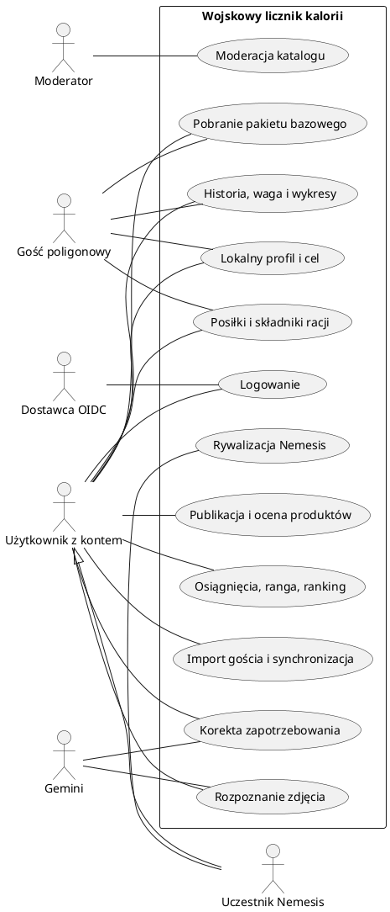

# Wojskowy licznik kalorii — wymagania projektowe

Wersja: 1.0, 9 października 2026 r. Zespół: 3 osoby.

Dokument łączy bazowy opis projektu z wymaganiami dotyczącymi trybu poligonowego, analityki, społeczności, rywalizacji i Gemini. Opisuje zakres do wykonania; nie oznacza, że aplikacja została już zaimplementowana. Parametry oznaczone jako propozycje można dostroić bez zmiany podstawowej architektury.

## 1. Cel i stos technologiczny

Celem jest rejestrowanie posiłków, wojskowych racji oraz spożytych kalorii i B/T/W (białka, tłuszczu i węglowodanów), również podczas wielodniowego braku internetu. Aplikacja wspiera obserwowanie masy ciała, realizację własnego celu oraz dobrowolną rywalizację.

| Warstwa | Technologia i zakres |
|---|---|
| Android | Kotlin, Android Studio; proponowany interfejs Jetpack Compose, ViewModel i repozytoria danych |
| Pamięć urządzenia | Room/SQLite dla dziennika, katalogu i kolejki; DataStore dla ustawień; WorkManager dla ponawiania synchronizacji |
| Backend | Python; proponowany FastAPI, REST/JSON, kontrakt OpenAPI, migracje bazy |
| Baza serwerowa | PostgreSQL; oddzielne dane aplikacji i systemu tożsamości |
| AI | Gemini wywoływany wyłącznie przez backend; model i limity konfigurowane na serwerze |
| Logowanie | Proponowany dostawca OIDC: Keycloak; Authorization Code z PKCE dla Androida; role sprawdzane przez backend |
| Repozytorium i CI/CD | GitHub, pull requesty, GitHub Actions |
| Wdrożenie | Zewnętrzny serwer/VPS z HTTPS; proponowane kontenery Docker Compose i reverse proxy |

Dostawca serwera, budżet i wersje zależności zostaną wybrane przy uruchamianiu środowiska. Pierwsze wdrożenie może działać na jednym VPS; jest to układ projektowy bez odporności na awarię całego serwera. Dokumentacja technologii znajduje się na końcu.

## 2. Aktorzy i uprawnienia

| Aktor | Dostęp |
|---|---|
| Gość poligonowy | Lokalny profil i cel, racje, podstawowe produkty, dziennik, pomiary wagi, lokalne podsumowania; bez konta i sieci |
| Użytkownik z kontem | Wszystkie własne dane, synchronizacja, katalog społeczności, Gemini, osiągnięcia i opcjonalny ranking |
| Uczestnik Nemesis | Uprawnienia użytkownika oraz dostęp do uzgodnionych statystyk konkretnej zaakceptowanej rywalizacji |
| Moderator katalogu | Obsługa zgłoszeń, korekt, ukrywania i scalania produktów; bez domyślnego dostępu do prywatnych dzienników |
| Administrator | Zarządzanie konfiguracją, kontami technicznymi, rolami i katalogiem oficjalnym |
| Systemy zewnętrzne | Dostawca logowania potwierdza tożsamość; Gemini zwraca propozycje rozpoznania i analizy |

Tryb standardowy i poligonowy to sposoby korzystania z tej samej aplikacji i dziennika. Powstaje jeden format danych, a nie dwie niezależne aplikacje. Ranga zdobywana w aplikacji nie daje uprawnień moderatora ani administratora.

## 3. Dostępność funkcji

| Funkcja | Gość offline | Konto offline | Konto online |
|---|---|---|---|
| Racje i podstawowe produkty | Baza dołączona do aplikacji/pobrana wcześniej | Tak | Tak, także aktualizacje |
| Dodawanie, edycja i usuwanie posiłków | Tak | Tak | Tak |
| Cel, waga, podsumowanie B/T/W | Lokalnie | Lokalnie | Lokalnie i na serwerze |
| Historia i wykresy 7/30/90 dni | Z własnych danych lokalnych | Z danych zapisanych/pobranych | Pełna historia serwerowa |
| Własny produkt ręczny | Lokalny szkic | Lokalny szkic | Tak, z opcją publikacji |
| Pełny katalog społeczności | Tylko uprzednio dostępny fragment | Zapisany fragment | Wyszukiwanie całego katalogu |
| Zdjęcie posiłku | Zapis lokalny do późniejszej analizy | Jak dla gościa | Analiza Gemini po zatwierdzeniu wysłania |
| Głosowanie, ranking, nowe Nemesis | Niedostępne | Ostatni pobrany stan, bez nowych działań | Tak |
| Osiągnięcia | Podgląd lokalnych warunków | Podgląd; nowe nagrody oczekują na serwer | Serwer potwierdza nagrody |
| Synchronizacja | Po zalogowaniu i przypisaniu danych | Po odzyskaniu sieci i ważnej sesji | Automatycznie i ręcznie |
| Korekta zapotrzebowania przez AI | Niedostępna | Ostatni zatwierdzony wynik | Tak |

Wygaśnięcie tokenu blokuje operacje serwerowe, ale nie blokuje zapisu do lokalnego dziennika aktywnego profilu. Brak internetu, awaria API lub Gemini nie może zatrzymywać podstawowych funkcji poligonowych.

## 4. Wymagania funkcjonalne

### WF-01. Konto i profil

- Rejestracja, logowanie, wylogowanie i odzyskanie dostępu przez dostawcę tożsamości. Backend przechowuje profil aplikacyjny powiązany z tożsamością, bez własnej bazy haseł.
- Profil: pseudonim, wzrost w cm, pomiary wagi w kg, klasa aktywności, cel: redukcja/utrzymanie/nadwyżka, dzienny cel kcal i opcjonalne cele B/T/W.
- Dodatkowe pola wymagane przez wybraną metodę szacowania zapotrzebowania, np. wiek, muszą mieć jasno opisane zastosowanie. Można samodzielnie podać cel bez korzystania z kalkulatora.
- Każda zmiana celu lub oszacowanego zapotrzebowania ma datę obowiązywania; nie przepisuje wyników wcześniejszych dni.
- Gość może prowadzić lokalny profil i później przypisać jego dane do konta. Ranking i udostępnianie statystyk są dobrowolne.

### WF-02. Personalizacja aktywności i zapotrzebowania

| Klasa | Opis profilu według założeń użytkownika |
|---|---|
| Stacjonarno-biurowa | Aktywność odpowiadająca orientacyjnie mniej niż 10 tys. kroków dziennie |
| Liniowa | Orientacyjnie 10–20 tys. kroków, średnia aktywność i sport |
| Komandos | Bardzo duża aktywność; orientacyjnie 25 tys. kroków i liczne treningi |

Są to deklarowane klasy aktywności, a nie uniwersalne limity kroków ani gotowe wartości kcal. Przy 20–25 tys. kroków użytkownik wybiera profil według całej aktywności, również treningów. Automatyczny odczyt kroków i integracja z zegarkiem pozostają poza podstawowym zakresem.

Backend wyznacza początkowe oszacowanie według jednej jawnej, wersjonowanej metody. Użytkownik może zmienić klasę i cel. W aplikacji należy odróżnić **szacowane zapotrzebowanie do utrzymania masy** od **celu spożycia**.

### WF-03. Dziennik w trybie standardowym

- Dodanie posiłku z listy produktów/potraw, ręcznie lub na podstawie zatwierdzonego rozpoznania zdjęcia.
- Posiłek ma datę, godzinę, opcjonalny typ (np. śniadanie), nazwę i składniki z gramaturą.
- Użytkownik może poprawić składniki, porcję, kcal oraz B/T/W, edytować lub usunąć wpis i oznaczyć dzień jako kompletnie zapisany.
- Aplikacja pokazuje sumę dzienną, pozostałe kcal i realizację celu. Przekroczenie celu nie blokuje zapisu.
- Wszystkie zapisy najpierw trafiają do trwałej pamięci urządzenia; wysłanie do API następuje osobno.

### WF-04. Racje żywnościowe

- Oficjalny katalog racji ma nazwę, wariant, producenta/źródło, składniki, masę i wartości odżywcze.
- Użytkownik wybiera rację, zaznacza tylko rzeczywiście zjedzone składniki i określa spożytą część, np. pół opakowania.
- Składnik można rozliczać osobno w różnych posiłkach. System nie zakłada zjedzenia całej racji po samym jej wyborze.
- Kalkulacja obejmuje tylko zjedzone ilości. Oficjalne wartości nie są zmieniane głosami użytkowników.
- Baza podstawowa obejmuje uzgodnione najpopularniejsze racje oraz produkty takie jak banany, inne owoce, batony i napoje, w tym Coca-Cola. Konkretne wartości muszą pochodzić z opisanych źródeł/etykiet; dane przykładowe oznacza się jako testowe.

### WF-05. Tryb poligonowy i pakiet danych

- Dostępny z ekranu startowego bez wymuszonego logowania, także przy pierwszym uruchomieniu bez internetu.
- Minimalny katalog jest dostarczany razem z aplikacją. Użytkownik może bez logowania pobrać jego nowszą wersję, gdy ma internet.
- Lokalne dodawanie, poprawianie i usuwanie posiłków, pomiary wagi, cel, historia i podsumowania działają po restarcie telefonu i aplikacji.
- Pakiet ma wersję, stałe identyfikatory produktów, datę i źródła. Aktualizacja jest atomowa; błąd pobrania pozostawia poprzednią poprawną wersję.
- Ekran pokazuje tryb pracy, wersję pakietu, czas ostatniej synchronizacji i liczbę oczekujących/błędnych operacji.
- Użytkownik może zablokować ruch sieciowy w trybie poligonowym. Po wyłączeniu tej blokady synchronizacja wraca automatycznie, jeśli jest konto i ważna sesja.

### WF-06. Synchronizacja bez utraty historii

- Każdy lokalny wpis otrzymuje UUID. Zmiana wpisu i dodanie operacji do kolejki następują w jednej transakcji Room.
- Kolejka obejmuje tworzenie, edycję i usuwanie posiłków, pomiary wagi, kompletność dni, lokalne szkice produktów oraz zmiany własnego celu/profilu. Publikowanie szkiców wymaga działania online.
- Przed pierwszym importem danych gościa użytkownik wybiera konto i zatwierdza ich przypisanie. Kolejne synchronizacje tego zbioru nie wymagają ponawiania zgody.
- Konto po stronie serwera jest ustalane z tokenu, nigdy z deklarowanego przez klienta identyfikatora użytkownika.
- Ponowienie operacji z tym samym identyfikatorem nie tworzy duplikatu. Za zsynchronizowaną uznaje się tylko operację potwierdzoną przez serwer.
- Zerwanie połączenia po zapisie serwerowym, a przed otrzymaniem odpowiedzi, jest obsługiwane przez bezpieczne ponowienie.
- Usunięcia są synchronizowane jako znaczniki usunięcia. Zmiany na dwóch urządzeniach są kontrolowane wersją rekordu; konflikt nie może po cichu usuwać jednej wersji.
- Przy konflikcie klient przechowuje obie wersje, pokazuje różnice i pozwala wybrać wynik. Ponawia zmianę z nową operacją i aktualną wersją bazową.
- Wylogowanie i zmiana konta nie przenoszą cudzych danych do nowego konta. Niewysłana kolejka pozostaje odseparowana pod dotychczasowym właścicielem; jej usunięcie wymaga świadomej decyzji.
- Dane lokalne są odporne na brak sieci, restart i aktualizację z poprawną migracją. Odinstalowanie lub utrata telefonu przed synchronizacją może usunąć jedyną kopię; interfejs musi jasno wskazywać wpisy istniejące tylko lokalnie.

### WF-07. Katalog społeczności i oceny

- Użytkownik tworzy produkt lub potrawę z nazwą, masą porcji oraz kcal i B/T/W. Do publikacji wymagany jest opis źródła: etykieta, przepis, własny szacunek lub AI.
- Wartości w katalogu są normalizowane do 100 g; porcja jest oddzielnym polem. Dla napojów można użyć ml, ale przeliczenie na gramy wymaga określonej gęstości, bez domyślnego utożsamiania jednostek.
- Ręcznie zapisany posiłek może zawierać same kcal; brak B/T/W jest oznaczony jako brak danych, a nie zero. Publiczny produkt bez pełnych danych jest oznaczony jako niekompletny.
- Jeden użytkownik ma jeden aktywny głos na produkt: w górę lub w dół; może go zmienić lub wycofać. Nie głosuje na własny wpis.
- Widok pokazuje osobno głosy dodatnie, ujemne, źródło i status weryfikacji. Popularność nie jest równoznaczna z potwierdzeniem poprawności.
- Zgłoszenie błędu trafia do moderatora. Zmiana katalogu nie zmienia odżywczych wartości już zapisanych posiłków.

### WF-08. Wyszukiwanie i unikanie duplikatów

- Katalog rozdziela produkt/potrawę od porcji: mały rosół i duży rosół używają tej samej definicji, lecz innej gramatury.
- Wyszukiwanie uwzględnia nazwę znormalizowaną, aliasy, markę, wariant, skład/przepis i wartości na 100 g.
- Niewielka różnica kcal sama nie tworzy nowego produktu. Także podobna liczba kcal sama nie wystarcza do automatycznego scalenia różnych potraw.
- Proponowany początkowy próg zgodności energetycznej: 10% na 100 g, stosowany wyłącznie razem ze zgodnością nazwy i składu. Jest to parametr deduplikacji, nie kryterium dietetyczne.
- Wysoka zgodność: wskazanie istniejącego produktu. Niejednoznaczność: lista kandydatów do wyboru. Brak zgodności: propozycja nowego wpisu.
- Wyraźnie różny przepis, marka lub skład może uzasadniać osobny wariant. Jednoczesne publikacje są sprawdzane ponownie przed zapisem; duplikaty można scalić z zachowaniem referencji i historii.

### WF-09. Gemini — analiza zdjęcia

1. Użytkownik robi zdjęcie lub wybiera je z galerii i akceptuje wysłanie do analizy.
2. Android zmniejsza zdjęcie i usuwa niepotrzebne metadane, w tym lokalizację. Backend sprawdza format, rozmiar i limit żądań.
3. Gemini zwraca uporządkowaną propozycję: składniki, gramatury, kcal, dostępne B/T/W, niepewność i uwagi.
4. Backend waliduje wynik i dopasowuje składniki do katalogu zgodnie z WF-08.
5. Użytkownik widzi propozycję i poprawia lub zatwierdza skład, masę i wartości. Samo wykonanie zdjęcia nie dodaje posiłku.
6. Po zatwierdzeniu aplikacja zapisuje posiłek. Brakujące produkty stają się szkicami; po zatwierdzeniu publikacji trafiają do katalogu jako szacunek AI, z ponowną kontrolą duplikatów.

Istniejący produkt nie jest nadpisywany wynikiem AI; korekta danego spożycia jest zapisana w pozycji dziennika. Backend nigdy nie przekazuje modelowi prawa do bezpośredniego zapisu bazy. Klucz Gemini nie znajduje się w APK. Przy błędzie modelu, przekroczeniu limitu lub braku internetu dostępne jest dodanie ręczne; ponowne wysłanie zdjęcia wymaga wcześniejszej zgody użytkownika na analizę.

### WF-10. Historia i analityka

- Dziennik według dni oraz wykresy dla ostatnich 7, 30 i 90 dni: masa ciała, kcal, B/T/W i realizacja celu.
- Podsumowanie okresu pokazuje średnie spożycie, liczbę kompletnych dni, liczbę dni w celu oraz zmianę masy między dostępnymi pomiarami.
- Proponowana definicja dnia w celu: kompletna deklaracja dziennika i spożycie w granicach ±10% celu obowiązującego tego dnia. Tolerancja jest wersjonowana.
- Dni bez wpisów lub niekompletne są oznaczane jako brak/niepełne dane, nie jako zerowe spożycie ani potwierdzony deficyt.
- Wykres wagi nie wymyśla pomiarów. Każdy wynik wskazuje liczbę dostępnych dni/pomiarów i aktualność synchronizacji.

### WF-11. Osiągnięcia, ranga i ranking

- Przykłady osiągnięć: 10 kolejnych dni z kompletnym dziennikiem; 10 dni realizacji celu; regularne pomiary wagi; zapis posiłków z racji.
- Przykład „10 dni powyżej 4000 kcal” można zrealizować jako osobiste osiągnięcie progowe dla użytkownika, którego ustawiony cel to uzasadnia. Samo zwiększanie spożycia nie daje dodatkowych punktów w globalnym rankingu.
- Ranga wynika z punktów za regularne prowadzenie dziennika, potwierdzone osiągnięcia i utrzymywanie własnego celu: redukcji, utrzymania lub nadwyżki.
- Propozycja punktów: 1 pkt za kompletny dzień, dodatkowy 1 pkt za dzień w celu; najwyżej 2 pkt dziennie. Pierwsze progi rang: 0/20/60/120 pkt. Nazwy rang i ostateczne progi ustala zespół.
- Większy deficyt, większa nadwyżka ani większa liczba wpisów w jednym dniu nie zwiększają punktów.
- Ranking pokazuje pseudonim, rangę, punkty i liczbę osiągnięć. Remisy rozstrzyga jednakowa pozycja; dalsze sortowanie po pseudonimie jest wyłącznie prezentacyjne.
- Serwer oblicza wynik z danych dziennika, a po korekcie wpisów przelicza zależne osiągnięcia i punkty. Wyniki offline nie są potwierdzonym wynikiem rankingowym.

### WF-12. Nemesis — rywalizacja dwóch użytkowników

- Jeden użytkownik zaprasza drugiego; rywalizacja rozpoczyna się dopiero po akceptacji i uzgodnieniu celu, okresu 7/30/90 dni oraz zakresu udostępnienia.
- W pierwszej wersji użytkownik ma najwyżej jedną aktywną rywalizację. Statusy: zaproszona, aktywna, zakończona, anulowana.
- Obaj widzą regularność, realizację własnego celu, procentową zmianę masy oraz średni szacowany deficyt/nadwyżkę. Surowa masa i dziennik posiłków nie są domyślnie udostępniane.
- Deficyt dnia [%] = 100 × (szacowane zapotrzebowanie − spożycie) / szacowane zapotrzebowanie. Wartość ujemna oznacza nadwyżkę. Obliczenie wymaga dodatniego oszacowania zapotrzebowania i kompletnego dziennika.
- Przykład 15% i 12% jest informacją porównawczą o zarejestrowanych danych, a nie automatycznym wskazaniem zwycięzcy. Obaj użytkownicy mają własne cele i wersje oszacowania zapotrzebowania.
- Proponowany wynik rywalizacji to punkty regularności i realizacji celu z WF-11 naliczone w jej okresie. Większy deficyt nie daje wyższego wyniku. Przy remisie wynik to remis.
- Niepełne dane są jawnie oznaczone. Opóźnione logi poligonowe uzupełniają statystyki. Propozycja: 7 dni na synchronizację po końcu rywalizacji; wcześniej wynik jest wstępny. Późniejsze wpisy nadal uzupełniają historię, lecz nie zmieniają zamkniętego wyniku.
- Uczestnik może zakończyć udostępnianie i anulować rywalizację. Bez zgody drugiej strony nie ma dostępu do jej danych.

### WF-13. Gemini — aktualizacja zapotrzebowania

- Backend analizuje trend wagi, kompletność dziennika, realizację celu i dotychczasową klasę aktywności; Gemini pomaga interpretować wynik i proponować korektę.
- Proponowany warunek początkowy: co najmniej 14 dni obserwacji, 10 kompletnych dni dziennika i 4 pomiary wagi. Progi wymagają strojenia; brak danych skutkuje brakiem korekty.
- Użytkownik otrzymuje propozycję klasy i zapotrzebowania, uzasadnienie, zakres dat i informację o niepewności. Może ją przyjąć lub odrzucić.
- Opcjonalny tryb automatyczny wymaga wcześniejszego włączenia przez użytkownika. Granice zmian i częstotliwość ustala wersjonowana konfiguracja backendu; każda zmiana jest zapisana i widoczna, z możliwością powrotu do poprzedniej.
- Propozycja granic technicznych: nie częściej niż raz na 14 dni i najwyżej 5% korekty oszacowania na cykl. Są to ograniczenia automatyzacji, nie zalecenie dotyczące diety.
- Zmiana oszacowania nie zmienia wstecz historii. Samo skorygowanie kategorii nie przestawia celu kalorycznego bez zatwierdzenia lub uprzednio wybranej reguły automatycznej.
- Walidacja i zapis należą do backendu. Gdy model zwróci niespójny wynik, obowiązuje poprzednia konfiguracja.

## 5. Przypadki użycia — opis tekstowy

| ID | Aktor i cel | Przebieg podstawowy | Wyjątek / rezultat |
|---|---|---|---|
| UC-01 | Gość: uruchomić tryb poligonowy | Wybiera tryb, ustawia lokalny profil i cel | Brak sieci/konta nie blokuje działania |
| UC-02 | Użytkownik: utworzyć konto i zalogować się | Otwiera logowanie dostawcy, wraca do aplikacji, pobiera własny profil | Anulowanie/błąd pozostawia możliwość działania lokalnego |
| UC-03 | Gość: przypisać historię do konta | Loguje się, widzi liczbę wpisów, zatwierdza konto docelowe | Zbiór jest przypisany raz; ponowienie nie duplikuje wpisów |
| UC-04 | Użytkownik/gość: ustawić profil i cel | Wprowadza wzrost, wagę, klasę i cel z datą obowiązywania | Niepoprawne wartości wymagają poprawy |
| UC-05 | Użytkownik/gość: dodać zwykły posiłek | Wyszukuje produkt, podaje ilość, zatwierdza | Zapis lokalny i natychmiastowe podsumowanie |
| UC-06 | Użytkownik/gość: rozliczyć rację | Wybiera rację, składniki i rzeczywiście zjedzone części | Niezaznaczone składniki nie zwiększają sumy |
| UC-07 | Użytkownik/gość: poprawić dziennik | Edytuje/usuwa wpis albo oznacza dzień jako kompletny | Zmiana trafia do kolejki; podsumowanie jest przeliczone |
| UC-08 | Użytkownik/gość: zapisać wagę | Podaje pomiar i jego datę | Wykres korzysta z faktycznych pomiarów |
| UC-09 | Użytkownik/gość: zobaczyć postęp | Wybiera okres 7/30/90 dni i wykres | Braki danych są widoczne; offline zakres zależy od pamięci lokalnej |
| UC-10 | Użytkownik/gość: pobrać pakiet bazowy | Przy dostępnej sieci sprawdza i pobiera wersję katalogu | Nieudana aktualizacja nie usuwa poprzedniego pakietu |
| UC-11 | Użytkownik: zsynchronizować dane | Aplikacja wysyła kolejkę, odbiera potwierdzenia i zmiany | Przy 401 prosi o logowanie; przy braku sieci zachowuje kolejkę |
| UC-12 | Użytkownik: rozwiązać konflikt | Porównuje wersję lokalną i serwerową, wybiera wynik | Bez decyzji obie wersje pozostają zachowane |
| UC-13 | Użytkownik: rozpoznać zdjęcie | Wybiera/robi zdjęcie, wysyła, poprawia propozycję, zatwierdza | Błąd AI umożliwia ręczny wpis; wynik bez akceptacji jest szkicem |
| UC-14 | Użytkownik: opublikować produkt | Uzupełnia dane, sprawdza podobne wpisy, zatwierdza publikację | Istniejący produkt jest używany zamiast duplikatu |
| UC-15 | Użytkownik: ocenić/zgłosić produkt | Daje jeden głos albo wskazuje problem | Zmiana głosu zastępuje poprzedni; zgłoszenie trafia do moderatora |
| UC-16 | Użytkownik: zobaczyć osiągnięcia i ranking | Otwiera własne nagrody i dobrowolny ranking | Offline widzi stan lokalny/pobrany z datą aktualizacji |
| UC-17 | Uczestnicy: rozpocząć Nemesis | Zaproszenie, uzgodnienie celu/okresu, akceptacja drugiej strony | Odrzucenie nie rozpoczyna rywalizacji |
| UC-18 | Uczestnik: śledzić/zakończyć Nemesis | Ogląda dozwolone porównanie lub anuluje udostępnianie | Brak zgody blokuje dostęp; końcowy wynik ma status wstępny/ostateczny |
| UC-19 | Użytkownik: dopasować zapotrzebowanie | Otwiera analizę, przyjmuje/odrzuca korektę lub włącza automat | Niepełne dane/błąd AI pozostawiają dotychczasowe ustawienia |
| UC-20 | Moderator: uporządkować katalog | Weryfikuje zgłoszenie, poprawia, ukrywa lub scala produkt | Referencje i historyczne wartości posiłków pozostają zachowane |

### Schemat przypadków użycia (UML / PlantUML)

Kod można otworzyć w dowolnym rendererze PlantUML. Przedstawia główne grupy przypadków; szczegóły opisuje tabela powyżej.

## 6. Model danych i wspólne reguły

| Encja | Najważniejsze dane / relacje |
|---|---|
| UserProfile | UUID, para issuer + subject dostawcy OIDC, pseudonim, wzrost, preferencje i zgody |
| GoalVersion | Użytkownik, cel kcal/B/T/W, typ celu, klasa i oszacowane zapotrzebowanie, okres obowiązywania, źródło zmiany |
| WeightEntry | UUID, użytkownik, kg, czas pomiaru, wersja, znacznik usunięcia |
| Product / ProductVersion | Nazwa, aliasy, marka/przepis, jednostka, kcal/B/T/W na 100 g, źródło, status i wersja |
| Ration / RationComponent | Racja, wariant, składniki, referencje produktów i masa opakowań |
| MealEntry / MealItem | UUID, właściciel, czas i lokalna data, składniki, spożyta masa, zapisane wartości odżywcze i wersja |
| DiaryDay | Użytkownik, lokalna data, status kompletności; kompletność synchronizowana jak inne dane użytkownika |
| ProductVote / ProductReport | Autor, produkt, wartość głosu albo opis zgłoszenia; unikalny głos autora na produkt |
| Achievement / UserAchievement | Wersjonowana reguła, nagroda użytkownika i powiązany okres |
| NemesisChallenge | Dwoje uczestników, cel, okres, strefa rozliczania, zgody, wersja zasad, status i wynik |
| AIAnalysis / EnergyAdjustment | Autor, rodzaj analizy, wersja modelu/reguł, propozycja, zatwierdzenie, daty i uzasadnienie |
| SyncOperation / ChangeLog | Op ID, właściciel, typ i ID encji, wersja bazowa, wynik; monotoniczny kursor zmian serwerowych |
| OfflinePackage | Wersja katalogu, format, źródła, suma kontrolna i data publikacji |

- Room przechowuje lokalne odpowiedniki danych potrzebnych offline, osobne zbiory gościa/kont, katalog i trwałą kolejkę `outbox`.
- `MealItem` zapisuje odżywczy obraz spożycia: masę, zastosowane wartości oraz ewentualną ręczną korektę. Aktualizacja/scalenie produktu nie przelicza historii.
- Dla produktu z wartościami na 100 g: wartość porcji = wartość na 100 g × spożyte gramy / 100. Brak wartości oznacza `null`; sumy B/T/W pokazują wtedy, że są niepełne.
- Czas przesyłany w ISO 8601/UTC wraz ze strefą IANA i zapisaną lokalną datą. Dziennik używa daty spożycia, nie daty synchronizacji; Nemesis używa jednej strefy uzgodnionej przy rozpoczęciu.
- Backend używa stałej precyzji liczbowej. Propozycja prezentacji: kcal do liczby całkowitej, makra do 0,1 g; obliczenia zachowują większą precyzję. API i Android mają wspólne przykłady obliczeń i zaokrągleń.
- Osiągnięcia i rankingi oblicza serwer, ponownie po istotnej korekcie dziennika; klient nie przesyła gotowych punktów jako wiążącego wyniku.

## 7. Kontrakt API do podziału pracy

Wersja początkowa `/api/v1`. Backend dostarcza OpenAPI i przykładowe odpowiedzi przed integracją mobilną. Poniższe ścieżki są projektem kontraktu do implementacji, a nie opisem działającego serwera.

| Obszar | Operacje |
|---|---|
| Profil | `GET /me`, `PATCH /me`, `GET /me/goals`, `POST /me/goals` |
| Katalog | `GET /products?query=...`, `GET /products/{id}`, `POST /products`, `POST /products/matches` |
| Racje i pakiet | `GET /rations`, `GET /rations/{id}`, `GET /offline-package/manifest`, `GET /offline-package/{version}` |
| Dziennik | `GET /me/meals?from=...&to=...`, `GET /me/weights?from=...&to=...` |
| Synchronizacja | `POST /sync/push`, `GET /sync/pull?cursor=...` |
| Zdjęcia AI | `POST /ai/meal-analyses`, `GET /ai/meal-analyses/{id}`, `POST /ai/meal-analyses/{id}/confirm` |
| Zapotrzebowanie AI | `POST /ai/energy-analyses`, `GET /ai/energy-analyses/{id}`, `POST /ai/energy-analyses/{id}/decision` |
| Oceny i zgłoszenia | `PUT /products/{id}/vote`, `DELETE /products/{id}/vote`, `POST /products/{id}/reports` |
| Statystyki | `GET /me/statistics?days=7|30|90`, `GET /me/achievements`, `GET /leaderboard` |
| Nemesis | `POST /nemesis`, `GET /me/nemesis`, `POST /nemesis/{id}/accept`, `POST /nemesis/{id}/cancel`, `GET /nemesis/{id}/statistics` |
| Moderacja | `GET /moderation/reports`, `PATCH /moderation/products/{id}`, `POST /moderation/products/{id}/merge` |
| Techniczne | `/health/live`, `/health/ready`; metryki dostępne wyłącznie dla infrastruktury |

Pakiet bazowy jest publiczny do odczytu. Pozostałe dane użytkowników wymagają access tokenu i kontroli właściciela/roli. Nie powstaje własny endpoint przyjmujący hasło do logowania.

### Protokół synchronizacji

Każda operacja `push` zawiera `operation_id`, `entity_type`, `entity_id`, `action`, `base_revision` i `payload`. Właściciel kolejki jest sprawdzany lokalnie przed wysyłką, a właściciel danych na serwerze wynika z tokenu. Nowy rekord ma pustą wersję bazową.

Backend zwraca wynik osobno dla każdej operacji: `accepted`, `already_applied`, `conflict` albo `rejected`, aktualną wersję oraz dane potrzebne do rozwiązania konfliktu. Zapis encji i wyniku operacji odbywa się w jednej transakcji PostgreSQL. Ten sam identyfikator z inną treścią jest błędem, a nie nową operacją. Kolejka zachowuje kolejność zmian tej samej encji.

`pull` zwraca stronicowane zmiany i usunięcia z kursorem opartym na sekwencji serwerowej, nie na zegarze telefonu. Klient zapisuje stronę i kursor w jednej transakcji. Przeterminowany kursor powoduje pełne pobranie stanu z zachowaniem niewysłanych operacji lokalnych. Retencja znaczników usunięcia i wyników operacji musi obsługiwać uzgodniony maksymalny okres offline; propozycja początkowa: 90 dni.

Wszystkie zmiany posiłków, wagi, kompletności dni i celu z Androida przechodzą przez wspólny protokół synchronizacji. Potwierdzenie analizy AI zwraca zatwierdzony szkic i referencje produktów; zapis dziennika nadal idzie przez tę samą kolejkę, aby uniknąć drugiego niezależnego zapisu.

Błędy API mają spójne pola `code`, `message`, `details`, `request_id`. Statusy: 401 — ponowne logowanie, 403 — brak uprawnień, 409 — konflikt, 422 — błędne dane, 429 — limit, 5xx — błąd serwera. Obsługa ponowień respektuje limity i opóźnienia; trwały błąd walidacji nie jest ponawiany bez końca.

## 8. Podział odpowiedzialności między trzy osoby

### Osoba 1 — aplikacja mobilna i pamięć lokalna

**Odpowiada za WF-01–13 po stronie Androida oraz UC-01–19 w interfejsie.**

- Projekt ekranów i nawigacji: start/tryb, profil/cel, dziennik, wybór racji, katalog, zdjęcie i korekta, historia/wykresy, osiągnięcia/ranking, Nemesis, ustawienia/synchronizacja.
- Kotlin: stan ekranów, walidacja, obliczenia porcji, prezentacja niepełnych danych i błędów API.
- Room: schemat, migracje, dane startowe, transakcje dziennik + kolejka, izolacja kont i gościa.
- WorkManager: synchronizacja po spełnieniu warunków sieci/sesji, ponawianie, ręczne uruchomienie, konflikty i widoczny stan kolejki.
- Integracja OIDC przez bibliotekę klienta, przeglądarkę systemową i PKCE; bez sekretu klienta w APK. Tokeny chronione z wykorzystaniem Android Keystore.
- Aparat/galeria, obsługa odmowy uprawnień, przygotowanie zdjęcia i zgoda na analizę. Brak sieci pozostawia zdjęcie/szkic lokalnie.
- Integracja API; aplikacja czyta dane dziennika z lokalnego repozytorium. Serwer aktualizuje jego stan poprzez synchronizację.
- Testy trwałości danych, obliczeń, migracji, konfliktów i krytycznych przepływów; wydanie APK do demonstracji.

**Dostarcza:** kod Androida, działający tryb poligonowy, ekrany wszystkich funkcji, testy i instrukcję uruchomienia. Otrzymuje od osoby 2 OpenAPI i dane testowe, a od osoby 3 adresy środowisk i konfigurację logowania.

### Osoba 2 — backend Python, PostgreSQL i integracje

**Odpowiada za reguły biznesowe WF-01–13, API, UC-20 i poprawność danych serwerowych.**

- Model PostgreSQL, migracje, ograniczenia integralności, dane startowe racji/produktów wraz ze źródłami.
- FastAPI lub uzgodniony framework Python: endpointy, OpenAPI, walidacja, stronicowanie i wspólne błędy.
- Weryfikacja access tokenów: podpis, dozwolony algorytm, issuer, audience, czas ważności, klucze JWKS; autoryzacja właściciela i ról. ID token nie służy do wywołań API.
- Synchronizacja: idempotencja, wersjonowanie, konflikty, kursory, usunięcia, transakcje i izolacja danych użytkowników.
- Wersjonowany pakiet offline, wyszukiwanie i dopasowanie produktów, głosy, zgłoszenia oraz minimalna obsługa moderacji przez zabezpieczone API.
- Gemini: adapter API, walidacja odpowiedzi, dopasowanie produktów, limity użytkownika, śledzenie zużycia i obsługa błędów. Zlecenia AI mają trwały stan; wymagające czasu zadania obsługuje proces roboczy.
- Statystyki 7/30/90 dni, kompletność dziennika, wersje celów, osiągnięcia, punkty, rangi i Nemesis z kontrolą zgód.
- Korekty zapotrzebowania: reguły, walidacja, wersjonowanie, uzasadnienie, zgody i historia zmian.
- Testy integracyjne z PostgreSQL, testy autoryzacji między kontami i kontraktu synchronizacji; mock Gemini w CI.

**Dostarcza:** kod Python, migracje, OpenAPI, seed katalogu, testy i dokumentację zasad. Uzgadnia z osobą 1 format synchronizacji; z osobą 3 sposób uruchamiania usług i zadania okresowe.

### Osoba 3 — DevOps, GitHub i wdrożenie

**Odpowiada za środowiska, CI/CD i operacyjną dostępność usług.**

- Repozytorium GitHub: proponowany monorepo z `/android`, `/backend`, `/infra`, `/docs`; chroniona główna gałąź i wymagane kontrole PR.
- Lokalny Docker Compose oraz oddzielne konfiguracje testowej i docelowej instalacji na zewnętrznym serwerze.
- Uruchomienie API, procesu roboczego, PostgreSQL, dostawcy logowania i reverse proxy z HTTPS. Baza nie jest publicznie dostępna.
- Konfiguracja dostawcy OIDC: środowiska/realmy, publiczny klient Androida z wymaganym PKCE S256, audience API, role, dokładne adresy powrotu i obsługa poczty do odzyskiwania konta. Hasła nie trafiają do aplikacji ani backendu.
- Sekrety bazy, Gemini, poczty, wdrożeń i podpisywania APK przechowywane poza repozytorium; kontrolowany dostęp i rotacja. Konfiguracja wersjonowana bez sekretów.
- GitHub Actions: Android — kompilacja, lint i testy; Python — lint i testy z testowym PostgreSQL; następnie budowa oznaczonego obrazu i publikacja artefaktów.
- PR uruchamia sprawdzenia bez dostępu do sekretów produkcyjnych. Testy CI nie wykonują płatnych wywołań Gemini.
- Wdrożenie testowe po scaleniu; docelowe z wersjonowanego wydania, z kontrolowanym zatwierdzeniem w GitHub. Przed migracją kopia bazy; po wdrożeniu test gotowości i podstawowy test działania.
- Procedura wycofania obrazu i osobna procedura awarii migracji danych. Sam powrót do starego obrazu nie gwarantuje odwrócenia migracji.
- Kopie PostgreSQL aplikacji i systemu tożsamości, przechowywane również poza serwerem; co najmniej jedna sprawdzona procedura odtworzenia.
- Monitoring dostępności, błędów, czasu odpowiedzi, dysku, zadań synchronizacji, procesu roboczego i kosztu/liczby analiz AI; alerty na awarie i przekroczenie limitów.
- Instrukcja konfiguracji, wdrożenia, odtwarzania, aktualizacji i obsługi awarii. Publikacja w Google Play jest osobnym zadaniem; zakres podstawowy obejmuje APK.

**Dostarcza:** pliki infrastruktury, workflowy GitHub Actions, działające środowisko, kopie i instrukcje operacyjne. Kod reguł, migracji i zadań okresowych tworzy osoba 2; ich uruchamianie i monitoring zapewnia osoba 3.

### Wspólne punkty styku

| Temat | Osoba 1 | Osoba 2 | Osoba 3 |
|---|---|---|---|
| Offline/synchronizacja | Room, kolejka, ekran konfliktów | Protokół, wersje i idempotencja | Dostępność i monitoring API |
| Logowanie | Klient Android i tokeny | Walidacja tokenów i dostęp do danych | Konfiguracja dostawcy i domen |
| Racje/katalog | Wybór i obliczenie porcji | Źródła, dane, wersje i deduplikacja | Dostarczanie pakietu i kopie |
| Gemini | Zdjęcie, zgoda i korekta | Analiza, walidacja i dopasowanie | Sekrety, proces roboczy i limity kosztu |
| Nemesis/ranking | Widoki, zaproszenia, zgody | Punktacja i kontrola udostępniania | Harmonogram i monitoring |
| Wydanie | Poprawna aplikacja i testy | Poprawne API i migracje | Pipeline, deploy i odtworzenie |

## 9. Kolejność realizacji

1. **Fundamenty:** uzgodnić model, kontrakt API/sync i wspólne obliczenia; uruchomić repozytorium i CI. Osoba 1 implementuje lokalny dziennik na danych testowych, osoba 2 schemat/API, osoba 3 środowisko.
2. **Rdzeń offline i konta:** gotowy pakiet startowy, racje, posiłki, profil, cel, waga oraz synchronizacja i logowanie. Odbiór: 14 dni wpisów offline, następnie poprawny import do konta bez duplikatów.
3. **Historia, katalog i AI:** wykresy 7/30/90 dni, produkty społeczności, oceny, deduplikacja, zdjęcie i ręczna korekta wyniku.
4. **Motywacja i dopasowanie:** osiągnięcia, rangi, ranking, Nemesis oraz korekty zapotrzebowania z wersjonowaniem.
5. **Odbiór całości:** scenariusze poniżej, wydanie APK, wdrożenie serwerowe, kontrola kopii i komplet instrukcji.

Etap 2 jest pierwszą użyteczną wersją. Etapy 3–5 pozostają częścią pełnego zamówionego zakresu. Nie ustalono terminu końcowego; zespół estymuje zadania po akceptacji kontraktu i wyborze infrastruktury.

## 10. Kryteria odbioru i wymagania niefunkcjonalne

| ID | Scenariusz / oczekiwany wynik |
|---|---|
| KO-01 | Nowa instalacja w trybie samolotowym: gość dodaje banan i składnik racji; po restarcie wpisy i suma pozostają |
| KO-02 | Częściowa racja: zjedzenie połowy jednego składnika i całego drugiego daje dokładną sumę tych ilości |
| KO-03 | 14 dni offline: posiłki, edycje, usunięcia, kompletność dni i pomiary po logowaniu trafiają na serwer z pierwotnymi datami |
| KO-04 | Ten sam push wysłany trzy razy, także po utracie odpowiedzi: jeden wpis, jedna zmiana punktacji |
| KO-05 | Wygaśnięcie sesji nie blokuje lokalnego zapisu; synchronizacja wznowiona po ponownym logowaniu |
| KO-06 | Równoczesna edycja na dwóch urządzeniach: konflikt widoczny, obie wersje zachowane do decyzji |
| KO-07 | Zmiana konta: wpisy i kolejka konta A nie zostają wysłane na konto B |
| KO-08 | Przerwana aktualizacja katalogu lub migracja aplikacji: dotychczasowy katalog i niewysłane logi pozostają dostępne |
| KO-09 | Mały i duży rosół oraz drobna różnica kcal: wspólny produkt i różna masa; inny przepis nie jest scalany samą zgodnością kcal |
| KO-10 | Zdjęcie z rozpoznaniem błędnym, timeoutem lub brakiem B/T/W: użytkownik może poprawić wynik lub wpisać ręcznie, bez cichego zapisu |
| KO-11 | Historia z brakującymi dniami: brak danych nie jest wyświetlany jako zero kcal lub potwierdzony deficyt |
| KO-12 | Zmiana celu dziś nie zmienia realizacji celu wczoraj; aktualizacja katalogu nie zmienia kcal historycznego posiłku |
| KO-13 | Zmiana głosu nie zwiększa liczby głosujących; cudze konto nie może zmienić własności głosu ani posiłku |
| KO-14 | Nemesis bez akceptacji nie ujawnia statystyk; większy deficyt nie daje dodatkowych punktów; anulowanie odcina dalszy dostęp |
| KO-15 | Korekta AI: za mało danych oznacza brak zmiany; zaakceptowana korekta ma uzasadnienie i datę, a automat respektuje ustawione granice |
| KO-16 | PR przechodzi CI; wydanie uruchamia się na serwerze przez HTTPS; brak kluczy/sekretów w repozytorium, logach i APK |
| KO-17 | Odtworzenie kopii na środowisku testowym przywraca dziennik, katalog i konfigurację tożsamości |

Dodatkowe wymagania:

- Interfejs w języku polskim, czytelne jednostki i stany: lokalny, oczekujący, zsynchronizowany, konflikt, błąd. Działanie podstawowe nie zależy od AI.
- Propozycja celu wydajności: zapis lokalny do 1 s i typowe żądanie API bez AI do 2 s dla 95% żądań, w uzgodnionym teście na środowisku docelowym; pomiar uwzględnia oddzielnie sieć.
- Analizy AI mają limit czasu, status przetwarzania i możliwość powrotu do ręcznego wpisu. Limity zdjęć i użytkownika są konfigurowane oraz dokumentowane przed integracją.
- Logi techniczne nie zawierają haseł, tokenów, zdjęć ani całych prywatnych dzienników. Dane dostępne są tylko uprawnionym osobom; API sprawdza własność każdego zasobu.
- Propozycja retencji zdjęć: usuwanie po analizie lub najpóźniej po 24 h; trwały zapis zdjęcia wymaga osobno określonej funkcji i zgody. Dane wysyłane Gemini ogranicza się do potrzeb analizy.
- Propozycja kopii: codziennie, historia 14 dni, sprawdzenie odtworzenia przed odbiorem. Docelowe RPO 24 h i RTO 4 h są celami projektowymi do potwierdzenia testem.
- Zmiany schematów Room/PostgreSQL zachowują dane. Wydanie obejmuje instrukcję uruchomienia, konfigurację bez sekretów, OpenAPI, źródła katalogu i znane ograniczenia.

## 11. Decyzje pozostające do doprecyzowania

Nie blokują przygotowania podstawowego dziennika i kontraktu:

- Nazwy i warianty racji w pierwszym pakiecie oraz wiarygodne źródła ich wartości.
- Dostawca i budżet serwera, domena, SMTP oraz limity kosztów Gemini.
- Minimalna wersja Androida i urządzenia testowe; wersje bibliotek oraz modelu Gemini dobierane przy implementacji.
- Metoda początkowego szacowania zapotrzebowania, dodatkowe pola profilu i parametry adaptacji.
- Finalne nazwy rang, lista osiągnięć, progi punktowe i okno końcowego rozliczenia Nemesis.

Poza podstawowym zakresem: iOS, zegarki/automatyczny odczyt kroków, analiza obrazu offline na urządzeniu, czat między użytkownikami, panel dowódczy, integracja z wojskowymi systemami organizacji i publikacja sklepowa. Można je dodać jako oddzielne zadania.

## 12. Dokumentacja źródłowa wyborów technicznych

Wymagania biznesowe pochodzą z rozmowy. Poniższe źródła potwierdzają techniczne wzorce proponowane w dokumencie; nie stanowią źródła wartości odżywczych ani zasad dietetycznych.

- Lokalna warstwa danych i synchronizacja: [Android — offline-first](https://developer.android.com/topic/architecture/data-layer/offline-first), [Room](https://developer.android.com/training/data-storage/room).
- Backend i kontrakt API: [FastAPI](https://fastapi.tiangolo.com/).
- Logowanie mobilne: [RFC 8252 — OAuth 2.0 for Native Apps](https://www.rfc-editor.org/rfc/rfc8252), [AppAuth-Android](https://github.com/openid/AppAuth-Android).
- OIDC, endpointy i weryfikacja kluczy: [Keycloak OIDC](https://www.keycloak.org/securing-apps/oidc-layers); konfiguracja PKCE: [Keycloak Server Administration Guide](https://www.keycloak.org/docs/latest/server_admin/index.html).
- Gdy potrzebne będą konta istniejącej organizacji: [AD a Microsoft Entra ID](https://learn.microsoft.com/en-us/entra/fundamentals/compare). Wariant dla samodzielnej rejestracji zewnętrznych użytkowników: [Microsoft Entra External ID](https://learn.microsoft.com/en-us/entra/external-id/external-identities-overview). Jest to alternatywa wdrożeniowa, nie drugi obowiązkowy system logowania.
- Sekrety CI/CD: [GitHub Actions — using secrets](https://docs.github.com/en/actions/how-tos/write-workflows/choose-what-workflows-do/use-secrets).
