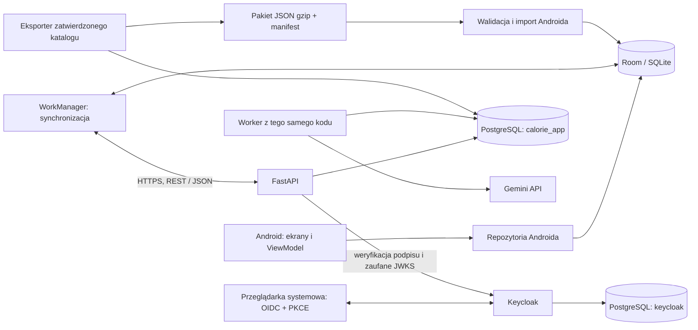

# Architektura systemu — wersja 1 - osoba 2

Status: decyzje do implementacji, 9 października 2026 r. Zakres naszej pracy: **Osoba 2 — backend, dane i integracje**. Reguły funkcjonalne i limity obowiązują zgodnie z [wymaganiami](../WYMAGANIA_PROJEKTOWE.md); ten dokument ustala ich realizację techniczną. [Plan etapów](PLAN_PRAC.md) określa kolejność, a [workflow](WORKFLOW.md) sposób dostarczania zmian.

## 1. Decyzja o bazach i JSON

**Serwer: PostgreSQL. Telefon: Room/SQLite. JSON: format wymiany i pakiet katalogu.** Wszystkie trzy mają odrębne zadanie.

| Dane | Gdzie są przechowywane | Kto zapisuje / kto odpowiada |
|---|---|---|
| Login, e-mail logowania, hasła w postaci obsługiwanej przez dostawcę, sesje, role | PostgreSQL, baza `keycloak` | Wyłącznie Keycloak; konfiguracja i utrzymanie: Osoba 3 |
| Konto aplikacyjne, profil, cele, waga, dziennik, zgody | PostgreSQL, baza `calorie_app` | API i worker przez usługi backendu; model i reguły: Osoba 2 |
| Produkty, wartości odżywcze, źródła, wersje, racje i ich składniki | Ta sama baza `calorie_app`, osobne tabele katalogu | Backend; oficjalne dane publikuje uprawniony administrator, katalog społeczności podlega moderacji |
| Synchronizacja, potwierdzenia operacji, konflikty serwerowe, zadania, naliczenia i limity AI | `calorie_app` | Backend i worker, z transakcjami i ograniczeniami unikalności |
| Racje i produkty dostępne offline, dziennik, profil gościa/konta, lokalna kolejka zmian | Jedna lokalna baza Room/SQLite `calorie_local.db` | Repozytoria danych Androida; implementacja: Osoba 1 |
| Pakiet startowy i aktualizacja oficjalnego katalogu | Wersjonowany plik JSON skompresowany gzip; po imporcie rekordy w Room | Osoba 2 generuje i waliduje, Osoba 3 udostępnia, Osoba 1 importuje |
| Ustawienia urządzenia, np. motyw i blokada sieci | DataStore | Android; nie jest tam przechowywany dziennik ani outbox |
| Tokeny sesji Androida | Prywatny magazyn aplikacji, szyfrowany kluczem z Android Keystore | Biblioteka OIDC i warstwa sesji; bez tokenów w logach, zwykłym JSON i katalogu |
| Zdjęcia oczekujące na analizę | Prywatne pliki aplikacji / krótkotrwały prywatny magazyn serwera | W bazie wyłącznie metadane, właściciel i termin usunięcia |

Na początek jedna instancja PostgreSQL obsługuje **dwie oddzielne bazy logiczne**, z osobnymi użytkownikami technicznymi. Produkty i profile pozostają w jednej bazie aplikacji: potrzebujemy relacji, transakcji i wspólnych migracji. Nie wprowadzamy osobnej bazy produktów, MongoDB ani Redis w v1. W razie wzrostu ruchu instancje można później rozdzielić bez zmiany kontraktu Androida.

Dane dev, test i produkcyjne są odseparowane: osobne bazy, konta techniczne, realmy i sekrety. Dwie bazy opisują układ **jednego środowiska**, a nie wspólny magazyn wszystkich środowisk. Jedna instancja na VPS jest wspólnym punktem awarii; kopia poza VPS i próba odtworzenia są warunkiem wydania.

### Właściciel danych i uprawnienia

- `keycloak` ma własnego użytkownika DB. Backend nie czyta ani nie modyfikuje jego tabel. Konto wiąże przez zweryfikowaną parę `(issuer, sub)`, nigdy przez e-mail jako klucz relacji.
- `calorie_app_migrator` posiada schemat i wykonuje DDL. `calorie_app_api` i `calorie_app_worker` mają tylko potrzebne prawa wykonawcze; nie są superuserami i nie wykonują migracji przy starcie każdego procesu.
- Schemat aplikacji to `app`; nie tworzymy osobnej bazy dla każdego modułu. Wspólny PostgreSQL pozwala atomowo zapisać np. posiłek, rewizję, wynik sync i projekcję Nemesis.
- Każda tabela prywatna ma `owner_id` lub jednoznaczny łańcuch własności. Repozytoria wymagają kontekstu konta z tokenu, a testy A/B sprawdzają izolację. Złożone FK, np. `(owner_id, meal_id)`, zapobiegają podpięciu pozycji do posiłku innego konta. Przypadki współdzielone, np. Nemesis, mają osobne reguły zgody i uczestnictwa.
- Port DB nie jest publiczny. W lokalnym środowisku port diagnostyczny można udostępnić wyłącznie na localhost. Dostęp użytkowników aplikacji odbywa się przez API lub Keycloak, nigdy przez połączenie SQL z telefonu.

## 2. Elementy systemu



API i worker to dwa procesy **jednej modularnej aplikacji**. Moduły komunikują się przez funkcje/usługi wewnątrz procesu i jedną bazę; nie uruchamiamy osobnych mikroserwisów do profili, posiłków czy rankingu. Ten wybór ułatwia transakcje i utrzymanie przez trzy osoby.

Przeglądarka obsługuje logowanie, a Android przekazuje API access token. Klucz Gemini Free Tier występuje tylko po stronie serwera, w projekcie bez aktywnego billing. Wydanie funkcji użytkownikom w Polsce ma ograniczenie warunków dostawcy opisane w wymaganiach 11.6. Brak Gemini ogranicza funkcję AI; brak serwera nie zatrzymuje lokalnego dziennika.

## 3. Moduły backendu i granice odpowiedzialności

| Moduł | Odpowiedzialność | Reguła graniczna |
|---|---|---|
| `identity` | Walidacja OIDC, konto aplikacyjne, bootstrap, role, stan usuwania | Nie przechowuje haseł; adapter administracyjny Keycloak ma minimalny zakres praw |
| `profiles` | Profil, wersje celów i oszacowania, zgody | Zgody online nie są nadpisywane starszym profilem offline |
| `catalog` | Produkty, wersje, źródła, racje, pakiety, wyszukiwanie i moderacja | Oficjalny katalog ma osobny proces publikacji; prywatny szkic nie jest publicznym produktem |
| `diary` | Posiłki, pozycje, waga, kompletność dnia i obliczenia | Pozycja przechowuje zastosowane wartości odżywcze |
| `sync` | Push/pull, rewizje, checkpointy, snapshot, idempotencja i retencja | Koordynuje transakcję, ale wywołuje walidację modułu domenowego |
| `analytics` | Statystyki, punkty, odznaki i rankingi | Wylicza wyniki z danych, nie akceptuje punktów dostarczonych przez klienta |
| `nemesis` | Zaproszenia, zgody, projekcje dzienne, finalizacja | Projekcje są zapisywane razem ze zmianą źródłową przed terminem |
| `ai` | Zlecenia, adapter Gemini, schemat wyniku, limity i zużycie darmowej puli | Wynik modelu jest danymi do walidacji; nie wykonuje SQL ani poleceń modelu |
| `jobs` | Trwała kolejka, dzierżawy, harmonogramy i retry | Przejęcie zadania nie pozwala staremu workerowi zapisać wyniku |

Przepływ żądania: **router HTTP → schemat wejścia → usługa przypadku użycia → repozytorium SQLAlchemy → transakcja PostgreSQL**. Router obsługuje transport i kontekst konta; reguły nie są kopiowane do endpointów. Usługa określa granicę transakcji; repozytorium nie wykonuje samodzielnego commit ukrytego przed usługą. Wspólne kalkulacje używają Decimal, a Android BigDecimal i tych samych wektorów obliczeń.

Docelowy układ repozytorium (katalogi kodu powstaną w etapach implementacji):

```text
android/                      # Osoba 1
backend/                      # Osoba 2
  pyproject.toml, uv.lock
  src/calorie_app/
    main.py, worker.py
    core/                     # konfiguracja, błędy, kontekst żądania
    db/                       # sesje i granice transakcji
    modules/<nazwa_modulu>/    # routery, schemas, services, models, repositories
    integrations/             # Keycloak i Gemini
  migrations/                 # Alembic
  tests/unit/, integration/, contract/
  data/demo/, data/catalog/   # wyraźnie rozdzielone dane testowe i źródła katalogu
contracts/                    # OpenAPI, JSON Schema i przykłady integracyjne
infra/                        # Osoba 3
docs/                         # wspólna dokumentacja
.github/workflows/            # CI/CD: Osoba 3, kontrole backendu: Osoba 2
```

## 4. Model danych i trwałość historii

Kluczowe grupy tabel w `calorie_app`:

| Grupa | Główne tabele i ograniczenia |
|---|---|
| Tożsamość aplikacji | `user_accounts`: UUID, unikalne `(issuer, subject)`, stan i generacja; `user_profiles`: relacja 1:1 z kontem; `user_consents`: wersja, rodzaj, stan, czas |
| Cele / dziennik | `goal_versions`, `meal_entries`, `meal_items`, `weight_entries`, `diary_days`; właściciel, rewizja, daty, znaczniki usunięcia; unikalność dnia na konto |
| Katalog | `products`, `product_versions`, `product_sources`, `rations`, `ration_versions`, `ration_components`; FK do dokładnej wersji produktu, jawna ilość i jednostka |
| Pakiety | `offline_packages`, `offline_package_items`; publikacja wskazuje konkretny zestaw niezmiennych wersji |
| Synchronizacja | `sync_state` z epoką instalacji, `sync_counters`, `sync_operations`, `change_log`, `deleted_entity_ids`, `sync_snapshots`, `sync_recovery_mappings`; unikalne operacje i przypisania odzyskanych rekordów, uporządkowanie transakcji |
| Społeczność | `product_votes`, `product_reports`, `moderation_actions`; jeden aktywny głos danego autora na produkt |
| Wyniki | `achievement_rules`, `user_achievements`, `day_scores`, `nemesis_challenges`, `nemesis_day_projections`; unikalność naliczeń i jawne wersje reguł |
| AI / zadania | `ai_analyses`, `energy_adjustments`, `ai_quota_reservations`, `jobs`; właściciel, wejściowe rewizje, status, terminy i idempotencja |

`meal_items` przechowuje ilość, jednostkę, kcal/B/T/W zastosowane przy zapisie, wersję formuły i opcjonalną referencję katalogową. Referencja służy identyfikacji, a obliczenie historii korzysta z zapisanej wartości. Wycofanie produktu lub nowa receptura nie przelicza dawnych posiłków. Istotne wersje i źródła są archiwizowane; nie stosujemy kaskadowego usuwania historii przy usunięciu produktu.

Relacyjnie przechowujemy dane potrzebne do filtrowania, relacji i ograniczeń. JSONB jest dopuszczony dla wersjonowanego wyniku AI, payloadu operacji i odtwarzalnej kopii snapshotu; nie zastępuje tabel użytkowników, produktów ani pozycji dziennika. W DB używamy NUMERIC, w API ciągów dziesiętnych. Brak makr to `null`. Podstawa produktu to 100 g albo 100 ml; przeliczenie między tymi jednostkami wymaga źródła gęstości.

## 5. Telefon i działanie offline

Room/SQLite jest bieżącym źródłem danych dla ekranów dziennika i katalogu. JSON nie jest edytowany po każdym posiłku. Wyszukiwanie, sumowanie, relacje, migracje oraz atomowy zapis wpisu i operacji outbox odbywają się w bazie telefonu.

| Tabele lokalne | Zakres |
|---|---|
| `local_owners` | Oddzielne zakresy: UUID gościa oraz UUID konta przypisany do `(issuer, sub)` |
| `catalog_product_versions`, `catalog_ration_versions`, `catalog_ration_components` | Wersje danych wspólnych; prywatne szkice są przechowywane osobno z właścicielem |
| `catalog_generations`, `catalog_generation_items`, `catalog_active` | Nieaktywna i aktywna generacja pakietu oficjalnego |
| `local_profile`, `local_goals`, `local_meals`, `local_meal_items`, `local_weights`, `local_diary_days`, `local_product_drafts` | Dane prywatne z `owner_scope_id`; DAO i relacje wymagają tego zakresu |
| `outbox`, `server_shadow`, `sync_conflicts`, `sync_state` | Niewysłane operacje, znana wersja serwera, obie wersje konfliktu, checkpoint i epoka danego konta; obszar odzyskiwania zachowuje poprzedni stan po restore |

Jedna baza pozwala zachować lokalne transakcje. Izolację kont wymuszamy przez zakres właściciela i złożone klucze także na telefonie. Zmiana aktywnego konta nie zmienia właścicieli danych. WorkManager działa dla konkretnego zakresu; przed wysyłką i zapisem odpowiedzi ponownie sprawdza konto sesji i generację zadania. Opóźniona odpowiedź dla konta A nie może trafić do B. Tokeny nie są częścią outbox.

Import gościa wymaga świadomego wyboru konta. W jednej transakcji lokalnej rejestrujemy trwałe przypisanie zbioru gościa do konta i zachowujemy UUID wpisów; import może być ponawiany po awarii, ale zbiór nie może następnie zostać przypisany do innego konta. Kolizja istniejącego UUID jest konfliktem, nie nadpisaniem. Android nie kasuje oryginalnych danych przed potwierdzeniem importu.

Zapis posiłku tworzy w jednej transakcji Room lokalną zmianę i outbox. Po powrocie sieci kolejność to pull → push → pull. Pull uzupełnia `server_shadow` i lokalny widok z uwzględnieniem oczekujących operacji; nie zastępuje ich bez decyzji. Szczegóły, w tym niezmienność już wysłanych operacji, są w rozdziale 11.3 wymagań.

Obsługujemy 30 dni synchronizacji przyrostowej. Po tym okresie następuje pełny snapshot i uzgodnienie, ale katalog, lokalny dziennik i kolejka pozostają. Limit nie oznacza usuwania lokalnej historii po 30 dniach ani blokady aplikacji. Utrata telefonu przed wysłaniem danych nadal oznacza utratę jedynej kopii tych danych.

Migracje Room zachowują dziennik i outbox; automatyczne usuwanie bazy przy niezgodnym schemacie jest niedopuszczalne. Dla danych prywatnych i tokenów wyłączamy zwykłe kopie Androida przenoszące je między instalacjami. Odtwarzanie danych konta odbywa się z serwera; gość ma jasno widoczny status danych tylko lokalnych.

## 6. Pakiet racji: JSON jako dostawa, Room jako baza

### Zawartość i wersjonowanie

Wybieramy pełny pakiet `base-pl.<release>.json.gz` oraz mały `manifest.json`. Ten sam format trafia do zasobów APK i do pobierania przez HTTPS. Pierwszy start w trybie samolotowym importuje pakiet z APK. Aktualizacje różnicowe katalogu pozostawiamy poza v1.

| Część | Pola / zawartość |
|---|---|
| Manifest | `package_id`, `release`, `schema_version`, `min_reader_version`, `published_at`, `path`, `compressed_bytes`, `uncompressed_bytes`, `sha256`, liczby produktów/racji/składników |
| Nagłówek pakietu | Tożsamość i wersje identyczne z manifestem; `kind=official` lub `demo` |
| Produkty | UUID produktu i rewizja, nazwa/aliasy/marka/wariant, jednostka, wartości na 100 jednostek jako ciągi dziesiętne, źródło i stan weryfikacji |
| Racje | UUID i rewizja, nazwa/wariant/producent, składniki z referencją do dokładnej wersji produktu, ilością i jednostką |
| Źródła | Identyfikator, URL lub opis etykiety/dokumentu, data odczytu i rynek |

`schema_version` opisuje strukturę, a `release` konkretną publikację danych; oba są niezależne od wersji Room i aplikacji. Release jest monotoniczną liczbą dla danego pakietu. Nie publikujemy zmienionej treści pod istniejącym release. Pakiet demo ma inne `package_id` i nie jest akceptowany przez importer oficjalnego wydania. Nie zawiera użytkowników, posiłków ani sekretów.

Limity v1: 10 MiB skompresowanego pliku, 50 MiB po rozpakowaniu, 10 000 wersji produktów, 1000 racji i 100 000 składników. To limity projektu. Kontrola rozmiaru działa podczas pobierania i rozpakowywania, przed zbudowaniem całego obiektu w pamięci. Manifest nie może kierować pobrania na dowolny host: `path` jest ścieżką względną zatwierdzonego endpointu HTTPS. SHA-256 dotyczy dokładnie pobranych bajtów gzip.

### Publikacja po stronie serwera

1. Administrator zatwierdza konkretne wersje produktów i racji wraz ze źródłami. Oficjalny seed musi spełnić warunki pełnych danych z wymagań 11.4; fikcyjne dane są oznaczone demo.
2. Eksporter odczytuje spójny zestaw wersji PostgreSQL, sprawdza referencje/jednostki/kompletność i generuje deterministyczny JSON oraz gzip z ustalonym czasem nagłówka. Generuje też hash i liczności.
3. Powstały plik jest zapisywany pod nową, niezmienną ścieżką. Na pojedynczym VPS wystarcza katalog artefaktów dostępny do odczytu przez HTTPS; nie trzeba uruchamiać kolejnego serwera bazy ani usługi obiektowej.
4. Dopiero po zapisaniu i zweryfikowaniu pliku transakcja w DB publikuje metadane nowego release. Publiczny manifest jest odpowiedzią z tych metadanych. Błąd przed publikacją pozostawia dotychczasowy manifest; osierocony nieopublikowany plik można posprzątać.

Źródłem prawdy zatwierdzonego katalogu jest PostgreSQL. Pliki wejściowe seeda są kontrolowanym importem, a publikowany JSON odtwarzalnym eksportem. Poprawka danych przechodzi przez import/weryfikację i nową wersję w DB, a nie ręczną edycję udostępnionego pliku.

### Import i aktualizacja telefonu

1. Android sprawdza manifest, zgodność schematu/readera, release i dostępne miejsce. Nowa aplikacja ma pakiet lokalny; problem sieci nie zatrzymuje tego importu.
2. Pobiera do pliku tymczasowego, kontroluje rozmiar i SHA-256, następnie strumieniowo rozpakowuje z limitem. Nie wyłącza weryfikacji certyfikatu HTTPS.
3. Waliduje JSON, UUID, niepowtarzalność wersji, liczności, pełne referencje składników, jednostki, wartości i źródła. Istniejąca para UUID + rewizja z inną treścią oznacza uszkodzony pakiet.
4. Wpisuje zwalidowane dane i członkostwo do **nieaktywnej generacji** w Room. Etap może być dzielony na transakcje, a interfejs nadal widzi poprzednią aktywną generację.
5. W jednej krótkiej transakcji ponownie porównuje `release` z aktywnym dla tego `package_id` i przełącza `catalog_active` tylko na nowszą, kompletną generację. Opóźniony import starszej publikacji nie może zastąpić nowszej; powtórzenie tej samej publikacji niczego nie zmienia. Jeden unikalny WorkManager na pakiet ogranicza wyścigi, ale o poprawności decyduje warunek w transakcji. Nie zmienia tabel prywatnych, outbox, szkiców ani cache katalogu społeczności. Po restarcie widoczna jest w całości stara albo nowa generacja.
6. Sprząta plik tymczasowy i niepotrzebną nieaktywną generację. Nie usuwa wersji przypiętych przez historyczne posiłki, niewysłane operacje lub zapisane szkice. Brak miejsca/błąd walidacji pozostawia poprzedni katalog i czytelny komunikat.

SHA-256 wykrywa uszkodzenie i niezgodność pliku; zaufanie do dostawy zapewnia HTTPS, kontrola publikacji oraz podpis APK dla pakietu startowego. Wycofanie błędnego release odbywa się przez nowy release z poprawnymi wersjami; aplikacja nie przyjmuje przypadkowego obniżenia numeru publikacji.

## 7. Utrzymanie i ryzyka

- Jedna baza aplikacji zawiera prywatne dane: właściciel zasobu, autoryzacja i testy między kontami są wymagane w każdym nowym endpointcie. Logi zawierają identyfikator żądania i kody błędów, a nie tokeny lub pełne payloady.
- Worker, API i eksporter korzystają z tych samych modeli i usług. Harmonogram obejmuje kolejkę, punkty po północy, Nemesis, retencję sync, snapshoty i usuwanie zdjęć. Dokładne reguły retry/kwalifikacji wynikają z wymagań.
- Zdjęcia nie trafiają do PostgreSQL jako wielkie obiekty ani do repozytorium. Przy jednym VPS API i worker mają prywatny wspólny katalog plików z losowymi nazwami i kontrolą właściciela. Pliki te są wyłączone z kopii; TTL backendu wynosi maksymalnie 24 h według wymagań.
- Osoba 3 tworzy kopie obu baz i konfiguracji tożsamości oraz zachowuje opublikowane artefakty katalogu. Kopia aplikacji obejmuje także liczniki sync, potwierdzenia operacji i rezerwacje AI. Restore odbywa się przy zatrzymanym API i workerach: przed otwarciem ruchu dostaje nowy `sync_epoch`, unieważnia stare snapshoty i sesje oraz sprawdza zgodność obu baz. Klient przechodzi osobny tryb odzyskiwania, zachowując także wcześniej potwierdzone dane; brak rekordu po cofnięciu bazy nie dowodzi usunięcia. Dokładny kontrakt określa 11.3 wymagań.
- Po restore rzeczywisty adapter Free Tier pozostaje wstrzymany do uzgodnienia liczników albo wygaśnięcia niepewnych okien limitów; stare zadania nie są ponownie wysyłane. Zasady 11.6 wymagań obowiązują również przy przenoszeniu środowiska z kluczem. O3 dokumentuje RPO/RTO z próby; dane nieobecne w kopii i na urządzeniach mogą być utracone.
- Wprowadzamy mechanizmy potrzebne do obecnych wymagań. Podział na mikroserwisy, osobna baza katalogu, Redis, osobny broker, wyszukiwarka zewnętrzna i aktualizacje różnicowe pakietu wymagają dopiero uzasadnienia pomiarem obciążenia.

## 8. Podstawa decyzji

Wybór konkretnych podziałów i limitów jest decyzją projektu. Oficjalne dokumenty potwierdzają użyte mechanizmy:

- [Android: aplikacja offline-first](https://developer.android.com/topic/architecture/data-layer/offline-first) — lokalne źródło danych i synchronizacja przez repozytorium.
- [Room](https://developer.android.com/training/data-storage/room) i [migracje Room](https://developer.android.com/training/data-storage/room/migrating-db-versions) — relacyjna pamięć lokalna i zachowanie danych przy zmianach schematu.
- [DataStore](https://developer.android.com/topic/libraries/architecture/datastore) — proste ustawienia; [Android Keystore](https://developer.android.com/privacy-and-security/keystore) — ochrona kluczy kryptograficznych.
- [Keycloak: konfiguracja bazy](https://www.keycloak.org/server/db) — baza zarządzana przez dostawcę logowania.
- [PostgreSQL: schematy i uprawnienia](https://www.postgresql.org/docs/17/ddl-schemas.html) — organizacja i prawa wewnątrz bazy.
