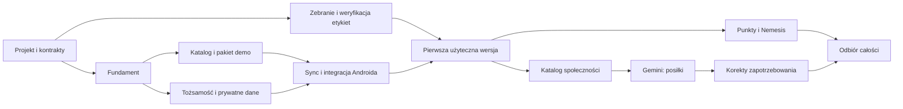

# Plan prac - osoba 2

Data: 9 października 2026 r. Plan dotyczy implementacji [wymagań](../WYMAGANIA_PROJEKTOWE.md) według [architektury](ARCHITEKTURA.md). Repozytorium zawiera dokumentację i [artefakty E0 z walidatorem](../contracts/README.md); wynik kontroli określa [raport odbioru](e0/ODBIOR.md). Nie oznacza to rozpoczęcia E1. Nie podajemy terminu końcowego bez pomiaru czasu pierwszych zadań i dostępności trzech osób.

## 1. Etapy i warunki zakończenia

Każdy etap kończy się działającym, sprawdzalnym rezultatem. Kryteria KO odnoszą się do rozdziału 10 wymagań. „Właściciel: O2” oznacza nas; O1 odpowiada za Androida, O3 za infrastrukturę i GitHub.

| Etap | Praca Osoby 2 | Rezultat i warunek zakończenia | Zależności / współpraca |
|---|---|---|---|
| E0. Projekt i przygotowanie kontraktów | Doprecyzowanie modeli, lista przypadków błędów, szkice OpenAPI i JSON Schema, wektory Decimal/BigDecimal; rejestr źródeł katalogu | O1 otrzymuje wersjonowane przykłady profilu, posiłku, pakietu i sync; O3 dostaje parametry Keycloak i usług. Dokumenty mają spójne reguły i niezależną recenzję | Schematy, przykłady i walidator dostarczono lokalnie; stan recenzji w raporcie E0. Implementacja API zaczyna się w E1 |
| E1. Uruchamialny fundament | Python 3.13, FastAPI, konfiguracja, SQLAlchemy/Alembic, logowanie zdarzeń, błędy API, health, pierwsza migracja, pytest i Ruff | Nowy checkout uruchamia API i testy na PostgreSQL 17; migracja działa na pustej bazie; health/live i health/ready mają poprawne znaczenie; sprawdzenia PR wykonują się rzeczywiście | O3: dwie bazy i konta techniczne, lokalny Compose, CI; O2: komendy i testy |
| E2. Katalog i format offline | Produkty/wersje/źródła, racje/składniki, generator pakietu, manifest, publiczne odczyty i testy spójności; dane demo | O1 importuje pakiet demo z APK bez sieci i oblicza części racji; generator nie publikuje wadliwego ani niepełnego oficjalnego pakietu; wspólne jednostki i obliczenia | E1. Etykiety zbieramy od E0. O1 może pracować na demo bez czekania na komplet źródeł |
| E3. Tożsamość i prywatny model | Adapter tokenów, konto aplikacyjne/bootstrap, profil, cele i zgody; modele dziennika, wagi i kompletności; usługi i walidacja | Testy A/B oraz złego issuer/audience/podpisu przechodzą; baza wymusza własność i unikalność; scenariusz ręcznego celu nie wymaga Gemini | E1; O3: testowy Keycloak i dane publicznego klienta; O1: PKCE i obsługa sesji |
| E4. Synchronizacja i integracja offline | Push/pull, idempotencja, konflikty, liczniki, snapshot, retencja, import gościa, uzgodnienie po 30 dniach i zmiana sync_epoch | KO-03, KO-05–08, KO-12, KO-18–20, KO-23, KO-31 oraz części KO-04/13/24/25/32 wyszczególnione poniżej; 30 dni offline i utrata odpowiedzi nie powodują duplikacji lub utraty zmian | E2 + E3. O1 wdraża outbox i rozwiązywanie konfliktów; O2 dostarcza referencyjne scenariusze |
| E5. Pierwsza użyteczna wersja | Uzupełnienie zweryfikowanego katalogu; read API dziennika i statystyki 7/30/90 dni; dokumentacja obsługi synchronizacji | KO-01–02 na oficjalnym katalogu i KO-11; APK i API obsługują profil/cel, racje, posiłki, wagę i sync; pakiet ma pełne dane ze źródeł; działa lokalnie od pierwszego startu | E4 + zweryfikowane etykiety. O1 dostarcza APK, O3 środowisko HTTPS. To koniec rdzenia, nie całego projektu |
| E6. Katalog społeczności | Publikacja szkiców, deduplikacja, głosy, zgłoszenia, moderacja i audyt | KO-09 i KO-13; jeden głos autora, brak głosu na własny produkt, scalanie zachowuje referencje i historię; uprawnienia moderatora sprawdzone | E5; O1: formularze i obsługa niekompletnych danych |
| E7. Gemini i analiza posiłku | Trwałe zadania, prywatny magazyn plików, adapter z mockiem, walidacja JSON, limity Free Tier, analiza/confirm bez drugiej ścieżki zapisu posiłku | KO-10, KO-21, KO-28; błędy nie blokują ręcznego wpisu; testy referencyjne modelu spełniają kryteria wymagań; wywołania przechodzą przez jeden rejestr zużycia puli | E6 dla dopasowania/publikacji produktów. O3 przygotowuje darmowy projekt do testów deweloperskich; wydanie AI w EOG wymaga rozwiązania ograniczenia z 11.6 |
| E8. Motywacja i Nemesis | Punkty, odznaki, ranking z opt-in, zaproszenia, zgody, projekcje i finalizacja; harmonogram zamknięcia dni | KO-14, KO-22, KO-26–27, KO-29; opóźnione dane i worker nie zmieniają zasad; cofnięcie zgody odcina odczyt | E5; technicznie niezależne od E7, ale dla jednej Osoby 2 realizowane kolejno, bez mnożenia rozpoczętych prac |
| E9. Korekty zapotrzebowania | Deterministyczne reguły, agregaty, wyjaśnienie AI, zatwierdzanie i automat z limitami oraz audytem | KO-15 i KO-24; brak danych/zmiana rewizji/cofnięcie zgody blokują stary wynik; zmiana działa od następnego dnia i nie przestawia celu kcal | E7 + sprawdzone statystyki E5 |
| E10. Odbiór i wydanie | Pełna regresja, migracja z poprzedniego wydania, kontrakt dla APK, dokumentacja API i znanych ograniczeń, pomoc przy odtworzeniu | Wszystkie KO-01–32 mają wynik i dowód; O3 potwierdza KO-16–17 oraz pełne KO-32 na odtworzonej kopii; O1 wydaje APK; wydanie opisuje wersje schematów i pakietu | Wszystkie wcześniejsze etapy; warunki wydania i rollback w workflow |

Osoba 2 nie czeka z katalogiem na zakończenie pełnej synchronizacji. Wczesny pakiet demo pozwala Osobie 1 uruchomić lokalny dziennik; weryfikacja oficjalnych etykiet przebiega równolegle. Nie uznajemy jednak danych demo za spełnienie bramki E5.

Kryteria obejmujące kilka funkcji odbieramy częściami; wcześniejszy etap nie wymaga kodu planowanego później:

| Kryterium | Odbiór częściowy i zakończenie |
|---|---|
| KO-01–02 | E2: mechanizm offline i obliczenia na demo; E5: pełny odbiór na oficjalnym katalogu |
| KO-04 | E4: jeden wpis i jedna rewizja mimo powtórzeń; E8: brak ponownego naliczenia punktów |
| KO-13 | E3/E4: własność posiłków; E6: własność i unikalność głosów, pełny odbiór |
| KO-24 | E4: data celu utworzonego offline; E9: data i historia korekty AI, pełny odbiór |
| KO-25 | E4: efektywna kompletność; E5: brak zer w średnich; E8: brak punktów; E9: pominięcie w analizie energii, pełny odbiór |
| KO-30 | E2: importer i wyścig dwóch release; E5: weryfikacja z oficjalnym pakietem |
| KO-32 | E4: epoka i zachowanie danych telefonu; E7: blokada replay AI i ochrona puli po cofnięciu liczników; E10: pełna próba odtworzenia z O3 |

KO-31 jest bramką integracji kont w E4. Każde dodane później kryterium otrzymuje przypisanie do etapu przed rozpoczęciem zależnego kodu.

## 2. Kolejność i zależności

Diagram pokazuje zależności techniczne. O2 ma zasadniczo jedno zadanie implementacyjne w toku; prace równoległe oznaczają głównie współpracę O1/O3 lub zbieranie źródeł. Plan nie zakłada trzech pełnoetatowych programistów backendu. Po E1 mierzymy czas zadań i aktualizujemy estymację reszty zakresu.

## 3. Pierwszy zestaw zadań do wykonania

| ID | Konkretne zadanie | Dowód ukończenia |
|---|---|---|
| B-001 | Utworzyć szkielet `backend`, pyproject, lockfile, konfigurację i format błędów | Nowy checkout, jednoznaczna instrukcja uruchomienia i prawidłowy health |
| B-002 | Uzgodnić z O3 dwie bazy, role DB i środowisko testowe | API łączy się wyłącznie z `calorie_app`; brak praw DDL konta wykonawczego; Keycloak działa na własnej bazie |
| B-003 | Pierwsza migracja modelu konta i podstawowego katalogu | Migracja pustej bazy, kontrola indeksów/FK i testy ograniczeń |
| B-004 | Wersja 1 schematu produktu/racji/pakietu i wektory obliczeń | Te same wyniki dla połowy składnika racji, ml, null i zaokrągleń po stronie Python i Kotlin |
| B-005 | Eksport jawnie demonstracyjnego pakietu i importer referencyjny do testów | Hash, liczności, referencje i odrzucenie uszkodzonego pakietu; O1 może zacząć import Room |
| B-006 | Rejestr źródeł oficjalnego katalogu | Lista pozycji, konkretne etykiety/FDC ID, brakujące pola i stan weryfikacji; żadnych wymyślonych makr |
| B-007 | Kontrakt tożsamości oraz sync z przykładami dobrego i błędnego żądania | O1/O3 znają audience, właściciela, rewizje, checkpointy, kody błędów i zachowanie ponowień |

B-001–003 realizujemy najpierw w E1. Projektowe części B-004/B-006/B-007 dostarcza E0: schematy, demo, źródła, wektory i kontrakt sync. Wykonanie Kotlin, produkcyjny eksporter/importer i oficjalne etykiety pozostają w odpowiednich kolejnych etapach. Uzgodnienia są przekazywane w repozytorium/PR, bez potrzeby ręcznego rozsyłania kopii dokumentów.

## 4. Czego potrzebujemy

| Zasób | Do kiedy / po co | Odpowiedzialny |
|---|---|---|
| Python 3.13, uv, Git i edytor | E1: lokalny backend i identyczne zależności z lockfile | O2 |
| Docker Desktop z działającym silnikiem Linux/WSL2 albo równoważne środowisko kontenerowe | E1: PostgreSQL 17 i Keycloak; testy integracyjne na prawdziwym PostgreSQL | O3 zapewnia konfigurację, O2 uruchamia lokalnie |
| Lokalne pliki Compose i `.env.example` bez sekretów | E1: odtwarzalne uruchomienie dwóch baz, OIDC i usług | O3 + wymagania O2 |
| Dostęp do PR i sprawdzeń GitHub | E1: chroniony main, recenzje i CI | O3; O2 dostarcza sprawdzenia backendu |
| Testowy Keycloak, issuer, audience i URI powrotu Androida | E3: prawdziwe testy logowania, role i rotacja kluczy | O3, URI z O1 |
| Android Studio, właściwy JDK/SDK, emulator i co najmniej jedno urządzenie | Najpóźniej E2/E4: import pakietu i przepływy offline | O1 |
| Etykiety racji WZ 1/WZ 4 WEGE i wszystkich składników, rekordy FDC, źródło napoju | Zebranie od E0, komplet przed E5 | O2; zespół może dostarczyć fotografie etykiet |
| Projekt/klucz Gemini Free Tier bez aktywnego Cloud Billing | E7: testy referencyjne; wcześniej wystarcza mock | O3 utrzymuje sekret i odczytuje limity AI Studio; O2 limiter i testy |
| VPS, domena, HTTPS, SMTP, kopie poza serwerem | Przed wspólną integracją i E10 | O3 |
| Zestaw scenariuszy i przykładowych danych | Od E0, rozwijany w każdym etapie | O2 + O1 dla scenariuszy telefonu |

Lokalna kontrola z 9.10.2026: Git jest dostępny; `uv` i `docker` nie zostały znalezione w PATH. `python`/`py` wskazują aliasy Windows, więc wymagają potwierdzenia właściwego interpretera 3.13. To lista rzeczy do zweryfikowania przed E1, a nie dowód, że programy nie są zainstalowane gdzie indziej. W tej pracy planistycznej nie instalowano zależności ani nie zakładano płatnych usług.

PostgreSQL i Keycloak uruchamiamy kontenerowo; nie ma potrzeby ręcznej instalacji osobnego serwera SQL w Windows. Android nie potrzebuje lokalnego PostgreSQL — korzysta z SQLite/Room w aplikacji. Narzędzia Androida nie blokują pierwszych testów backendu, ale są niezbędne do odbioru integracji.

## 5. Materiały przekazywane zespołowi

| Odbiorca | Materiał | Moment |
|---|---|---|
| O1 | Wersjonowane OpenAPI, JSON Schema pakietu, demo JSON gzip, przykłady sync/błędów, wspólne obliczenia | Pierwsza wersja E0/E2, aktualizacja przed zmianą integracji |
| O1 | Scenariusze konfliktów, importu gościa, przełączenia kont, wygasłej sesji i 30 dni offline | Przed rozpoczęciem E4 |
| O3 | Lista usług, bazy/role, zmienne, komendy startu/testów/migracji i health | E1, rozszerzana wraz z workerem |
| O3 | Harmonogramy: kolejka, północ, Nemesis, sprzątanie, retencja, limity Free Tier | Przed wdrożeniem danej funkcji |
| Cały zespół | Raporty testów, wersje APK/API/pakietu i instrukcja odtworzenia | Każde wspólne wydanie |

Formalny kontrakt eksportujemy z modeli FastAPI i walidujemy w CI. Nie utrzymujemy niezależnie dwóch ręcznie edytowanych OpenAPI. Wczesne przykłady są projektem kontraktu; od E1 obowiązujący plik jest generowany i porównywany z wersjonowanym artefaktem.

## 6. Ryzyka i sposób prowadzenia prac

- Największy zakres ma O1/O2. Dzielimy funkcje na małe rezultaty, wcześnie integrujemy katalog i sync, a estymację opieramy na wykonanych zadaniach. Cały zakres pozostaje obowiązujący; E5 jest kamieniem milowym, nie skróceniem zamówienia.
- Brak etykiet blokuje oficjalny katalog, dlatego ich zbieranie zaczyna się razem z kontraktem. Demonstracja na fikcyjnych danych nie zamyka tego ryzyka.
- Bez wspólnych kontraktów Android i backend mogą inaczej rozumieć jednostki, daty i konflikty. Odpowiedzi przykładowe oraz wektory testowe są dostarczane przed integracją.
- Synchronizacja, migracje, izolacja kont i historyczne wartości mają pierwszeństwo przed AI i rywalizacją. Zmiany tych mechanizmów wymagają testów awarii i współbieżności.
- Budżet i gotowość serwera ustala O3, ale backend musi działać lokalnie z mockiem Gemini. Dostępność darmowej puli AI nie blokuje rdzenia dziennika.

Decyzja Free Tier: prace E0–E6 mogą postępować. E7/E9 rozwijamy na mocku i darmowym API w zakresie deweloperskim. Przy obecnych warunkach Google udostępnienie Gemini użytkownikom w Polsce wymaga Paid Services, co koliduje z ustaleniem darmowego API. Pełny odbiór E7/E9/E10 pozostaje zależny od rozwiązania tej kwestii zgodnie z wymaganiami 11.6; nie oznaczamy tych funkcji jako dostarczonych na podstawie samego mocka.
