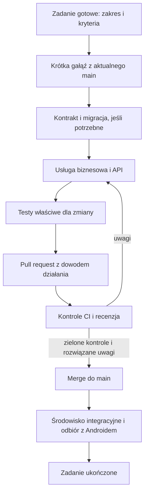

# Workflow pracy i dostarczania zmian - osoba 2

Status: ustalony proces dla zespołu, 9 października 2026 r. Realizujemy [plan Osoby 2](PLAN_PRAC.md) według [architektury](ARCHITEKTURA.md). E1 dostarcza wykonywalny [workflow backendu](../.github/workflows/backend.yml); jego rzeczywisty wynik określa [raport E1](e1/RAPORT_E1.md). O3 potwierdza ochronę gałęzi i rozszerza CI o Androida oraz wdrożenie.

## 1. Przepływ pojedynczego zadania

Tablica pracy: **Backlog → Gotowe → W toku → Recenzja → Integracja → Ukończone**. Blokadę oznaczamy wraz z przyczyną i właścicielem następnego kroku. Jedna osoba utrzymuje najwyżej jedno zasadnicze zadanie implementacyjne „W toku”; małe naprawy i zbieranie materiałów mogą przebiegać obok.

### Komunikacja między agentami

Wspólnym dziennikiem przekazania jest [Komunikacja agentów](KOMUNIKACJA_AGENTOW.md). Na początku zadania agent wczytuje aktualny plik i wskazane zmiany dotyczące swojej roli. Po ważnym kroku dopisuje rezultat, commit/PR, zależności i pytania; odbiorca sam potwierdza odczyt oraz odpowiedź. Wpisy zachowują historię, a status planu, recenzji i integracji pozostaje zgodny z tym workflow. Plik nie wysyła automatycznych powiadomień.

### Kiedy zadanie jest gotowe do rozpoczęcia

- Ma identyfikator, cel użytkowy, przypisanie do etapu i właściciela.
- Wskazuje wejście/wyjście, reguły błędów i kryteria odbioru, w tym zależny WF/KO.
- Wiemy, czy zmienia API, model bazy, pakiet offline, uprawnienia lub dane historyczne.
- Zależności od O1/O3 mają znany stan; implementację możliwą na mockach można rozpocząć bez oczekiwania na zewnętrzny serwer.

Przykład: „B-005: wygenerować pakiet demo ze stałymi UUID; manifest i zawartość mają zgodne liczności; błędna referencja składnika blokuje eksport; importer testowy odtwarza identyczne dane”.

## 2. Git i pull requesty

1. Pobieramy aktualny `main`, sprawdzamy lokalne zmiany i zakładamy gałąź, np. `codex/B-005-offline-package` dla prac wykonywanych z Codex. Nie nadpisujemy cudzych ani wcześniejszych niezatwierdzonych zmian.
2. Jeden PR dotyczy jednego spójnego rezultatu. Jeżeli zmienia kontrakt, najpierw aktualizuje modele/przykłady i opis skutków dla O1/O3. Destrukcyjne migracje nie są dodatkiem do niezwiązanego zadania.
3. Commity opisują konkretną zmianę. Pliki migracji już użyte przez zespół pozostają niezmienne; poprawka dostaje nową migrację.
4. PR zawiera: problem i wynik, zakres API/danych, migrację/kompatybilność, wykonane testy oraz potrzebne działania O1/O3. Dla zmiany backendu przykładowe żądanie/odpowiedź jest lepszym dowodem niż sam zrzut terminala.
5. Subagent może przeprowadzić dodatkową recenzję techniczną. Jego ocena nie zastępuje testów ani akceptacji członka zespołu na GitHubie. Dla większej zmiany projektowej „bardzo dobra” oznacza co najmniej 9/10 i brak istotnych usterek, z konkretnymi argumentami.
6. O3 ustawia ochronę `main`: wymagany PR, zielone wymagane sprawdzenia, rozwiązane uwagi i brak bezpośredniego force-push. Decyzją właściciela z 10 października 2026 review jest opcjonalne: wymagane jest 0 zatwierdzeń, a `require_last_push_approval` jest wyłączone. Można scalić własny PR po zaliczeniu kontroli i rozwiązaniu istotnych uwag. Po istotnej poprawce wymagamy ponownego sprawdzenia zmienionego zakresu. Stare review `Request changes` nadal może blokować merge; zamykamy je po potwierdzeniu poprawki, nie przez wyłączenie testów.
7. Po scaleniu O3 wdraża do środowiska integracyjnego. O1/O2 wykonują właściwy scenariusz na zgodnych wersjach APK i API. Sam merge nie zamyka zadania, jeśli integracja była częścią kryterium.

Wymagane kontrole są zależne od dostępności funkcji GitHuba dla danego repozytorium; O3 potwierdza faktyczne ustawienia. Do tego czasu zespół stosuje ten sam proces ręcznie i nie opisuje `main` jako technicznie chronionego.

## 3. Workflow CI — kontrakt dla Osoby 3

Uruchomienia: PR do `main` oraz zmiana `main`. Każdy PR otrzymuje stabilne sprawdzenie zbiorcze `ci-required`. O3 może ograniczać kosztowne zadania do właściwych ścieżek, ale sprawdzenie wymagane nie może zostać pominięte ani oznaczać sukcesu, gdy wymagany test nie wykonał się.

| Sprawdzenie | Co rzeczywiście wykonuje | Warunek sukcesu / właściciel zawartości |
|---|---|---|
| `docs-contract` | Linki lokalne, poprawność wersjonowanych JSON/JSON Schema, generowanie OpenAPI i porównanie z artefaktem | Zmiana kontraktu jawna i poprawna; O2 |
| `backend-quality` | Instalacja z `uv.lock`, Ruff lint/format i testy jednostkowe reguł | Brak błędów; komendy utrzymywane przez O2 |
| `backend-postgres` | Tymczasowy PostgreSQL 17, migracja pustej bazy oraz testy integracyjne/kontraktowe | Testy uruchomiły się na PostgreSQL; brak zamiany na SQLite lub pomijania z powodu braku DB; O2 |
| `backend-migrations` | Przejście z poprzedniego wydania na nowe na reprezentatywnych danych | Zachowane dane, indeksy i oczekiwany schemat; brak niejawnego zerowania bazy; O2 |
| `catalog-package` | Eksport/import demo, rozmiary/hash, UUID, referencje, jednostki i niezmienność historycznych danych | Zgodność z kontraktem; oficjalny release ma osobną walidację źródeł przed publikacją; O2 |
| `android` | Kompilacja, lint, testy obliczeń/Room; testy urządzenia w uzgodnionym profilu | O1 dostarcza zadania Gradle i przypadki do integracji |
| `build` | Budowa obrazu backendu i artefaktu APK z identyfikatora commitu | Budowa nie wymaga sekretów produkcyjnych; O2/O1, opakowanie pipeline O3 |
| `ci-required` | Zbiera wyniki kontroli wymaganych dla danego zakresu | Błąd, anulowanie lub brak obowiązkowego wyniku blokuje PR; O3 |

W E1 uruchamiamy kontrole istniejącego kodu, migracji i jakości. Kolejne kontrole stają się wymagane razem z funkcją z danego etapu. Brak kodu lub zbioru testów nie jest dowodem działania; PR nie dodaje „zielonego” pustego zadania w miejsce przyszłego sprawdzenia. Zmiana tylko dokumentacji wymaga odpowiednich kontroli dokumentacji, nie pełnego zestawu emulatorów.

Testy PR nie korzystają z produkcyjnych danych, hasła administratora Keycloak ani rzeczywistego Gemini. Gemini jest mockowane, a tokeny testowe i efemeryczna baza powstają na potrzeby testu. Kontrola kryptografii obejmuje rzeczywiście podpisane tokeny i testowe JWKS; e2e z prawdziwym Keycloak następuje na środowisku integracyjnym przed E4 i przy zmianach logowania.

O3 stosuje minimalne `GITHUB_TOKEN` permissions, akcje przypięte do pełnych SHA, automatyczne propozycje aktualizacji zależności i skanowanie sekretów. Kod niezaufanego PR nie działa z sekretami przez `pull_request_target`. Dokumentacja bezpieczeństwa GitHub jest źródłem reguł, a konkretna konfiguracja jest częścią E1.

## 4. Workflow wdrożenia

| Moment | Działania |
|---|---|
| PR | Sprawdzenie i budowa; bez publikacji produkcyjnej i Gemini mockowane |
| Merge do `main` | Oznaczenie obrazu SHA, wdrożenie integracyjne, migracja jednorazowa, smoke test API i wymaganych usług |
| Wydanie wersjonowane | Uzgodniony zestaw APK/API/pakietu; test zgodności, kopia, zatwierdzenie środowiska produkcyjnego przez O3 i wdrożenie |
| Awaria | Wstrzymanie dalszych wdrożeń, diagnoza na identyfikatorze wydania; rollback obrazu tylko przy kompatybilnym schemacie, w przeciwnym razie poprawka migracji lub sprawdzone odtworzenie |

Migracje uruchamia osobny krok z rolą migratora; kilka replik API nie próbuje ich wykonać równolegle. Dla zmian schematu stosujemy, gdy potrzeba, rozszerzenie → migrację danych → przełączenie kodu → późniejsze usunięcie starego pola. Usunięcie kolumny używanej przez poprzedni obraz uniemożliwia prosty rollback tego obrazu.

Odtworzenie starszej kopii jest osobną procedurą awaryjną: O3 zatrzymuje ruch i workery, przywraca spójny zestaw baz/artefaktów, ustawia nowy `sync_epoch`, unieważnia stare sesje/snapshoty i sprawdza zgodność tożsamości. O2 sprawdza odzyskiwanie telefonu z zachowaniem potwierdzonych i niewysłanych wpisów. Rzeczywiste AI pozostaje wstrzymane do uzgodnienia lub wygaśnięcia niepewnych okien limitów zgodnie z wymaganiami 11.6; zadania ze starej kopii nie wywołują dostawcy automatycznie. Dopiero wynik KO-32 pozwala otworzyć właściwe funkcje. Zwykły restart lub kompatybilny rollback obrazu nie zmienia epoki.

Backend wspiera aktualny kontrakt mobilny przez cały gwarantowany okres offline: zmiana kompatybilna może być dodana, ale usunięcie pól/semantyki wymaga nowej wersji API i planu aktualizacji. Stary kontrakt oraz format operacji utrzymujemy co najmniej do końca ważności ostatniego checkpointu wystawionego dla tej wersji, czyli 30 × 24 h od jego wystawienia. Przed wycofaniem wersji ogłaszamy migrację i przestajemy wydawać dla niej nowe checkpointy; wydanie kolejnego przedłuża termin utrzymania. Po upływie tego czasu nadal nie wolno zgubić starej kolejki: aktualizacja klienta ma migrację/reconciliation, a niewspierane żądanie dostaje jawny błąd. Żaden deploy nie skraca ważności istniejącego checkpointu bez bezpiecznej ścieżki odzyskiwania.

Publikacja pakietu katalogu jest osobnym przebiegiem: zatwierdzone źródła → eksport niezmiennych wersji → walidacja → zapis artefaktu → publikacja manifestu. Nie wymaga nowego APK, jeśli schema jest zgodna. Nowy APK zawsze zawiera sprawdzony pakiet startowy.

## 5. Definition of Done

Zadanie jest ukończone, gdy:

- Zachowanie spełnia kryteria zadania oraz właściwe WF/KO, także wymagane scenariusze błędów.
- Dane mają poprawnego właściciela, walidację i transakcje; sprawdzono wpływ na historię, ponowienia i migracje.
- Wymagane testy wykonały się, recenzja nie ma nierozwiązanych istotnych uwag, a PR został scalony.
- Dokumentacja i generowane kontrakty odpowiadają kodowi; O1/O3 mają potrzebne przykłady i konfigurację.
- Integracja i wdrożenie objęte zadaniem zostały sprawdzone; pozostałe ograniczenia są jawne i nie podważają kryterium odbioru.

Recenzent sprawdza przede wszystkim: izolację kont, niezawodność transakcji, zachowanie po utracie odpowiedzi, brak destrukcyjnego nadpisania outbox/historii, zgodność jednostek/dat oraz limity i uprawnienia usług zewnętrznych. Dla zmiany dokumentacji wystarcza kontrola spójności, linków i opisanych scenariuszy; nie tworzymy testów aplikacji udających weryfikację samej treści.

## 6. Oficjalne źródła

- [GitHub: ochrona gałęzi](https://docs.github.com/en/repositories/configuring-branches-and-merges-in-your-repository/managing-protected-branches/about-protected-branches).
- [GitHub Actions: bezpieczne użycie](https://docs.github.com/en/actions/reference/security/secure-use).
- [Android: migracje Room](https://developer.android.com/training/data-storage/room/migrating-db-versions).

Te dokumenty opisują mechanizmy narzędzi; przyjęty podział ról, etapy i kryteria są zasadami naszego projektu.

Przed udostępnieniem funkcji AI O3 sprawdza warunki dostawcy dla regionu odbiorców. Dla przyjętego Free Tier obecne ograniczenie EOG z wymagań 11.6 blokuje wydanie Gemini użytkownikom w Polsce; nie aktywujemy rozliczeń automatycznie.
