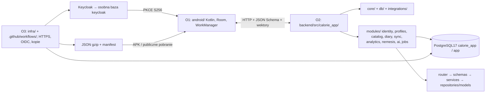
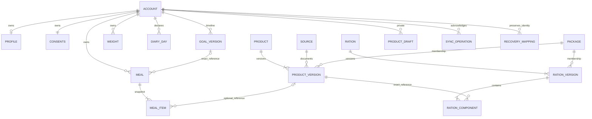

# Kontrakty i integracja E0 - osoba 2

Status: **design draft**, 9 października 2026. Wynik lokalny projektowych części B-004, B-006 i B-007. [Mapa artefaktów](../../contracts/README.md), [sync i odzyskiwanie](SYNCHRONIZACJA.md), [audyt katalogu](ZRODLA_KATALOGU.md), [odbiór](ODBIOR.md). Nie uruchomiono backendu, ORM, migracji ani importera Room.

## Granice i źródła kontraktu

HTTP ma przypięte OpenAPI **3.1.1**, schematy JSON dialekt **2020-12**. Definicje żyją raz w `contracts/schemas/`, OpenAPI odwołuje się do nich lokalnymi `$ref`. Schemat katalogu ma niezależne `schema_version=1` i `min_reader_version=1`. Zmiana danych zwiększa release, zmiana produktu jego revision; żadna z tych liczb nie jest wersją Room.

Od E1 OpenAPI wdrożonych endpointów jest generowane przez FastAPI/Pydantic 2. Przy przejęciu endpointu O2 porównuje wejścia, wyjścia, błędy, auth, przykłady i semantykę z projektem, a ręczną operację usuwa z aktywnego projektu lub przenosi do jawnego archiwum. Niewdrożone operacje pozostają projektem; dwie aktywne definicje tego samego endpointu są niedopuszczalne. To zadanie E1, nie istniejący generator backendu.

Podstawy formatu: [OpenAPI 3.1.1](https://spec.openapis.org/oas/v3.1.1.html), [JSON Schema 2020-12](https://json-schema.org/draft/2020-12), [generowanie OpenAPI w FastAPI](https://fastapi.tiangolo.com/how-to/extending-openapi/); odczyt 2026-10-09. Wybór szczegółów domenowych poniżej jest decyzją projektu.

Diagram przedstawia docelowe katalogi. Powstaną w kolejnych etapach; E0 nie tworzy pustych modułów. Profil i jedzenie są w `calorie_app`, hasła i sesje w Keycloak. Dostęp do Room i wbudowanych racji nie wywołuje API ani Gemini.

## Model logiczny i własność

| Encja | Klucze, rewizje i reguły |
|---|---|
| Account | UUID, unikalne `(issuer, subject)`, generation, stan active/deleting. Nie używamy e-maila jako klucza. Bootstrap ustala konto z tokenu, bez body i bez importu gościa |
| Profile | Najwyżej jeden żywy na owner; UUID profilu jest niezależny od account_id. Gość zachowuje UUID przy pierwszym imporcie do pustego konta. Jeżeli konto ma profil, klient uzgadnia dane i aktualizuje istniejący UUID z bieżącą rewizją, zachowując lokalny oryginał. Po delete nowy profil ma nowy UUID; brakujący po restore również dostaje nowy UUID z RecoveryMapping. Brak profilu oznacza `profile:null`. Zgody nigdy nie są polem Profile |
| Consent | Jeden rekord online na owner, niezależna revision od1; domyślnie ranking i automat false. PUT wymaga Idempotency-Key oraz If-Match; rekord jest tworzony z kontem |
| GoalVersion / timeline | Wersja ma własny UUID; jest niezmienna po przyjęciu. Cała oś właściciela ma rewizję. Nowa decyzja tworzy nowy UUID i sprawdza `timeline_base_revision`. Dla danej daty obowiązuje jedna wersja; korekta tworzy nową wersję i audyt `correction_of`, stara pozostaje referencją historii |
| Weight | UUID + owner + revision, kg, UTC, strefa i data. Kilka pomiarów jednego dnia jest dozwolone; nie interpolujemy brakujących pomiarów |
| DiaryDay | UUID, unikalne `(owner,local_date)`. Pierwszy twórca wybiera UUID; kolizja dnia z innym UUID jest konfliktem do uzgodnienia. Strefa dnia przypisana przy jego pierwszym wpisie; klient nie tworzy drugiego dnia dla tej samej daty |
| Meal / MealItem | UUID wpisu oraz składników, owner na posiłku i złożone FK `(owner,meal_id)`. Jedna operacja zastępuje cały agregat 1..100 składników. Usunięcie ostatniego składnika jest delete posiłku; elementy nie synchronizują się oddzielnie |
| Product / version / source | Stabilny UUID produktu, unikalne `(product_id,revision)`; wersja i udokumentowane źródło niezmienne. Źródła mają datę odczytu i status, nie dziedziczą wiarygodności nazwy |
| Ration / version / component | Stabilny UUID + revision, komponenty o kolejności1..N, ilość i jednostka oraz FK do dokładnej wersji produktu. Komponent nie jest automatycznie spożytym MealItem |
| Package | UUID pakietu + monotoniczny release, niezmienne członkostwo konkretnych wersji; osobna tożsamość demo/official |
| SyncOperation / ChangeLog | `(owner,operation_id)` unikalne, hash kanonicznej operacji i trwały minimalny wynik. Rewizja encji należy do epoki. Licznik per konto porządkuje zatwierdzone transakcje; zegar telefonu nie ustala kursora |
| RecoveryMapping | Unikalne `(owner,source_epoch,source_entity_id) → target_entity_id`, zapis razem z odzyskaną encją; dane i konflikt opisuje schemat sync |

Wszystkie prywatne odczyty wymagają owner z zweryfikowanego tokenu. Cudzy identyfikator daje404. Moderator/admin nie otrzymuje dostępu do cudzych dzienników. Żaden payload sync nie przyjmuje `owner_id`. UUID losowe v4 są zalecane dla wpisów; katalog demo stosuje udokumentowane v5. UUID są małymi literami; rewizje są liczbami całkowitymi1..2147483647. Przepełnienie wymaga migracji wersji protokołu, nie zawinięcia licznika. Cele pozostają niezmiennymi wersjami: delete użytego celu daje goal_in_use, pozostałych goal_immutable; anulowanie/przesunięcie przyszłego celu jest nową audytowaną wersją osi, nie usunięciem.

`local_revision` Androida zwiększa się przy edycji lokalnej; `base_revision` to ostatnia znana rewizja **serwera w danej epoce**, null przy create. Nie zastępujemy jej lokalnym licznikiem. Snapshot posiłku przechowuje własną nazwę, ilość, jednostkę, podstawę, wartości odżywcze, pochodzenie, gęstość/źródło oraz wersję formuły. ProductRef jest opcjonalny, ale jeśli istnieje, wskazuje dokładną wersję. Ręczna korekta zmienia snapshot posiłku z audytem rewizji, nie katalog. Prywatny szkic może zostać skopiowany do ręcznego snapshotu bez fałszywej referencji publicznej. Historyczne wersje są chronione przed kaskadowym usunięciem; nowy katalog nie przelicza historii.

## Liczby, ilości i brak danych

Decimal na drucie to **string**: `0` lub niezerowa część całkowita bez zer wiodących, opcjonalna kropka i1..6 cyfr, ostatnia niezero. Zakazane: znak plus/minus, przecinek, wykładnik, białe znaki, NaN/Infinity, JSON number. Dopuszczalny zakres ogólny0..999999.999999; pola dodatnie od0.000001. Kanonizacja odbywa się w adapterze UI przed walidacją/pierwszą wysyłką (`1.200000→1.2`, `-0→0`); nie zmienia już wysłanej operacji. Surowe `1.0` w kontrakcie jest błędem, nie drugim zapisem tej samej liczby. Hash operacji używa tego kanonicznego zapisu. Rewizje, liczności, wiek i release pozostają integer, nie Decimal. Wyjścia kalkulatora (resting_kcal, maintenance_kcal) używają osobnego ComputedDecimal do12 miejsc: zachowują dokładny wynik wejść6-miejscowych przemnożonych przez6.25 iPAL, bez zaokrąglania do skali wejściowej. Ręcznie zatwierdzony cel pozostaje wejściem do6 miejsc; klient świadomie ustala jego wartość.

Limity techniczne: spożycie jednego składnika≤10000g/ml, masa≤1000kg, wzrost≤300cm, cel kcal≤20000, cel pojedynczego makra≤5000g. Kalkulator przyjmuje wiek18..120 i dodatnie wyjście. To ograniczenia formatu, **nie zalecenia żywieniowe**. Katalog przechowuje dodatnią ilość opakowania niezależnie od domyślnej/spożytej porcji; zwykły posiłek może obejmować więcej niż jedno opakowanie. Ekran wyboru jednej racji ogranicza wybraną część do ilości tego komponentu.

Podstawa zawsze100g albo100ml. Bez konwersji: `wartość × ilość /100`. `ml→g`: mnożenie przez udokumentowaną gęstość g/ml. `g→ml`: dzielenie przez gęstość; brak gęstości blokuje tylko konwersję. Ilość opakowania nie jest podstawą wartości odżywczych. Proszek pozostaje suchym produktem w g, chyba że źródło jawnie definiuje przygotowany napój.

Norma obliczeń `nutrition_v1`: Decimal/BigDecimal; mnożenie i dzielenie przez100 dokładne, bez float/Double. Dzielenie ogólne (np. g/gęstość) daje **skalę12, HALF_UP**, potem dokładne mnożenie. Python checker używa precyzji50 cyfr, która pokrywa limity wejść i maksymalne sumy; Kotlin `divide(divisor,12,HALF_UP)` i pozostałe operacje dokładne. Normalizacja materiału do katalogu per100 jest osobnym krokiem: do6 miejsc HALF_UP, z zachowaniem źródłowych wartości i jawnej straty precyzji. Nie zaokrągla się każdego składnika do prezentacji. Sumujemy wszystkie wartości, dopiero suma: kcal do całkowitej, makra do0.1g HALF_UP. Analityka używa sum przed prezentacją; nie przelicza energii na podstawie wzoru4/4/9.

W pełnym payloadzie brak wymaganego pola jest błędem; `null` oznacza nieznane, `"0"` znane zero. Brak opcjonalnego pola służy wyłącznie wskazanym opcjom protokołu (np. brak checkpointu rozpoczyna snapshot), nigdy domyślnej wartości odżywczej. Każde pole Nutrition jest wymagane i nullable. Agregat ma `known_sum`, `missing_count`, `complete`; pusta suma daje0 z osobną informacją o braku wpisów. UI nie przedstawia sumy niepełnej jako pełnego spożycia.

Efektywna kompletność dnia: deklaracja użytkownika AND≥1 żywy posiłek AND energia znana dla wszystkich pozycji AND suma kcal>0. Brak makr nie blokuje kompletności energii, ale makra pozostają niepełne. Pusty dzień i same zera nie wchodzą do średnich jako potwierdzony deficyt. Dzień w celu wymaga dodatkowo zamknięcia doby i dodatniego celu; granice90%..110% są włączne, liczone z dokładnej sumy. Punkty powstają w przyszłych etapach, nie w walidatorze E0.

## Czas, cel i dziennik

UTC ma postać RFC3339 z `Z`, do6 cyfr ułamka sekundy. IANA jest walidowana przez bazę stref, nie sam regex. `local_date` musi odpowiadać `occurred_at` w zapisanej strefie. Po zmianie strefy profilu nie przeliczamy dat historycznych. Strefa istniejącego DiaryDay jest stała; nowy wpis tej samej daty używa strefy tego dnia albo wymaga świadomego przeniesienia do innej daty. To zapobiega dwóm różnym chwilom zamknięcia jednego dnia.

Przykład: Warszawa `2026-10-08T22:30:00Z` to dzień9 października. Jesienna godzina02:30 występuje25 października dwukrotnie: `00:30Z` i `01:30Z`; oba wpisy mają tę samą datę, różne chwile UTC. Wiosenna lokalna02:30 29 marca nie istnieje; UI wymaga poprawnego instant zamiast zgadywać. Doba kończy się następną lokalną północą, nie po stałych24h. Limit synchronizacji30dni oznacza dokładnie30×24h według serwera.

Goal `effective_from` jest lokalną datą w zapisanej strefie. Nowa decyzja ma datę dziś lub późniejszą względem `decided_at`; późna synchronizacja zachowuje tę datę. Pole czasu klienta nie jest dowodem autentyczności, dlatego korekta historii jest jawną operacją z audytem (`reason=history_correction`, `correction_of`). Po korekcie oś wskazuje nową obowiązującą wersję dla daty, a snapshot i wcześniejsza referencja Meal pozostają zachowane. `goal_id` w posiłku może być null (dziennik bez celu); jeśli podany, cel musi już być potwierdzony i należeć do właściciela. Zależności wysyłamy po potwierdzeniu wcześniejszej paczki. Kalkulator zwraca szacunek utrzymania `mifflin_pal_v1`, nie ustawia celu ani deficytu; dane wejściowe i wynik są częścią opcjonalnego snapshotu oszacowania celu.

## HTTP i dalsze granice

API pod `/api/v1`. Publiczne: oficjalne racje, manifest i gzip. Produkty (również lista), profil, cele, dziennik, waga, kalkulator, zgody i sync wymagają bearer access tokenu. Podstawowe produkty gość czyta z Room/pakietu. Projektowe przykłady demo nie dowodzą istnienia oficjalnego wydania.

Listy poza sync: `limit`1..500 (domyślnie100), nieprzezroczysty `page_token`; stabilny porządek UUID, a dziennik według `(occurred_at,UUID)`. Token wiąże owner/filtry/epokę oraz granicę odczytu, TTL60min, po wygaśnięciu410; strony prywatne nie są checkpointem sync. Zmiana filtra przy tokenie daje422. Daty `from/to` są włączne, `from≤to`, maksymalnie366dni na zapytanie; dłuższą historię dzielimy na zakresy, nie usuwamy. Odczyty list mają stabilny snapshot na czas paginacji; implementacja E3/E5. Produkty/racje pod ID przyjmują opcjonalną dokładną revision; bez niej zwracają najnowszą publiczną wersję. Ukryty/cudzy zasób404. Pojedyncze odpowiedzi nie mają paginacji.

Mutacje online: Idempotency-Key UUID w zakresie właściciel+operacja. Hash body i wersji warunku oraz wynik zapisane atomowo. Ponowienie z identycznym body/If-Match zwraca pierwotny wynik, nawet gdy obecna wersja urosła; inna treść409. Minimalne potwierdzenie trwa do usunięcia konta, pełne odpowiedzi≥60dni. Bootstrap jest idempotentnym utworzeniem tożsamości z tokenu (kontrola stanu/generacji, bez wersji profilu). PUT consents wymaga If-Match z cytowaną revision; niezgodność409, brak nagłówka422. Kalkulator jest obliczeniem bez mutacji i nie wymaga klucza. Prywatne zapisy dziennika/profilu/celu mają wyłącznie sync.

HTTP200 push oznacza dopuszczenie paczki po auth, epokach, checkpointach i limitach.401/403/409/413/422 pełnego preflight nie wykonują żadnej mutacji. Operacje dopuszczonej paczki mają osobne commity; późny błąd zachowuje prefix, a brak HTTP200 nie daje nowych ACK i nie usuwa kolejki. Regułę wykonuje [E4 v1](../e4/DECYZJE_V1.md). Reguły tokenów i błędów sync są w osobnym dokumencie.429 i503 mają Retry-After;401 WWW-Authenticate; komunikaty są informacyjne, logika klienta używa `code`. Limity transferu dotyczą bajtów UTF-8 JSON, nie długości stringa Kotlin.

Poza E0: publikacja/matches/głosy/reports/moderacja produktów (E6), analizy zdjęć i confirm zwracające szkic do sync (E7), statystyki/osiągnięcia/leaderboard/Nemesis invite/accept/cancel/statistics (E5/E8), analizy/decision energii (E9). Wymagają auth, zgód i wersji reguł; E0 nie projektuje szczegółowych tabel ani pozornych endpointów tych funkcji. Gemini tylko Free Tier, klucz po stronie backendu, mock w CI; brak klucza i usługi nie blokuje E0. Kwestie szerszego udostępnienia wracają przed wydaniem zgodnie z wymaganiami11.6.

## Przekazanie O1: stan Androida → E0 → adaptacja

Odczytano przez `git show` gałąź `origin/codex/android-offline-racje` (`f5aabfc`), bez merge i edycji Androida: README, assets, `core/Nutrition.kt`, `data/Database.kt`, `data/DiaryRepository.kt`. Poniżej są **zadania**, nie już wykonane poprawki.

| Obecny Android | Kontrakt E0 | Potrzebna adaptacja O1 |
|---|---|---|
| `basic-banana`, `demo-ration-a`, `guest-initial-goal` | UUID i dokładne wersje | Trwała tabela migracji roboczych ID, zachowanie snapshotów i outbox. Nigdy nie wysyłać tych ID na API; nie utożsamiać demo z oficjalnym produktem |
| `Nutrients` i Room REAL/Double | Decimal string / NUMERIC / BigDecimal | Migracja danych bez kasowania; udokumentowana konwersja dawnych Double do6 miejsc HALF_UP, zachowanie oryginalnego snapshotu/audytu; wspólne wektory, wykonanie Kotlin po stronie O1 |
| Brak choć jednego makra daje null całej sumy | Suma znanych + brakujące + complete | Pokazywać niepełną sumę; brak energii obsługiwać niezależnie od zera |
| `defaultGrams` i `packageGrams`, wyłącznie g | Podstawa100g/ml, quantity oraz osobna ilość opakowania | Dodać ml i gęstość ze źródłem; nie przyjmować1ml=1g; dawny napój demo w g zachować jako historyczny snapshot |
| `catalogVersion`, import IGNORE | Product UUID+revision; package UUID+release/schema | Oddzielić wersje produktu, generacji, czytnika i Room; odmowa innej treści pod tą samą wersją |
| JSON assets bez gzip/manifestu | Ten sam format APK i pobrania | Walidacja rozmiaru/hash/ref, nieaktywna generacja i atomowe przełączenie z powtórnym porównaniem release; chronić historię/outbox |
| Meal ma localRevision/serverRevision, payload wysyła local_revision | Epoka + serwerowa base_revision | Zachować lokalny licznik osobno, dodać server_shadow; nie używać local_revision jako blokady API |
| MealItem już kopiuje wartości per100, brak revision produktu | Pełny snapshot + exact ProductRef, g/ml, formuła i pochodzenie | Uzupełnić migrowane metadane; nie odtwarzać starego snapshotu z dzisiejszego katalogu |
| Cel upsert dla dzisiejszej daty | Niezmienna GoalVersion i revision osi | Migracja osi i UUID, nowe decyzje/korekty jako wersje, konflikt osi zamiast cichego upsert |
| Outbox bez epoki/checkpointu, wiele zmian tej encji | Jedna encja/paczka, niezmienny wysłany operation_id/body | Rozdzielić niewysłane i wysłane operacje; kolejne budować dopiero z potwierdzoną rewizją; po restore zachować także potwierdzone dane |
| Stały `guest`, brak sieci | Trwały owner_scope UUID i konta `(issuer,sub)` | Przypisanie gościa raz po świadomej decyzji, izolacja WorkManager A/B i ponowna kontrola konta przed zapisem odpowiedzi |

Migracja Room ma najpierw kopię/reprezentatywny test poprzedniego schematu, a potem transakcyjne mapowanie; bez destructive fallback. Wysłanych operacji nie konwertujemy w miejscu — zachowujemy oryginał do uzgodnienia. E0 nie deklaruje wykonania tych testów ani budowania APK.

## Przekazanie O3: konfiguracja

| Ustawienie | Kontrakt / właściciel wartości |
|---|---|
| Bazy i schemat | PostgreSQL17: osobne `keycloak` i `calorie_app`; schemat aplikacji `app`; każda instancja środowiska odseparowana |
| Role DB | keycloak tylko swoją bazę; `calorie_app_migrator` DDL; `calorie_app_api` i `calorie_app_worker` minimalne prawa wykonawcze. DATABASE_URL i sekrety dostarcza O3 |
| OIDC client / audience | Publiczny `calorie-android`, audience `calorie-api`, role API z przestrzeni klienta: user/catalog_moderator/admin |
| Realmy | `calorie-dev` i `calorie-prod`; dokładne issuer HTTPS i JWKS z zaufanej konfiguracji O3, nie z requestu |
| PKCE / redirect | Authorization Code + S256; systemowa przeglądarka. Dokładny redirect URI i applicationId od O1; O3 allowlist, bez wymyślonej domeny/sekretu APK |
| JWT | RS256, issuer/aud/sub/exp/nbf/iat; max exp-iat300s, skew60s, JWKS cache≤900s i ograniczane odświeżanie kid. Nieznany klucz nie otwiera dostępu |
| Sync |30×86400s checkpoint inclusive,60×86400s szczegóły, snapshot3600s,≤100 operacji, JSON≤1048576B, encja≤262144B, strona≤500 rekordów. Minimalne rejestry do usunięcia konta |
| Restore | Nowy losowy sync_epoch poza cofniętą kopią przed otwarciem ruchu; unieważnienie sesji/snapshotów, kopia obu baz i artefaktów, test KO-32 z O1/O2 |
| Pakiet | gzip≤10485760B, JSON≤52428800B,10000 produktów,1000 racji,100000 komponentów. Host HTTPS zatwierdza O3; pierwszy pakiet w APK działa bez hosta |
| Health E1 | GET `/health/live`200 jeśli proces żyje; GET `/health/ready`200 dopiero przy dostępnej DB i właściwej migracji, inaczej503. Bez sekretów; brak Gemini nie blokuje gotowości dziennika |
| Limity operacyjne | O3 ustala wspólnie z O2 limity request/s i pool DB przed E1/E3; API429 i Retry-After. Nie wpisujemy niepotwierdzonych parametrów VPS |
| Gemini później | O3 dostarcza klucz Free Tier bez billing w E7, O2 adapter i mock. Model/limity sprawdzane przed integracją; CI bez prawdziwych wywołań |

Adresy, sekrety, URI Androida i Compose pozostają do dostarczenia przez O1/O3 w odpowiednim etapie. Nie blokują kontraktu E0. Pierwsze zadanie E1: B-001 — uruchamialny szkielet FastAPI na Python3.13 z health, konfiguracją, wspólnymi błędami i testami; potem B-002/B-003 z rzeczywistym PostgreSQL17. E1 nie został rozpoczęty.

## Doprecyzowanie bootstrapu w E3

Wdrożone E3 opisuje [integracja O1](../e3/INTEGRACJA_O1.md) i generowane OpenAPI. Każda chroniona operacja poza bootstrapem wymaga istniejącego konta, inaczej 403 account_bootstrap_required. Identyczny bootstrap zachowuje wynik i server_time, ale aktywność/generacja/epoka mają pierwszeństwo przed replayem. Po zmianie epoki stary klucz daje 409 sync_epoch_changed z details [{field:sync_epoch,reason:bieżący UUID}]; po zmianie generacji 409 account_generation_changed. Nowy klucz daje bieżący kontekst tego samego konta bez resetu zgód. deleting zawsze daje 403. nbf jest opcjonalny, obecny zawsze sprawdzany; access token Keycloak typ=Bearer i audience calorie-api odróżnia się od ID tokenu. Pełne uzgodnienie po restore jest E4.
